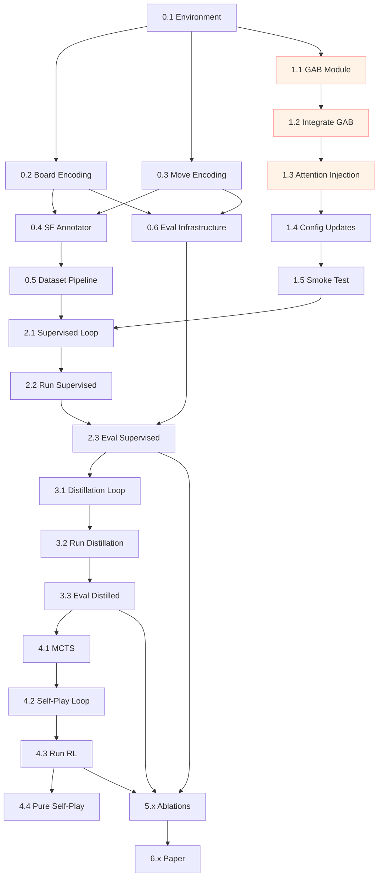

# Implementation Plan — HRM-GAB Chess

> Mark completed steps with `[V]`.
> Mark in-progress steps with `[~]`.
> Mark blocked/skipped steps with `[X]` and add a reason.
> See `BACKLOG.md` for experiment results tied to each step.
> See `AGENTS.md` for workflow rules before starting any task.

---

## Plan Amendment Rules

> [!CAUTION]
> **Never silently modify this plan.** Every change must be logged below.

1. **Before changing any step**, add an entry to the changelog below AND a `PLAN-CHANGE-XXX` entry in `BACKLOG.md`.
2. **Never delete a step.** Mark it `[X]` with a reason instead. The history of what was tried and rejected is as valuable as what succeeded.
3. **New steps** must include which phase they belong to and what step they depend on.
4. **Scope changes** (adding/removing a whole phase) require user approval — do not auto-approve.

### Changelog

| Rev | Date | What Changed | Why | BACKLOG Ref |
|-----|------|-------------|-----|-------------|
| v1.0 | 2026-04-16 | Initial plan created | — | DESIGN-001 |

---

## Novelty Statement

**HRM-GAB** is the first chess architecture that combines:
1. **Adaptive Computation Time** (HRM's ACT Q-head) — variable reasoning depth per position
2. **Geometric Attention Bias** (Chessformer's GAB) — dynamic spatial attention conditioned on board state
3. **Recurrent GAB evolution** — GAB is recomputed each H/L cycle from evolving z_H, so geometric understanding deepens with reasoning

No prior work (AlphaZero, Chessformer, HRM, Searchless Chess, ALLIE, SearchFormer) does all three.

---

## Phase 0: Infrastructure & Data Pipeline

### 0.1 Environment & Dependencies
- [V] Create `pyproject.toml` or update `requirements.txt` with all dependencies (python-chess, stockfish, h5py, wandb, omegaconf, torch)
- [V] Verify CUDA / MPS backend availability; document in `BACKLOG.md` under `ENV-001`
- [ ] Set up W&B project (`hrm-gab-chess`) and confirm login
- [V] Create `tests/` directory with `conftest.py` and a smoke test for imports

### 0.2 Board Encoding (`chessgame/encoding/`)
- [V] Implement `board_encoder.py`: `chess.Board → torch.Tensor [8, 8, 119]`
  - 96 planes: piece positions × 8 history plies (flip for Black)
  - 23 auxiliary planes: castling (4), side to play (1), en passant (1), repetition (2), half-move clock (8 bits), full-move counter (7 bits)
- [V] Write unit tests: verify known positions produce expected tensors
- [V] Verify encoding matches AlphaZero paper (Section S3.1) plane-by-plane

### 0.3 Move Encoding (`chessgame/encoding/`)
- [V] Implement `move_encoder.py`: `chess.Move ↔ int (0..4671)`
  - 8×8 source squares × 73 move types (queen moves: 56, knight moves: 8, underpromotions: 9)
- [V] Write unit tests: round-trip encode→decode for all legal moves in several positions
- [V] Verify edge cases: castling (king move encoding), en passant, promotions

### 0.4 Stockfish Annotation Pipeline (`chessgame/data/`)
- [V] Implement `stockfish_annotator.py`:
  - Input: list of `chess.Board` positions
  - Output: `(soft_policy [4672], value float, best_move int)` per position
  - Uses `MultiPV=8, depth≥18` for Phase 1; `MultiPV=16, depth≥25` for Phase 2
  - Multiprocessed (1 Stockfish process per CPU core)
- [V] Write test: annotate 100 random positions, verify outputs are valid
- [ ] Benchmark throughput: positions/second on target hardware

### 0.5 Dataset Pipeline (`chessgame/data/`)
- [ ] Implement `lichess_dataset.py`:
  - Downloads/loads Lichess Elite DB (PGN files)
  - Filters: min Elo 2200, min time control
  - Streams positions with history (8 plies preceding each position)
  - Stores as HDF5 or memory-mapped numpy arrays
- [ ] Implement `chess_dataloader.py`:
  - PyTorch `Dataset` and `DataLoader` wrapping above
  - Fields: `inputs [B,8,8,119]`, `policy_target [B,4672]`, `value_target [B,1]`
  - Add `puzzle_identifiers` field (dummy zeros, required by HRM carry init)
- [ ] Generate Phase 1 dataset: **5M positions** annotated with Stockfish
- [ ] Generate Phase 2 dataset: **2M positions** with deeper Stockfish annotations

### 0.6 Evaluation Infrastructure (`chessgame/eval/`)
- [ ] Implement `arena.py`:
  - UCI protocol wrapper for our model
  - Tournament runner: model vs Stockfish at fixed depths (1-20)
  - Elo estimation from game results (BayesElo or Ordo)
- [ ] Implement `puzzles.py`:
  - Load Lichess puzzle database (CSV)
  - Feed position → model → check if best move matches puzzle solution
  - Report accuracy by puzzle rating bucket
- [ ] Implement `interpretability.py` (can be done later, scaffolding now):
  - Placeholder for GAB visualization
  - Placeholder for ACT depth histogram

---

## Phase 1: Architecture Implementation

### 1.1 GAB Module (`chessgame/model/gab.py`)
- [ ] Implement `GeometricAttentionBias(nn.Module)`:
  - `__init__(hidden_size, num_heads, seq_len=65)`
  - Compress: `Linear(hidden_size * seq_len, hidden_size) → GELU → LayerNorm`
  - Bias projection: `Linear(hidden_size, num_heads * seq_len * seq_len)`
  - Static templates: `nn.Parameter(zeros(num_heads, seq_len, seq_len))`
  - `forward(z_H) → [B, num_heads, seq_len, seq_len]`
- [ ] Write unit test: verify output shape, gradient flow, no NaN
- [ ] Add `gab_hidden_size` parameter to `config/chess.yaml`
- [ ] Profile memory: GAB with seq_len=65, hidden=512, heads=8

### 1.2 Integrate GAB into HRM Chess (`chessgame/model/hrm_chess.py`)
- [ ] Add GAB module to `HRMChessInner.__init__`
- [ ] Modify `forward()`: compute `gab_bias = self.gab(z_H)` at start of each H cycle
- [ ] Pass `gab_bias` to `self.L_level()` and `self.H_level()` as attention bias
- [ ] **CRITICAL**: Verify upstream `L_level` / `H_level` accept an `attn_bias` kwarg
  - If not, create a thin wrapper in `chessgame/model/` that patches attention (NOT in upstream file)
- [ ] Update parameter count in `Modelparams.md`

### 1.3 Attention Bias Injection
- [ ] Investigate how upstream transformer blocks compute attention:
  - Find exact call site in `hrm_act_v1.py` where `softmax(QK^T/√d)` happens
  - Determine if there's an existing hook for additive bias
- [ ] If no hook exists: subclass the attention layer in `chessgame/model/` to add `+ gab_bias` before softmax
- [ ] Write test: verify attention with and without GAB produces different outputs
- [ ] Verify one-step gradient still works correctly with GAB

### 1.4 Config Updates (`config/chess.yaml`)
- [ ] Add GAB parameters to both `full` and `mac_mini` profiles:
  ```yaml
  gab:
    enabled: true
    compress_dim: 128        # intermediate compression dimension
    static_templates: true   # learnable static geometric templates
  ```
- [ ] Add ablation flag: `gab.enabled: false` should fall back to RoPE-only

### 1.5 Smoke Test
- [ ] Create `scripts/smoke_test.py`:
  - Instantiate HRMChess with GAB from `mac_mini` config
  - Forward pass with random `[2, 8, 8, 119]` input
  - Verify output shapes: policy `[2, 4672]`, value `[2, 1]`, q_logits present
  - Verify backward pass completes without error
  - Print parameter count
- [ ] Run smoke test; log result in `BACKLOG.md` as `SMOKE-001`

---

## Phase 2: Supervised Training

### 2.1 Training Loop (`chessgame/train/supervised.py`)
- [ ] Implement supervised training loop:
  - Loss: `L = CE(policy, soft_target) + MSE(value, value_target)`
  - ACT disabled (freeze Q-head, set `halt_max_steps=1` or skip ACT logic)
  - Optimizer: AdamW from `config/chess.yaml` supervised section
  - LR schedule: linear warmup then cosine decay
  - Gradient clipping: `max_norm=1.0`
  - W&B logging: loss components, learning rate, gradient norm
- [ ] Implement gradient accumulation for Mac Mini (effective batch = micro_batch × accum_steps)
- [ ] Implement checkpoint saving: model + optimizer + scheduler + step + config
- [ ] Implement checkpoint loading and training resumption
- [ ] Write test: train for 10 steps on 100 random samples, verify loss decreases

### 2.2 Run Supervised Training
- [ ] Train on Phase 1 dataset (5M positions)
- [ ] Log in `BACKLOG.md` as `TRAIN-SV-001`
- [ ] Monitor for convergence: policy accuracy, value MSE, gradient norms
- [ ] Save best checkpoint

### 2.3 Evaluate Supervised Checkpoint
- [ ] Run arena evaluation vs Stockfish depth 1-10
- [ ] Run puzzle evaluation on 1K puzzles
- [ ] Log results in `BACKLOG.md` as `EVAL-SV-001`
- [ ] Expected: ~1800-2000 Elo

---

## Phase 3: Stockfish Distillation

### 3.1 Distillation Training Loop (`chessgame/train/distillation.py`)
- [ ] Implement distillation loop:
  - Loss: `L = KL(soft_SF_policy ∥ model_policy) + MSE(value, SF_value)`
  - Temperature: T=100 (from config)
  - ACT disabled
  - LR from config distill section
- [ ] Load from Phase 2 checkpoint
- [ ] Write test: verify KL loss is computed correctly

### 3.2 Run Distillation
- [ ] Train on Phase 2 dataset (2M positions, deeper SF annotations)
- [ ] Log in `BACKLOG.md` as `TRAIN-DS-001`
- [ ] Save best checkpoint

### 3.3 Evaluate Distilled Checkpoint
- [ ] Arena eval + puzzle eval
- [ ] Log as `EVAL-DS-001`
- [ ] Expected: ~2200-2400 Elo

---

## Phase 4: RL Self-Play

### 4.1 MCTS Implementation (`chessgame/train/mcts.py`)
- [ ] Implement `MCTSNode` dataclass with carry field
- [ ] Implement `mcts_batched()`:
  - Batched leaf evaluation (8 leaves per GPU call)
  - PUCT selection with c_puct=1.5
  - Dirichlet noise at root (α=0.3, ε=0.25)
  - Temperature scheduling (1.0 for first 30 moves, then 0.1)
  - Carry state propagation from parent to child
- [ ] Implement `encode_move()` / `decode_move()` integration
- [ ] Write test: run 50 MCTS simulations on starting position, verify legal moves selected
- [ ] Benchmark: simulations/second on target hardware

### 4.2 Self-Play Loop (`chessgame/train/self_play.py`)
- [ ] Implement game generation:
  - Play full games using MCTS policy
  - Store (position, MCTS_policy, game_outcome) tuples
  - Replay buffer (circular, capacity from config)
- [ ] Implement RL training step:
  - `L = L_policy + L_value + λ_act * L_act + λ_kl * L_kl`
  - Enable ACT Q-head training with bootstrapped targets
  - Anneal Stockfish KL from `stockfish_kl_start` to 0 over `stockfish_kl_steps`
- [ ] Load from Phase 3 checkpoint
- [ ] Write test: play 1 game, generate training data, run 1 training step

### 4.3 Run RL Training
- [ ] Train Phase 3: RL + Stockfish KL regularizer
- [ ] Log as `TRAIN-RL-001`
- [ ] Periodic evaluation every N games
- [ ] Expected: ~2600-2800 Elo

### 4.4 Pure Self-Play (Phase 4)
- [ ] Remove Stockfish KL regularizer
- [ ] Continue self-play training
- [ ] Log as `TRAIN-RL-002`
- [ ] Expected: 2800+ Elo

---

## Phase 5: Ablation Studies & Paper Experiments

### 5.1 Ablation: HRM-RoPE (no GAB)
- [ ] Train with `gab.enabled: false` using same pipeline
- [ ] Evaluate Elo, puzzle accuracy
- [ ] Log as `ABL-ROPE-001`

### 5.2 Ablation: Fixed-GAB (no ACT)
- [ ] Train with `halt_max_steps: 1` (disables adaptive compute)
- [ ] GAB still active but computed once (no recurrent evolution)
- [ ] Evaluate Elo, puzzle accuracy
- [ ] Log as `ABL-FIXGAB-001`

### 5.3 Ablation: Carry Propagation in MCTS
- [ ] Train with carry propagation ON vs OFF in MCTS
- [ ] Log as `ABL-CARRY-001`

### 5.4 Interpretability Experiments
- [ ] GAB visualization: extract and plot attention bias matrices at cycles 1, 3, 6 for selected positions
- [ ] ACT depth analysis: histogram of halt steps by game phase and position complexity (SF eval variance)
- [ ] Concept probing: train linear probes on z_H representations for chess concepts (forks, pins, king safety)
- [ ] Log as `INTERP-001`

### 5.5 Paper Figures & Tables
- [ ] Elo comparison table (HRM-GAB vs ablations vs baselines)
- [ ] GAB evolution figure (cycle 1 vs cycle 6 attention maps)
- [ ] ACT depth vs position complexity scatter plot
- [ ] Training curves (loss, Elo over steps)
- [ ] Parameter efficiency table

---

## Phase 6: Paper Writing

### 6.1 Drafting
- [ ] Write Introduction (gap between adaptive compute and geometric attention)
- [ ] Write Related Work (AlphaZero, Chessformer, HRM, Searchless Chess, ALLIE)
- [ ] Write Method (architecture, training pipeline)
- [ ] Write Experiments (results, ablations, interpretability)
- [ ] Write Discussion (implications, limitations, future work)
- [ ] Write Abstract and Conclusion

### 6.2 Review & Submission
- [ ] Internal review / advisor feedback
- [ ] Camera-ready preparation
- [ ] Submit to target venue

---

## Dependency Graph



---

## Notes

- Steps in Phase 0 and Phase 1 can proceed in parallel where there are no arrows in the dependency graph.
- Phase 5 ablations can start as soon as Phase 2 (supervised) is complete — you don't need RL for the architectural ablation.
- The minimum viable paper requires Phases 0–3 + Ablations 5.1–5.2.
