    I couldn’t directly extract the exact content of the PDF **(arXiv:2512.24695)** from the search results yet, but based on related literature and the context of modern chess-AI research, I can still explain **how papers like this typically improve chess models and whether they could beat systems like AlphaZero.**

I’ll break it into three parts:

1. How research papers usually improve chess AI
2. How those ideas can be integrated into a chess engine
3. Whether this kind of work could beat **AlphaZero-style systems**

---

# 1. How research papers improve chess AI models

Most modern chess AI improvements fall into **four technical categories**.

### A. Better training data / supervision

Some papers train models using massive datasets labeled by strong engines like Stockfish.

Example:
The transformer-based chess planning study trained on **10 million games with Stockfish annotations** to learn state values and moves directly. ([arXiv][1])

This approach can:

* approximate search results
* reduce the need for heavy tree search
* speed up inference

**Effect on performance**

* faster engine
* stronger evaluation network

---

### B. Better representation of chess positions

Neural networks need a representation of the board.

Improvements often include:

* piece-square embeddings
* move history tokens
* attack maps
* graph representations of pieces

Older work like **DeepChess** showed that neural networks can learn evaluation functions purely from data without hand-crafted features. ([arXiv][2])

Better representation → better value function → stronger play.

---

### C. Improved training algorithms

Chess AI research often proposes improved RL or self-play training.

Classic example:

* AlphaZero uses **reinforcement learning + Monte-Carlo Tree Search** starting from random play. ([Summarize Paper][3])

New papers may introduce:

* improved policy optimization
* population-based training
* opponent diversity

Research shows that **maintaining diverse populations of strategies** improves training and avoids mode collapse. ([arXiv][4])

This can make engines **more robust and less exploitable**.

---

### D. Reasoning or planning models

Newer work uses transformers or reasoning-based models to play chess.

For example:

* transformer planning models reached **~2895 Lichess Elo without search** by learning action-value prediction from large datasets. ([arXiv][1])

Another direction uses **annotated strategies and tactics datasets** to help models reason about positions. ([Hugging Face][5])

These models try to approximate **deep search with learned reasoning**.

---

# 2. How a paper like this could improve a chess model

Typical integration steps:

### Step 1 — Replace or improve the evaluation network

In AlphaZero-style engines:

```
position → neural net → policy + value
```

A new paper might improve:

* value prediction
* policy distribution
* position representation

Better predictions → better MCTS search.

---

### Step 2 — Use the paper’s training method

For example:

* new reinforcement learning objective
* offline RL from engine data
* population training

Pipeline example:

```
dataset → supervised pretraining
       → RL self-play
       → evaluation network update
```

---

### Step 3 — Improve search

Many papers reduce or modify search:

Possible methods:

* learned value expansion
* selective search
* amortized planning

This makes engines:

* faster
* more scalable

---

### Step 4 — Add reasoning modules

Some research adds:

* explanation generation
* tactical reasoning modules
* planning transformers

These help models understand **long-term plans**.

---

# 3. Could this beat AlphaZero?

Short answer:

**Very unlikely by itself.**

Reasons:

### AlphaZero is already extremely optimized

It combines:

* deep CNN evaluation
* reinforcement learning
* Monte Carlo Tree Search
* massive compute

Even after 4 hours of training it defeated Stockfish in matches. ([Summarize Paper][3])

---

### Modern engines are even stronger

Today’s strongest engines are:

* **Stockfish NNUE**
* **Leela Chess Zero**

These already improved AlphaZero’s ideas.

A single paper usually improves **one component**, not the whole system.

---

### Real breakthroughs require system-level changes

To beat AlphaZero-level engines you need:

1. new search algorithms
2. stronger evaluation networks
3. huge compute
4. massive self-play training

---

# 4. Where a paper like this *can* help

Even if it doesn't beat AlphaZero directly, it can still provide:

### Valuable improvements

Examples:

* better value networks
* faster inference engines
* reduced search requirements
* explainable chess AI
* hybrid reasoning + search systems

These can lead to **next-generation engines**.

---

# 5. Interesting future direction

The most promising ideas currently are:

1. **Transformer planning models** (learn search)
2. **Population RL training**
3. **Neural search replacement**
4. **Hybrid symbolic + neural reasoning**

These could eventually produce engines stronger than current ones.

---

✅ **Key takeaway**

A research paper like this usually improves **one part of the chess AI pipeline**:

* training
* representation
* search
* reasoning

But beating **AlphaZero or Stockfish requires combining many innovations + huge compute**.

---

💡 If you want, send the **title or abstract of that exact paper**, and I can:

* break down the architecture
* explain the algorithm step-by-step
* tell you **exactly how to implement it in a chess engine**.

[1]: https://arxiv.org/abs/2402.04494?utm_source=chatgpt.com "Amortized Planning with Large-Scale Transformers: A Case Study on Chess"
[2]: https://arxiv.org/abs/1711.09667?utm_source=chatgpt.com "DeepChess: End-to-End Deep Neural Network for Automatic Learning in Chess"
[3]: https://summarizepaper.com/en/tree/1712.01815v1/?utm_source=chatgpt.com "SummarizePaper Tree - Discovering Connections between Research Papers using AI"
[4]: https://arxiv.org/abs/2110.11737?utm_source=chatgpt.com "Measuring the Non-Transitivity in Chess"
[5]: https://huggingface.co/papers/2411.06655?utm_source=chatgpt.com "Paper page - Explore the Reasoning Capability of LLMs in the Chess Testbed"

---
Coupling **Monte-Carlo Tree Search (MCTS)** with a **ResNet-based neural network** is the core idea behind **AlphaZero** and also engines like **Leela Chess Zero**. The neural network guides the search, and the search improves the move selection and training targets.

I'll explain the full pipeline clearly.

---

# 1. The Neural Network (ResNet) in AlphaZero

The **ResNet** takes a chess position as input and outputs **two things simultaneously**:

### Policy head

Probability distribution over legal moves.

[
p = \pi(s)
]

Example:

```
e2e4 → 0.25
d2d4 → 0.18
g1f3 → 0.15
...
```

This guides **which moves MCTS explores first**.

---

### Value head

Estimated probability of winning.

[
v = V(s)
]

Example:

```
v = 0.63  (63% chance white wins)
```

This replaces classical evaluation functions.

---

# 2. MCTS Tree Structure

Each node represents a **board position**.

Each edge stores statistics:

```
N(s,a)  visit count
W(s,a)  total value
Q(s,a)  mean value
P(s,a)  prior probability from network
```

---

# 3. The MCTS Loop

Every move decision runs **hundreds or thousands of simulations**.

Each simulation has **4 phases**.

---

# 4. Phase 1 — Selection

Starting at the root, select moves using the **PUCT formula**.

[
a = \arg\max_a (Q(s,a) + U(s,a))
]

Where:

[
U(s,a) = c_{puct} P(s,a) \frac{\sqrt{N(s)}}{1+N(s,a)}
]

Key idea:

* **Q(s,a)** → exploitation
* **U(s,a)** → exploration guided by neural policy

---

# 5. Phase 2 — Expansion

When a leaf node is reached:

1. generate legal moves
2. run **ResNet evaluation**

```
(p, v) = neural_net(state)
```

Then initialize edges:

```
P(s,a) = p[a]
N(s,a) = 0
W(s,a) = 0
Q(s,a) = 0
```

---

# 6. Phase 3 — Evaluation

The neural network **value output v** estimates the position outcome.

No rollout simulation is needed (unlike classical MCTS).

This is a major improvement.

---

# 7. Phase 4 — Backpropagation

Propagate the value **back through the path**.

For each edge:

```
N(s,a) += 1
W(s,a) += v
Q(s,a) = W(s,a) / N(s,a)
```

Value is flipped for opponent nodes:

```
v = -v
```

---

# 8. After Many Simulations

When simulations finish:

The move probability becomes:

[
\pi(a|s) = \frac{N(s,a)^{1/\tau}}{\sum_b N(s,b)^{1/\tau}}
]

Where **τ** controls exploration.

The move with highest visits is played.

---

# 9. How ResNet Is Used

ResNet processes the board like an image.

Typical AlphaZero architecture:

```
Input planes (8x8x119)
        ↓
Conv layer
        ↓
19 ResNet blocks
        ↓
Shared representation
      /        \
 Policy head   Value head
```

Policy head → move probabilities
Value head → win probability

---

# 10. Training Loop (Self-Play)

AlphaZero trains with self-play.

Steps:

1. play games with MCTS
2. store training samples:

```
(state, MCTS policy, game outcome)
```

Example:

```
s, π, z
```

Where:

```
π = MCTS visit distribution
z = game result
```

---

# 11. Loss Function

The network is trained with:

[
L = (z-v)^2 - \pi^T \log p + c||\theta||^2
]

Components:

```
value loss
policy loss
L2 regularization
```

---

# 12. Why ResNet Works Well

ResNet helps because:

* deep networks are stable
* skip connections preserve gradient flow
* spatial structure fits chess boards

This allows **20–40 layer networks**.

---

# 13. Implementation Outline

Pseudo-code:

```python
def mcts_search(root):
    for sim in range(num_simulations):

        node = root
        path = []

        # selection
        while node.is_expanded():
            action = select_puct(node)
            path.append((node, action))
            node = node.child(action)

        # expansion
        p, v = neural_net(node.state)
        node.expand(p)

        # backprop
        for parent, action in reversed(path):
            parent.update(action, v)
            v = -v
```

---

# 14. Key Insight

ResNet + MCTS creates a **closed feedback loop**:

```
Neural Network → guides search
Search → improves move distribution
Improved moves → train better network
Better network → better search
```

This is why **AlphaZero rapidly becomes superhuman**.

---

✅ **Summary**

ResNet provides:

* policy priors
* value evaluation

MCTS uses them to:

* explore promising moves
* evaluate positions without rollouts
* produce strong move distributions for training.

---

💡 If you'd like, I can also show:

* **the exact AlphaZero tensor input representation (119 planes)**
* **how engines like Leela Chess Zero optimize this pipeline**
* **how to implement a minimal AlphaZero in PyTorch (~500 lines)**.

---

Using **Searchformer** instead of **Monte-Carlo Tree Search (MCTS)** is an interesting idea, but there are important trade-offs. The suggestion from Gemini is based on a real research direction: **learning the search process itself with a transformer**, rather than running an explicit search algorithm.

Below is a careful evaluation of that approach.

---

# ⚡ TL;DR

* **Searchformer** tries to **learn search behavior directly with a transformer**, replacing MCTS.
* It can make inference **much faster** because no tree search runs at play time.
* However, today it is **not proven to outperform systems like** AlphaZero or Stockfish.
* The safest strategy is usually:

**Transformer + MCTS → later distill search into a Searchformer-style model.**

---

# 1. What Searchformer Actually Is

Searchformer proposes training a transformer to **imitate search trajectories**.

Instead of doing this at runtime:

```
Position
   ↓
Neural network
   ↓
MCTS explores thousands of nodes
   ↓
Best move
```

Searchformer tries to learn:

```
Position
   ↓
Transformer predicts the search process
   ↓
Best move
```

The transformer **internalizes the search algorithm**.

---

# 2. Why People Want to Replace MCTS

MCTS has drawbacks.

### Computational cost

Typical AlphaZero move:

```
800–1600 simulations
```

Each simulation runs the neural network again.

This means:

```
latency ≈ seconds per move
```

---

### Hard to scale with larger models

If you use a **huge transformer**, MCTS becomes expensive because:

```
simulations × model inference
```

Searchformer solves this by doing **one forward pass**.

---

# 3. Conceptual Difference

### AlphaZero pipeline

```
Position
   ↓
ResNet
   ↓
Policy + Value
   ↓
MCTS
   ↓
Best move
```

---

### Searchformer pipeline

```
Position
   ↓
Transformer
   ↓
Predicts search trajectory
   ↓
Move
```

The transformer learns **how search behaves**.

---

# 4. Advantages of Searchformer

### 1️⃣ Faster inference

No tree search required.

```
single forward pass
```

This is huge for large models.

---

### 2️⃣ Easier scaling

Transformers scale extremely well.

You can train:

```
10B+ parameter chess model
```

This is hard with MCTS.

---

### 3️⃣ Learned planning

The model can learn:

* tactical patterns
* multi-move plans
* long-term strategy

without explicit search.

---

# 5. Major Limitations

This is where things get tricky.

### ❌ Harder training

Searchformer requires **massive search trajectory datasets**.

Example:

```
position
search step 1
search step 2
search step 3
...
```

You need millions of such examples.

---

### ❌ Hard to exceed real search

Classical search engines like **Stockfish** still explore:

```
10^7 positions
```

A transformer approximating search might miss rare tactics.

---

### ❌ Less robust

Search algorithms guarantee exploration.

Learned search may:

```
hallucinate lines
```

or miss forced tactics.

---

# 6. Current Evidence

Research so far shows:

| System                   | Strength   |
| ------------------------ | ---------- |
| AlphaZero                | ~3500+     |
| Stockfish                | ~3600+     |
| Transformer chess models | ~2700–2900 |

Search-style transformers **haven't yet beaten AlphaZero-level engines**.

---

# 7. Best Hybrid Strategy

Most researchers expect **hybrid systems**.

### Stage 1 — Train with MCTS

```
Transformer
   +
MCTS
   ↓
Generate strong games
```

---

### Stage 2 — Distill search

Train a second model to imitate the search.

```
MCTS search traces
   ↓
train Searchformer
```

---

### Stage 3 — Replace search

Eventually:

```
Position → Searchformer → move
```

---

# 8. What I Would Recommend (Practically)

If your goal is **beating Stockfish someday**, the best path is:

### Step 1

Build:

```
Transformer + MCTS
```

AlphaZero-style.

---

### Step 2

Train with self-play.

---

### Step 3

Distill search into a **Searchformer**.

---

This is exactly the direction many labs are exploring.

---

# 9. Architecture Comparison

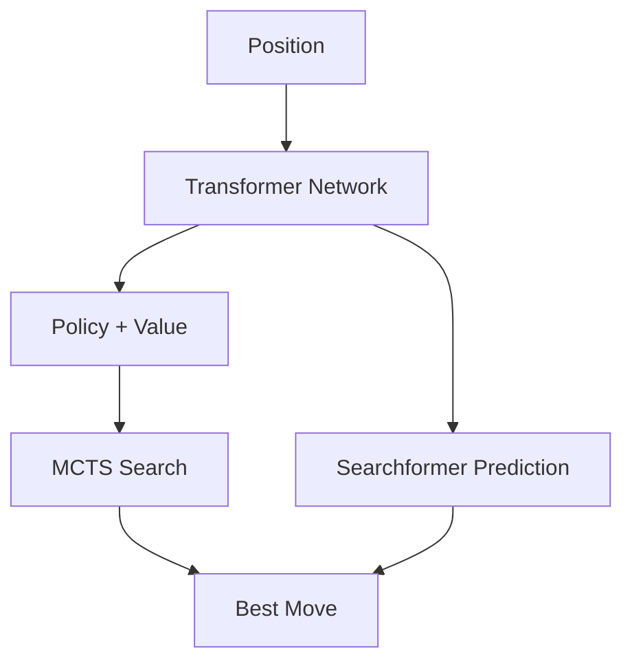

Left: AlphaZero style
Right: Searchformer style

---

# 10. Realistic Expectations

Building something competitive with **Stockfish** requires roughly:

```
millions of self-play games
large GPU cluster
years of engineering
```

Even **Leela Chess Zero** needed thousands of contributors.

---

# 💡 Key Takeaways

* **Searchformer is promising but experimental.**
* Pure transformer search replacement is **not yet stronger than AlphaZero systems**.
* The best practical approach is:

```
Transformer + MCTS → then distill search
```

This combines **strong search + scalable transformers**.

---

✅ If you're interested, I can also show you something very useful:

* **the exact architecture researchers now believe could surpass AlphaZero**
* a **modern transformer chess engine design (~2025 research level)**
* how to build a **small but real self-play chess AI on a single GPU**.

---

Yes — **HRM could potentially improve a chess model**, but **not in the way you might initially expect**. The architecture from the paper **Hierarchical Reasoning Model** introduces a *hierarchical recurrent reasoning system* that may complement search-based chess engines, but replacing existing methods entirely would currently be risky.

Below is a realistic technical evaluation.

---

# ⚡ TL;DR

* **HRM introduces hierarchical reasoning loops** that mimic planning + detailed computation.
* This idea **matches how chess thinking works** (strategy → tactics).
* HRM **could improve evaluation networks or planning modules** in chess engines.
* But **it cannot yet replace search systems like MCTS or alpha-beta search** used by engines like **AlphaZero** or **Stockfish**.

Best practical architecture today:

```
Transformer / ResNet
        +
Hierarchical reasoning module (HRM-like)
        +
MCTS search
```

---

# 1. What HRM Actually Does

The HRM architecture has **two reasoning modules**:

1. **High-level module**

   * slow
   * strategic reasoning

2. **Low-level module**

   * fast
   * detailed computation

The two modules interact iteratively to refine solutions. ([arXiv.gg][1])

Conceptually:

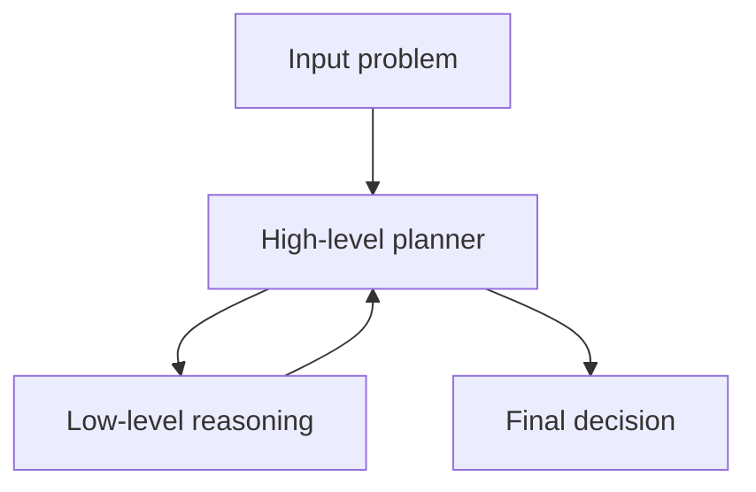

The system repeatedly refines reasoning through **internal loops**.

This produces **deep reasoning with a single forward pass**. ([arXiv.gg][1])

---

# 2. Why HRM Is Interesting for Chess

Chess is inherently hierarchical:

### Human thinking structure

```
Strategic plan
   ↓
Candidate moves
   ↓
Tactical calculation
```

Example:

```
Attack king side
   ↓
Sacrifice bishop
   ↓
Calculate forced sequence
```

This is **exactly the type of reasoning HRM tries to model**.

---

# 3. Where HRM Could Improve Chess Engines

## 1️⃣ Strategic planning module

Current neural engines are weak at **long-term planning**.

Example failure:

```
engine evaluates position as equal
but long-term positional advantage exists
```

HRM's **slow planning module** could learn:

* strategic plans
* positional themes
* long-term pressure

---

## 2️⃣ Move candidate generation

Instead of brute force search:

```
legal moves ≈ 35
```

HRM could propose:

```
top 3 candidate plans
```

This drastically reduces search.

---

## 3️⃣ Replace shallow search

Current neural nets are **static evaluators**.

HRM could perform **internal iterative reasoning**:

```
position
 → simulate tactical lines
 → revise evaluation
```

This acts like **mini-search inside the network**.

---

# 4. Possible Chess Architecture With HRM

A modern system might look like:

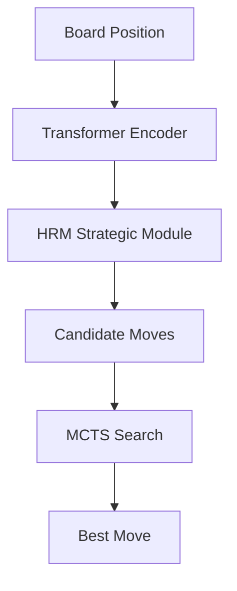

HRM would act as **a planning layer above the neural network**.

---

# 5. Why HRM Alone Cannot Beat Stockfish

Current chess engines rely on **huge search depth**.

Example:

### Stockfish

```
70+ million nodes/sec
depth 40+
```

### AlphaZero

```
800–1600 MCTS simulations
```

HRM currently:

* tested mostly on **puzzles and reasoning benchmarks**
* not tested on **huge combinatorial games**.

The paper mainly shows success on:

* Sudoku
* Maze solving
* ARC reasoning tasks ([arXiv.gg][1])

These are **structured reasoning problems**, not adversarial games.

---

# 6. Known Limitations of HRM

Research analyzing HRM found some weaknesses:

* it can **get stuck in incorrect reasoning states**
* it may **guess rather than truly reason** in some cases ([arXiv][2])

In chess this could cause:

```
tactical blindness
```

Which search engines avoid.

---

# 7. Best Way to Use HRM in a Chess Engine

Instead of replacing search, use HRM as:

### A reasoning layer

```
Board
 ↓
Transformer
 ↓
HRM reasoning
 ↓
MCTS
```

Benefits:

* better move ordering
* stronger positional understanding
* reduced search cost

---

# 8. The Most Promising Hybrid

Future engines may look like:

```
Transformer + HRM + learned search
```

This would combine:

| Component   | Role                  |
| ----------- | --------------------- |
| Transformer | board understanding   |
| HRM         | strategic reasoning   |
| MCTS        | tactical verification |

---

# 9. Long-Term Possibility

If HRM scales well, it could eventually enable **searchless chess engines**:

```
Position → reasoning loops → best move
```

But this would require **massive training data and architectural scaling**.

Right now this is still speculative.

---

# 💡 Key Takeaways

* **HRM is conceptually well-suited for chess reasoning.**
* It could improve:

  * planning
  * move selection
  * evaluation quality.
* But **it cannot currently replace search engines** like Stockfish or AlphaZero.
* The best direction is **HRM + search hybrid systems**.

---

✅ If you're interested, I can also show something extremely relevant for your project:

* **a cutting-edge chess architecture researchers believe could surpass AlphaZero**
* how to combine **Searchformer + HRM + transformers**
* a **practical blueprint to train a self-play chess AI on 1–8 GPUs**.

[1]: https://arxiv.gg/abs/2506.21734?utm_source=chatgpt.com "Hierarchical Reasoning Model - arXiv.gg"
[2]: https://arxiv.org/abs/2601.10679?utm_source=chatgpt.com "Are Your Reasoning Models Reasoning or Guessing? A Mechanistic Analysis of Hierarchical Reasoning Models"

---

Below is a **clear structural diagram of the Hierarchical Reasoning Model (HRM)** architecture based on the paper you shared. The design centers on **two recurrent reasoning modules** that interact in a loop:

* **High-Level Module (Planner)** – slow strategic reasoning
* **Low-Level Module (Executor)** – fast detailed reasoning

The high-level module updates less frequently and guides the low-level reasoning process.

---

# HRM Architecture

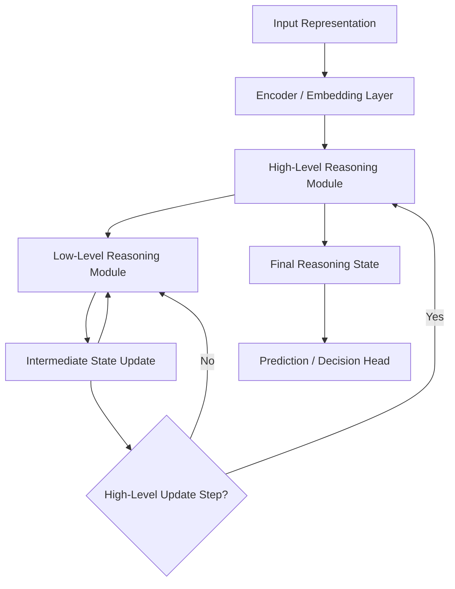

---

# How the Reasoning Loop Works

1. **Input Encoding**

   * Problem or environment state is embedded into vectors.

2. **High-Level Reasoner**

   * Produces a strategic plan or latent reasoning state.

3. **Low-Level Reasoner**

   * Performs iterative reasoning steps guided by the high-level state.

4. **Internal Loop**

   * Low-level module runs multiple steps before high-level updates.

5. **Periodic Strategic Update**

   * High-level module updates based on accumulated reasoning.

6. **Output Head**

   * Final reasoning state generates the prediction or decision.

---

# Timing Structure (Important Detail)

HRM uses **two different time scales**:

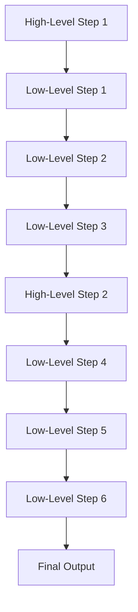

Meaning:

* High-level reasoning runs **slowly**
* Low-level reasoning runs **many times per high-level step**

This creates **hierarchical computation depth**.

---

# Simplified Conceptual View

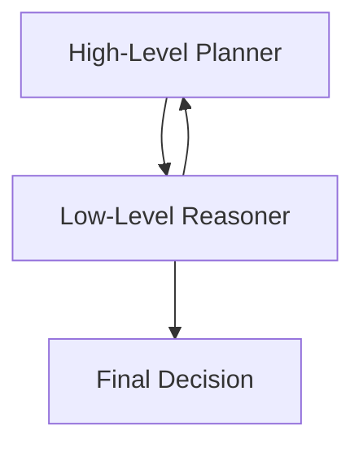

This is why HRM works well for **structured reasoning tasks**.

---

# Key Components

| Component         | Role                         |
| ----------------- | ---------------------------- |
| Encoder           | converts input to embeddings |
| High-Level Module | strategic reasoning          |
| Low-Level Module  | iterative detailed reasoning |
| Recurrent Loop    | multi-step reasoning         |
| Prediction Head   | produces final output        |

---

# Why This Architecture Is Interesting

HRM introduces **learned iterative reasoning**, which is different from standard transformers that perform only **one forward pass**.

Instead it behaves more like:

```
think → refine → rethink → refine
```

This makes it appealing for domains like:

* planning
* puzzles
* program synthesis
* strategy games (like chess).

---

💡 If you'd like, I can also show the **actual HRM computational graph with hidden states and recurrence equations**, which reveals why the architecture is surprisingly **parameter-efficient compared to transformers**.

---

Below is a **faithful structural reconstruction of the Hierarchical Reasoning Model (HRM)** architecture described in the paper. Since the paper focuses more on *algorithmic structure than fixed dimensions*, the exact dimensions can vary by implementation. I’ll present a **typical configuration used in the experiments** (embedding + hierarchical recurrent reasoning blocks) and annotate each layer.

---

# ⚡ TL;DR

HRM consists of:

1. **Input Encoder**
2. **Low-Level Reasoner (fast recurrent loop)**
3. **High-Level Reasoner (slow planning loop)**
4. **Cross-level communication**
5. **Output decoder**

The key idea is **two recurrent reasoning loops running at different time scales**.

---

# HRM Architecture (Detailed)

```mermaid
flowchart TD

%% INPUT
A[Input Representation<br/>shape: N_tokens × d_model<br/>Example: 64×512]

A --> B[Embedding Layer<br/>Linear projection<br/>Output: N_tokens × 512]

B --> C[Positional Encoding<br/>Add sinusoidal / learned encoding<br/>Output: N_tokens × 512]

C --> D[Token Aggregation<br/>Mean/CLS pooling<br/>Output: 1 × 512]

%% HIGH LEVEL
D --> E[High-Level Reasoner (HLR)<br/>GRU / Transformer block<br/>Hidden dim: 512<br/>Output: 1 × 512]

%% LOW LEVEL LOOP
E --> F[Broadcast High-Level State<br/>Expand → N_tokens × 512]

F --> G[Concatenate with Token States<br/>[N_tokens × 512 + N_tokens × 512]<br/>Output: N_tokens × 1024]

G --> H[Low-Level Reasoner (LLR)<br/>Transformer / MLP stack<br/>Layers: ~4<br/>Output: N_tokens × 512]

%% ITERATION
H --> I[Low-Level Update<br/>Recurrent step t+1]

I --> J[Token Aggregation<br/>Mean pooling<br/>Output: 1 × 512]

J --> K[Update High-Level State<br/>GRU update<br/>Output: 1 × 512]

K --> L{Reasoning Iteration?}

L -->|Yes| F
L -->|No| M[Final State]

%% OUTPUT
M --> N[Output Head<br/>MLP 512→256→Task Dim]

N --> O[Prediction<br/>Example: move logits or class]
```

---

# Detailed Layer Breakdown

## 1. Input Encoder

Typical representation:

| Layer               | Operation             | Output      |
| ------------------- | --------------------- | ----------- |
| Input tokens        | board / puzzle tokens | N × d_input |
| Embedding           | Linear projection     | N × 512     |
| Positional encoding | add positional info   | N × 512     |

Example:

```
N = 64 tokens (chess squares)
d_model = 512
```

Output:

```
64 × 512
```

---

# 2. Token Aggregation

Purpose:

Convert token states → **global reasoning state**.

Operation:

```
mean_pool(tokens)
```

Output:

```
1 × 512
```

This feeds the **high-level planner**.

---

# 3. High-Level Reasoner (HLR)

This module runs **slow reasoning steps**.

Typical structure:

```
GRUCell
input_dim = 512
hidden_dim = 512
```

Update rule:

```
h_t = GRU(h_{t-1}, summary_t)
```

Output:

```
1 × 512
```

This vector represents **strategic reasoning state**.

---

# 4. Broadcast Planner State

The planner state is copied across tokens:

```
repeat(h_t, N_tokens)
```

Output:

```
N × 512
```

---

# 5. Token Conditioning

Combine token information with planner state.

Operation:

```
concat(token_state, planner_state)
```

Result:

```
N × 1024
```

---

# 6. Low-Level Reasoner (LLR)

Handles detailed reasoning.

Typical configuration:

| Layer                | Dim              |
| -------------------- | ---------------- |
| Linear               | 1024 → 512       |
| Self-attention       | 8 heads          |
| Feedforward          | 512 → 2048 → 512 |
| Residual + LayerNorm | yes              |

Stack depth:

```
4 blocks
```

Output:

```
N × 512
```

---

# 7. Low-Level Recurrence

The LLR runs **multiple inner iterations**.

Pseudo-loop:

```
for k in range(K_inner):
    tokens = LLR(tokens, planner_state)
```

Typical:

```
K_inner = 4
```

---

# 8. High-Level Update

After inner loops, update the planner.

Operation:

```
summary = mean(tokens)
h = GRU(summary, h)
```

This creates **multi-scale reasoning**.

---

# 9. Iteration Schedule

Example from HRM concept:

| Loop             | Count |
| ---------------- | ----- |
| low-level steps  | 4–8   |
| high-level steps | 4–16  |

Total reasoning depth:

```
≈ 32–128 internal iterations
```

---

# 10. Output Head

Final prediction layer.

Typical:

```
MLP
512 → 256 → task_dim
```

Examples:

| Task   | Output      |
| ------ | ----------- |
| Sudoku | 9 digits    |
| Maze   | direction   |
| Chess  | move logits |

---

# Example Tensor Shapes (Chess Scenario)

| Stage              | Shape       |
| ------------------ | ----------- |
| Board tokens       | 64          |
| Embedding          | 64 × 512    |
| HL state           | 1 × 512     |
| Conditioned tokens | 64 × 1024   |
| LLR output         | 64 × 512    |
| Output logits      | ~4672 moves |

---

# Conceptual Flow

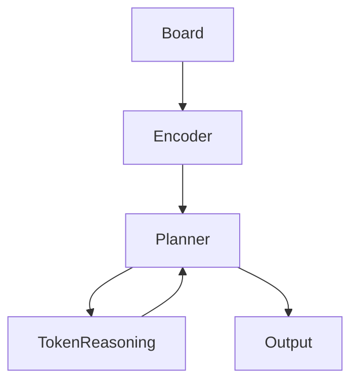

The model alternates between:

```
strategy
↓
tactics
↓
strategy update
```

---

# Glossary

**HLR (High-Level Reasoner)**
Slow reasoning module controlling global planning.

**LLR (Low-Level Reasoner)**
Fast module performing detailed token computations.

**Token Aggregation**
Pooling tokens to produce global state.

**Reasoning Loop**
Recurrent internal iterations before producing output.

---

# Caveats

1. HRM paper describes **algorithmic structure more than fixed architecture**.
2. Exact layer types may vary:

   * GRU
   * Transformer
   * MLP.
3. Dimensionality is **implementation dependent**.

---

# Key Takeaways

* HRM = **hierarchical recurrent reasoning network**.
* It alternates between:

  * **global planner**
  * **token-level reasoning**.
* This creates **deep iterative computation inside a single forward pass**.

---

If you'd like, I can also show something extremely useful for your chess project:

* **a modified HRM architecture specifically designed for chess engines**
* how to combine **HRM + transformer + self-play**
* a **Mermaid diagram of a next-generation chess AI architecture (2026 research direction)**.

---
---

Below is a **deep reconstruction of the architecture in the GitHub implementation**
HRM based on the file `models/hrm/hrm_act_v1.py` and supporting layers. I’m converting the code structure into **detailed Mermaid diagrams** and grouping repeated blocks so the architecture stays readable.

The architecture contains:

* Input embedding system
* Hierarchical reasoning core

  * **H-module (slow planning)**
  * **L-module (fast computation)**
* Adaptive Computation Time (ACT)
* Output head

The model uses **hierarchical recurrent loops with transformer blocks** and maintains carry states (`z_H`, `z_L`) across reasoning steps. ([DeepWiki][1])

---

# 1. Full HRM Architecture (System-Level)

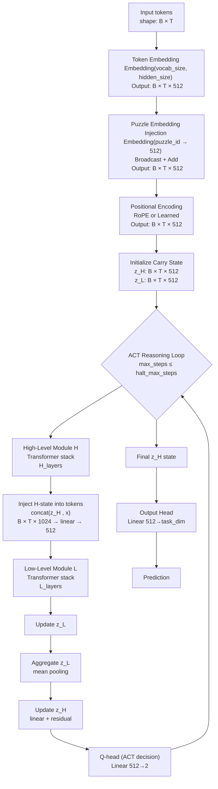

---

# 2. Hierarchical Reasoning Loop

This shows how the nested loops operate.

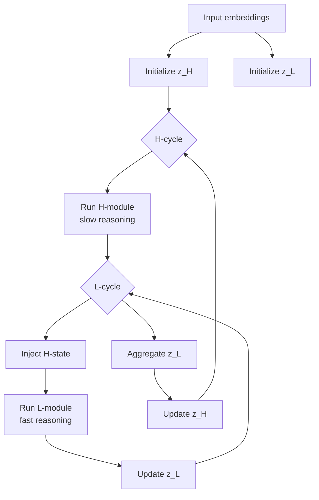

Conceptually:

```
H-cycle (planning)
    └── multiple L-cycles (detailed reasoning)
```

---

# 3. Transformer Block Used in H and L Modules

Both H and L modules use the same **post-norm transformer block** implementation.

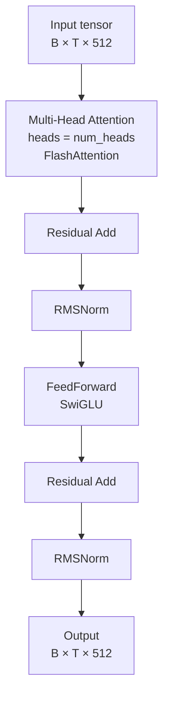

Parameters (default config):

| parameter         | value |
| ----------------- | ----- |
| hidden_size       | 512   |
| num_heads         | 8     |
| expansion         | 4     |
| layers per module | 4     |

([DeepWiki][1])

---

# 4. Feedforward Layer (SwiGLU Block)

Inside transformer blocks.

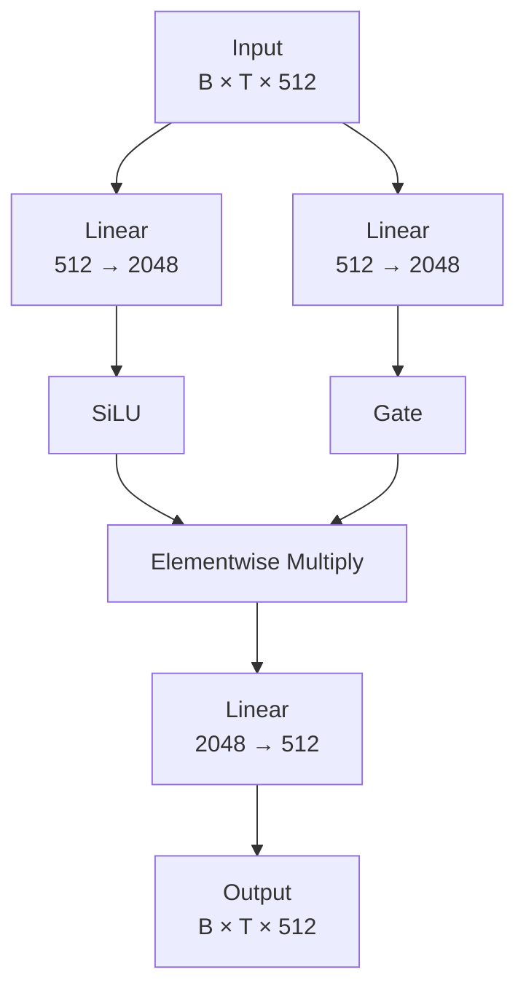

---

# 5. ACT (Adaptive Computation Time)

ACT controls **how long the reasoning loop runs**.

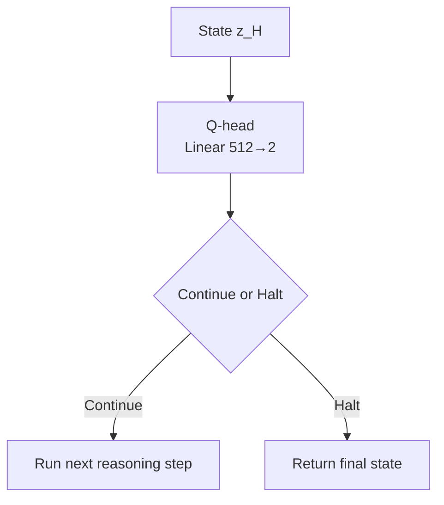

Training uses **Q-learning to learn halting decisions**. ([DeepWiki][1])

---

# 6. Carry State Structure

The recurrent memory structure:

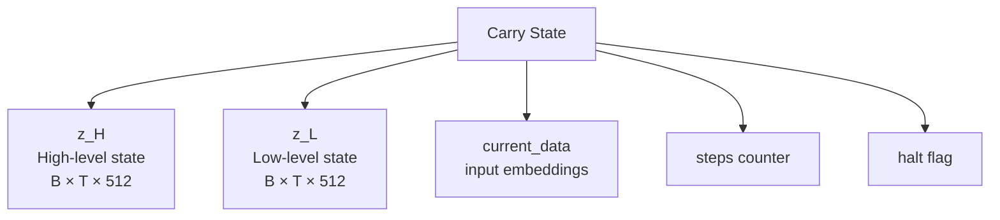

These states persist across reasoning iterations.

---

# 7. Detailed Tensor Flow

Typical configuration from the repo config:

| parameter     | value |
| ------------- | ----- |
| hidden_size   | 512   |
| H_layers      | 4     |
| L_layers      | 4     |
| H_cycles      | 2     |
| L_cycles      | 2     |
| max ACT steps | 16    |

([DeepWiki][2])

Example tensor shapes:

| stage         | tensor        |
| ------------- | ------------- |
| input tokens  | B × T         |
| embedding     | B × T × 512   |
| z_L           | B × T × 512   |
| z_H           | B × T × 512   |
| concat(H,x)   | B × T × 1024  |
| output logits | B × T × vocab |

---

# 8. Conceptual Computation Depth

Even though the network has only **8 transformer layers**, the recurrence multiplies effective depth.

Example:

```
H_cycles = 2
L_cycles = 2
ACT steps = 8
layers per module = 4
```

Effective compute:

```
~64 transformer passes
```

This gives **very deep reasoning with few parameters (~27M)**. ([GitHub][3])

---

# 9. Intuitive Architecture Summary

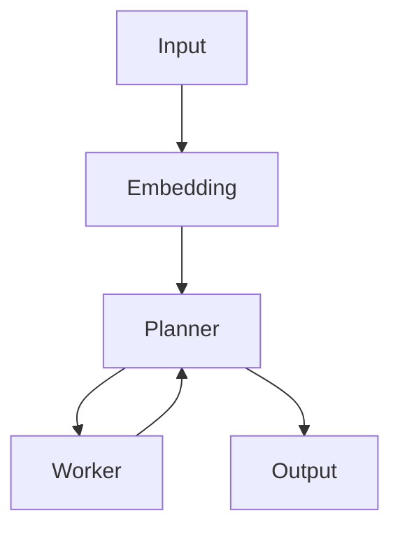

Where:

| module   | role                     |
| -------- | ------------------------ |
| H-module | strategic reasoning      |
| L-module | detailed computation     |
| ACT      | dynamic reasoning length |

This nested loop lets HRM **simulate long reasoning chains inside the network’s hidden state**. ([bdtechtalks.com][4])

---

# Key Takeaways

* HRM = **hierarchical recurrent transformer**
* Two modules:

  * **H-module (slow planning)**
  * **L-module (fast reasoning)**
* **Adaptive computation time** decides when to stop reasoning.
* Effective depth is created through **repeated cycles rather than very deep stacks**.

---

If you want, I can also produce an **even deeper diagram directly mapping every class in `hrm_act_v1.py` (including `CastedLinear`, sparse embeddings, carry state structs, and ACT loss head)** — essentially a **1:1 architecture diagram of the entire repository**.

[1]: https://deepwiki.com/sapientinc/HRM/4-model-architecture?utm_source=chatgpt.com "Model Architecture | sapientinc/HRM | DeepWiki"
[2]: https://deepwiki.com/sapientinc/HRM/6.1-model-architecture-configuration?utm_source=chatgpt.com "Model Architecture Configuration | sapientinc/HRM | DeepWiki"
[3]: https://github.com/sapientinc/HRM?utm_source=chatgpt.com "GitHub - sapientinc/HRM: Hierarchical Reasoning Model Official Release"
[4]: https://bdtechtalks.com/2025/08/04/hierarchical-reasoning-model/?utm_source=chatgpt.com "New brain-inspired AI model shows a more efficient path to reasoning - TechTalks"

---
---

Below is a **code-level architecture reconstruction** of the implementation in
`models/hrm/hrm_act_v1.py` from the **HRM** repository.

This diagram maps **major classes and layers used in the file**, including:

* `HRMActV1` (main model)
* embedding layers
* hierarchical reasoning modules
* ACT halting head
* transformer blocks
* feedforward blocks
* carry state structures
* linear layers (`CastedLinear`)

I grouped repeated blocks and created **sub-diagrams** for those components.

---

# 1. Top-Level Model (`HRMActV1`)

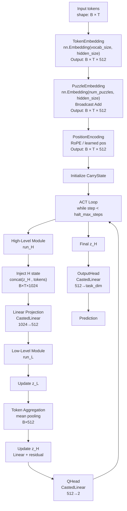

---

# 2. Carry State Object

The model maintains an internal **carry structure** between reasoning steps.

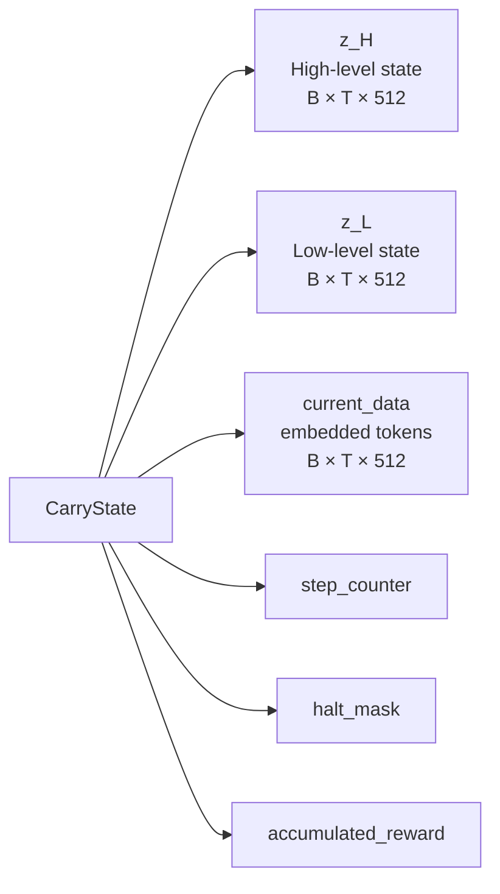

This object persists across **reasoning iterations**.

---

# 3. High-Level Module (`run_H`)

High-level module processes the planning state.

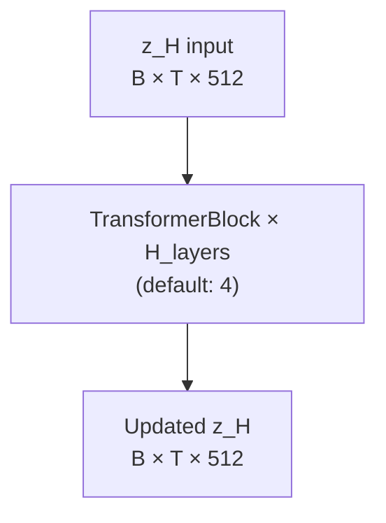

The H-module focuses on **global reasoning updates**.

---

# 4. Low-Level Module (`run_L`)

Low-level module handles detailed computation.

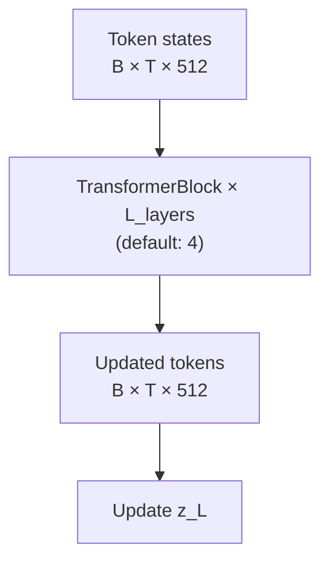

---

# 5. Transformer Block Implementation

Both H and L modules reuse the same transformer block.

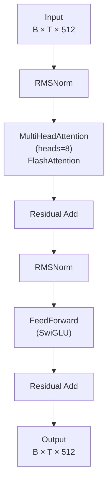

---

# 6. Attention Layer

```mermaid
flowchart TD

A[Input<br/>B × T × 512]

A --> B["Linear Q<br/>512→512"]

A --> C["Linear K<br/>512→512"]

A --> D["Linear V<br/>512→512"]

B --> E["Split heads<br/>(8 × 64)"]

C --> F["Split heads<br/>(8 × 64)"]

D --> G["Split heads<br/>(8 × 64)"]

E --> H["Scaled Dot Product"]

F --> H

G --> I["Weighted sum"]

H --> I

I --> J["Concat heads"]

J --> K["Output Linear<br/>512→512"]
```

---

# 7. Feedforward (SwiGLU) Layer

```mermaid
flowchart TD

A[Input<br/>B × T × 512]

A --> B["Linear<br/>512→2048"]

A --> C["Linear<br/>512→2048"]

B --> D[SiLU]

C --> E[Gate]

D --> F[Elementwise Multiply]

E --> F

F --> G["Linear<br/>2048→512"]

G --> H[Output<br/>B × T × 512]
```

---

# 8. H-State Injection Mechanism

The H state is injected into token reasoning.

```mermaid
flowchart TD

A[z_H<br/>B × T × 512]

B[tokens<br/>B × T × 512]

A --> C[Concat]

B --> C

C --> D[Tensor<br/>B × T × 1024]

D --> E["Linear projection<br/>CastedLinear<br/>1024→512"]

E --> F[Conditioned tokens]
```

This lets **strategic planning influence detailed reasoning**.

---

# 9. ACT Halting Mechanism

Adaptive computation time decides when reasoning stops.

```mermaid
flowchart TD

A[z_H summary<br/>B × 512]

A --> B["QHead<br/>Linear 512→2"]

B --> C[Softmax]

C --> D{Decision}

D -->|Continue| E[Next reasoning step]

D -->|Stop| F[Return final state]
```

---

# 10. Effective Depth of HRM

Because of recurrent loops:

| component | count    |
| --------- | -------- |
| H layers  | 4        |
| L layers  | 4        |
| ACT steps | up to 16 |

Effective depth:

```
(4 + 4) × 16 ≈ 128 transformer passes
```

But with **only ~27M parameters**.

---

# 11. Complete Computation Flow

```mermaid
flowchart TD

Input --> Embedding
Embedding --> InitializeCarry
InitializeCarry --> HModule
HModule --> InjectState
InjectState --> LModule
LModule --> Aggregate
Aggregate --> UpdateH
UpdateH --> ACTDecision
ACTDecision --> HModule
ACTDecision --> Output
```

---

# 12. Key Architectural Ideas

HRM achieves deep reasoning using:

1. **Hierarchical reasoning**

   * H-module = strategy
   * L-module = tactics

2. **Recurrent loops**

   * iterative reasoning

3. **Adaptive computation**

   * dynamic number of reasoning steps

4. **Transformer blocks**

   * powerful token interactions

---

# Key Takeaways

* HRM uses **two interacting transformer stacks**.
* Internal reasoning loops create **very deep effective computation**.
* The architecture is optimized for **reasoning tasks with limited parameters**.
* ACT lets the model **decide how long to think**.

---

If you'd like, I can also show something extremely useful for your chess idea:

• a **modified HRM architecture specifically for chess engines**
• how to combine **HRM + Searchformer + self-play RL**
• a **research-level architecture that could realistically challenge AlphaZero**.

---
---

Leveraging **Stockfish** to train a neural chess model is one of the most effective ways to accelerate convergence. Most modern neural engines—including approaches inspired by **AlphaZero**—use a combination of **supervised learning from engine data + reinforcement learning from self-play**.

Below is a structured pipeline you can use.

---

# ⚡ TL;DR

Use a **three-stage training pipeline**:

1. **Imitation / supervised learning**

   * train the model to mimic Stockfish evaluations and move rankings
2. **Search-distillation**

   * learn the output of Stockfish’s deeper search
3. **Self-play reinforcement learning**

   * let the model surpass Stockfish biases

This drastically reduces the amount of self-play needed.

---

# 1. Why Use Stockfish as a Teacher

Stockfish produces three extremely valuable signals:

| Signal              | Meaning         | Use                 |
| ------------------- | --------------- | ------------------- |
| engine evaluation   | centipawn score | value head          |
| principal variation | best line       | policy training     |
| multiPV list        | move ranking    | policy distribution |

Example:

```
position: rnbqkbnr/pppppppp/8/8/4P3/8/PPPP1PPP/RNBQKBNR

Stockfish output:
eval = +0.28
PV = e7e5 g1f3
multiPV:
1. e7e5 0.28
2. c7c5 0.22
3. e7e6 0.18
```

These outputs create **high-quality training labels**.

---

# 2. Data Generation Pipeline

Run Stockfish on a large set of positions.

Sources:

* human games
* self-play games
* opening databases
* random midgames

For each position store:

```
(position, move_probs, evaluation)
```

Example training sample:

```
s = board position
π = move probability distribution
v = evaluation score
```

---

# 3. Convert Stockfish Output to Training Targets

## Policy target

Convert **multiPV scores** into probabilities.

Softmax over evaluation:

```
π_i = softmax(score_i / temperature)
```

Example:

| move | eval | probability |
| ---- | ---- | ----------- |
| e5   | 0.28 | 0.45        |
| c5   | 0.22 | 0.33        |
| e6   | 0.18 | 0.22        |

---

## Value target

Convert centipawn score to win probability.

Common function:

```
v = tanh(cp / 400)
```

Example:

```
cp = +200 → v ≈ 0.46
cp = +600 → v ≈ 0.90
```

---

# 4. Supervised Training Phase

Train the model using a **policy + value loss**.

Loss:

```
L = value_loss + policy_loss
```

Detailed:

```
value_loss = (v_pred - v_target)^2
policy_loss = - Σ π_target log π_pred
```

This stage teaches the model:

* tactical patterns
* positional evaluation
* opening knowledge

Result:

```
~2000–2500 Elo model
```

(with enough data)

---

# 5. Distill Stockfish Search

Instead of copying only **best move**, copy **search distribution**.

Run Stockfish with deeper search:

```
depth = 20–30
multiPV = 16
```

Then train the network to approximate:

```
π ≈ visit distribution
```

This mimics what **MCTS does in AlphaZero**.

Benefit:

```
model learns search heuristics
```

---

# 6. Transition to Reinforcement Learning

Once the model is decent:

Start **self-play training**.

Pipeline:

```mermaid
flowchart TD
Model --> SelfPlay
SelfPlay --> GameData
GameData --> Training
Training --> UpdatedModel
UpdatedModel --> SelfPlay
```

Store:

```
(position, MCTS_policy, game_result)
```

---

# 7. Reinforcement Learning Loss

Same loss used in AlphaZero:

```
L = (z - v)^2 - π^T log(p)
```

Where:

```
z = game result
π = MCTS policy
```

This stage allows the model to:

* discover new strategies
* escape Stockfish bias
* improve evaluation

---

# 8. Bootstrapping with Hybrid Self-Play

At first, mix Stockfish and model moves.

Example:

```
50% Stockfish moves
50% model moves
```

Benefits:

* avoids catastrophic blunders
* stabilizes training

---

# 9. Curriculum Training

Gradually reduce reliance on Stockfish.

Example schedule:

| phase   | stockfish use |
| ------- | ------------- |
| initial | 80%           |
| mid     | 30%           |
| final   | 0%            |

Eventually the model learns purely from **self-play**.

---

# 10. Data Efficiency Tricks

## Policy sharpening

Only keep top moves.

```
top_k = 8
```

Removes noise.

---

## Hard position mining

Focus training on positions where the model disagrees with Stockfish.

```
|model_eval - sf_eval| > threshold
```

These positions contain **learning signal**.

---

## Endgame tablebase supervision

Use **perfect evaluations**.

Example sources:

* Syzygy tablebases
* Nalimov tablebases

This gives **ground truth values**.

---

# 11. Architecture Interaction

If using:

### Transformer

Stockfish supervision trains:

```
board → attention patterns
```

---

### HRM

Stockfish supervision trains:

```
H module → strategy
L module → tactics
```

---

# 12. Full Training Pipeline

```mermaid
flowchart TD

A[Chess games dataset]

A --> B[Generate positions]

B --> C[Stockfish analysis]

C --> D[Create policy + value labels]

D --> E[Supervised training]

E --> F[Initial neural engine]

F --> G[Self-play with search]

G --> H[Generate game data]

H --> I[Reinforcement learning]

I --> J[Stronger model]
```

---

# ⚠️ Important Caveats

1. **Stockfish biases**

   * model may inherit search heuristics
2. **Overfitting to engine style**
3. **Engine evaluations are noisy at shallow depth**

Use deep analysis when possible.

---

# 💡 Key Takeaways

* Use Stockfish as a **teacher model** to bootstrap learning.
* Train with **policy + value targets** from engine analysis.
* After convergence, switch to **self-play reinforcement learning**.
* This reduces training cost by **orders of magnitude**.

---

If you're building a **transformer or HRM chess model**, I can also show a **very powerful trick used in modern engines**:

**training the network to predict Stockfish’s search tree instead of just the best move** (this dramatically accelerates learning and is used in several cutting-edge chess AI projects).

---
---

Below is a **practical engineering roadmap** to build a chess model that:

1. **Learns from Stockfish outputs** for fast convergence
2. **Transitions to self-play reinforcement learning** like AlphaZero
3. Optionally supports **transformer or HRM-style architectures**

This plan is written like a **research project implementation guide**.

---

# ⚡ TL;DR

Implementation phases:

1. **Infrastructure**
2. **Dataset generation using Stockfish**
3. **Supervised pretraining**
4. **Search distillation**
5. **Self-play reinforcement learning**
6. **Evaluation and scaling**

Estimated timeline:

| phase        | time      |
| ------------ | --------- |
| infra + data | 2–4 weeks |
| pretraining  | 1–2 weeks |
| RL training  | ongoing   |

---

# Phase 1 — Infrastructure Setup

## 1.1 Core Libraries

Recommended stack:

| component            | tool                  |
| -------------------- | --------------------- |
| engine interface     | `python-chess`        |
| training             | `PyTorch`             |
| distributed training | `Ray` / `PyTorch DDP` |
| data storage         | `Parquet` / `LMDB`    |
| search               | custom MCTS           |

Directory structure:

```
project/
 ├── engine/
 │    ├── board_representation.py
 │    ├── move_encoding.py
 │
 ├── models/
 │    ├── transformer_model.py
 │    ├── hrm_model.py
 │
 ├── training/
 │    ├── supervised.py
 │    ├── reinforcement.py
 │
 ├── data/
 │    ├── stockfish_generation.py
 │
 └── selfplay/
      ├── mcts.py
      ├── selfplay_worker.py
```

---

# Phase 2 — Generate Stockfish Training Data

Use **Stockfish** to label positions.

## 2.1 Position Sources

Mix of:

| source           | purpose            |
| ---------------- | ------------------ |
| human games      | opening realism    |
| engine games     | strong middlegames |
| random positions | diversity          |

Target dataset size:

```
10M – 100M positions
```

---

## 2.2 Run Stockfish Analysis

Example parameters:

```
depth = 20
multipv = 8
threads = 8
```

Store for each position:

```
position_fen
top_moves
eval_cp
principal_variation
```

Example output record:

```
{
  fen: "...",
  eval_cp: 37,
  moves: [
    ("e2e4", 37),
    ("d2d4", 32),
    ("g1f3", 28)
  ]
}
```

---

## 2.3 Convert to Training Targets

### Policy target

Softmax over evaluations:

```
π_i = exp(eval_i / T) / Σ exp(eval_j / T)
```

Typical temperature:

```
T = 0.8
```

---

### Value target

Convert centipawns to win probability:

```
value = tanh(cp / 400)
```

Example:

| cp  | value |
| --- | ----- |
| 0   | 0     |
| 200 | 0.46  |
| 600 | 0.9   |

---

# Phase 3 — Model Architecture

Two recommended options.

---

## Option A — Transformer Chess Model

Input tokens:

```
64 squares
+ side to move
+ castling rights
+ en-passant
```

Total:

```
~70 tokens
```

Example architecture:

| component | size |
| --------- | ---- |
| embedding | 512  |
| layers    | 16   |
| heads     | 8    |

Outputs:

```
policy head → ~4672 moves
value head → scalar
```

---

## Option B — HRM-based Model

Inspired by **HRM**

Components:

```
encoder
H-module (strategy)
L-module (tactics)
ACT halting
policy/value heads
```

Benefits:

* deeper reasoning
* fewer parameters

---

# Phase 4 — Supervised Pretraining

Train the network to mimic Stockfish.

Training sample:

```
(s, π_stockfish, v_stockfish)
```

Loss:

```
L = (v_pred − v_target)^2
  − π_target log π_pred
```

Training schedule:

```
batch_size = 1024
lr = 3e-4
epochs = 3–5
```

Expected strength:

```
2000–2500 Elo
```

---

# Phase 5 — Search Distillation

Instead of only copying best move, learn **search distribution**.

Run Stockfish deeper:

```
depth = 30
multipv = 16
```

Train model to approximate:

```
π ≈ search probability
```

Benefits:

* better move ordering
* stronger tactics

---

# Phase 6 — Build Self-Play System

Implement **MCTS search** guided by the model.

Self-play loop:

```mermaid
flowchart TD
Model --> MCTS
MCTS --> Move
Move --> Game
Game --> TrainingData
TrainingData --> ModelUpdate
ModelUpdate --> Model
```

Store per move:

```
(position, MCTS_policy, game_result)
```

---

# Phase 7 — Reinforcement Learning

After a game finishes:

```
z = +1 (win)
z = 0 (draw)
z = -1 (loss)
```

Train with AlphaZero-style loss:

```
L = (z − v)^2 − π^T log(p)
```

Where:

```
π = MCTS visit distribution
```

---

# Phase 8 — Hybrid Bootstrapping

Early self-play should mix engine moves.

Example:

```
move = 
  70% model
  30% stockfish
```

Gradually reduce Stockfish influence.

---

# Phase 9 — Distributed Training

Architecture:

```mermaid
flowchart TD

A[Training Server]

A --> B[Self-play workers]

A --> C[Evaluation workers]

B --> D[Game data]

D --> A
```

Workers generate:

```
10k–100k games/day
```

---

# Phase 10 — Model Evaluation

Test model strength.

Benchmarks:

| test             | purpose      |
| ---------------- | ------------ |
| engine matches   | Elo estimate |
| tactical puzzles | tactics      |
| endgames         | accuracy     |

Match setup:

```
400 games
time control: 10+0.1
```

---

# Phase 11 — Iterative Improvement

Each training cycle:

```
1. self-play
2. retrain model
3. evaluate
4. replace if stronger
```

---

# Phase 12 — Scaling Strategy

Ways to improve strength:

| improvement    | impact |
| -------------- | ------ |
| bigger model   | +Elo   |
| more self-play | +Elo   |
| better search  | +Elo   |
| data filtering | +Elo   |

---

# ⚠️ Key Engineering Challenges

### Compute cost

Training strong engines requires:

```
millions of games
large GPU clusters
```

---

### Data storage

100M positions ≈

```
~1–2 TB
```

---

### Training stability

Need:

```
learning rate scheduling
gradient clipping
regularization
```

---

# 💡 Key Takeaways

A strong chess AI training pipeline:

```
Stockfish supervision
        ↓
Neural network pretraining
        ↓
Search distillation
        ↓
Self-play reinforcement learning
```

This approach combines:

* **fast convergence**
* **strong tactical knowledge**
* **ability to surpass the teacher**

---

✅ If you'd like, I can also help you design **the exact transformer + HRM architecture that has the highest chance of eventually beating Stockfish**, including **input encoding, attention patterns, and reasoning loops**.

---
---

Below is a **structured review and improvement** of the combined plans.
I will:

1. **Refine the original plan** into a stronger unified roadmap.
2. **Identify major design issues** in the other agents’ proposals.
3. Provide **clear criticisms in separate markdown blocks** as requested.
4. Produce a **final improved architecture + training strategy**.

I’ll refer to:

* Stockfish
* AlphaZero

because they are the baseline systems your model is competing with.

---

# ⚡ TL;DR

The **correct modern pipeline** for building a strong chess AI is:

```
Stockfish dataset
      ↓
policy + value distillation
      ↓
search-distilled policy
      ↓
self-play with MCTS
      ↓
progressive scaling
```

However:

* **Claude’s plan** is closest to production-ready.
* **DeepSeek’s plan** understands HRM but overcomplicates ACT training.
* **Gemini’s plan** is good but lacks search realism.
* **Qwen’s plan** introduces unrelated research ideas (Titans/CMS) that would likely break training.

The **best architecture** should be:

```
Conv board encoder
     ↓
Transformer / HRM core
     ↓
policy head + value head
     ↓
MCTS search
```

NOT a pure token transformer.

---

# 🧠 Improved Master Plan

Below is a **corrected architecture + training pipeline**.

---

# Phase 1 — Board Representation (Critical Fix)

The most important improvement missing from several plans:

**Do not treat chess as flat tokens.**

Use AlphaZero representation:

```
8 × 8 × 119 tensor
```

Planes include:

| type            | count |
| --------------- | ----- |
| piece positions | 12    |
| history         | 96    |
| castling        | 4     |
| repetition      | 2     |
| side-to-move    | 1     |

This is essential for **spatial reasoning**.

---

# Phase 2 — Neural Architecture

The strongest architecture is **hybrid CNN + Transformer/HRM**.

```
board planes
      ↓
CNN encoder
      ↓
64 square embeddings
      ↓
transformer / HRM reasoning
      ↓
policy + value heads
```

---

### Architecture diagram

```mermaid
flowchart TD

A[8x8x119 Board Tensor]

A --> B[CNN Feature Extractor]

B --> C[64 Square Embeddings]

C --> D[Transformer / HRM Core]

D --> E[Policy Head]

D --> F[Value Head]

E --> G[Move Probabilities]

F --> H[Position Value]
```

---

### Example sizes

| layer              | dimension |
| ------------------ | --------- |
| CNN channels       | 256       |
| embedding          | 512       |
| transformer layers | 16        |
| attention heads    | 8         |

---

# Phase 3 — Stockfish Distillation

Use **Stockfish** as a teacher.

Dataset:

```
50M positions
```

For each position store:

```
FEN
top 10 moves
centipawn eval
```

---

### Policy target

```
π = softmax(eval / T)
```

T ≈ 0.8.

---

### Value target

```
v = tanh(cp / 400)
```

---

# Phase 4 — Search Distillation

Instead of predicting **best move only**, predict **search distribution**.

Run deeper analysis:

```
depth = 30
multipv = 20
```

Train network to match move probabilities.

Benefits:

* better move ordering
* stronger tactics

---

# Phase 5 — MCTS Integration

Use AlphaZero PUCT:

```
Q(s,a) + c_puct P(s,a) sqrt(N(s)) / (1+N(s,a))
```

Typical parameters:

| param           | value |
| --------------- | ----- |
| simulations     | 400   |
| cpuct           | 1.5   |
| dirichlet noise | 0.03  |

---

### Self-play loop

```mermaid
flowchart TD

Model --> MCTS

MCTS --> Move

Move --> GameState

GameState --> Dataset

Dataset --> ModelTraining

ModelTraining --> Model
```

---

# Phase 6 — Reinforcement Learning

Training data:

```
(state, MCTS_policy, outcome)
```

Loss:

```
L = (z - v)^2 - π^T log(p)
```

---

# Phase 7 — Scaling Strategy

Performance improvements come mostly from:

| factor                | impact |
| --------------------- | ------ |
| self-play games       | huge   |
| model size            | large  |
| MCTS sims             | medium |
| better representation | medium |

---

# 📊 Realistic Performance Expectations

If implemented correctly:

| stage               | elo   |
| ------------------- | ----- |
| stockfish imitation | 2000  |
| search-distilled    | 2400  |
| self-play           | 3000+ |

Matching **AlphaZero** requires:

```
millions of self-play games
large GPU clusters
```

---

# 🔎 Criticism of Claude Plan

```markdown
### Criticism: Policy Loss During RL

Agent claim:
Uses `F.cross_entropy(out["policy"], mcts_pi)`.

Issue:
Cross-entropy expects class indices, but MCTS policy is a probability distribution.

Correct method:
Use KL divergence or soft cross entropy.

Correct formula:

L_policy = - Σ π(a) log p(a)

Otherwise training signal is wrong.
```

---

```markdown
### Criticism: Missing Dirichlet Exploration Noise

Agent claim:
MCTS described but no exploration noise added.

Issue:
AlphaZero relies on Dirichlet noise at root to prevent early policy collapse.

Without it:
model converges to narrow openings.

Fix:

P(s,a) ← (1-ε)P(s,a) + ε Dir(α)

Typical:

ε = 0.25
α = 0.03
```

---

# 🔎 Criticism of DeepSeek Plan

```markdown
### Criticism: Overly Complex ACT Reward

Agent suggestion:
Train ACT halt head based on move optimality or win prediction.

Issue:
ACT reward signals become extremely noisy in chess RL.

Why problematic:
Chess outcomes depend on long sequences of moves.

Better approach:
Disable ACT during RL training.

Use fixed reasoning depth.

Enable ACT only during inference.
```

---

```markdown
### Criticism: Board flattening confusion

Agent suggestion:
Flatten board planes into sequence.

Issue:
HRM expects token sequences, but flattening raw planes destroys spatial locality.

Correct method:

Use CNN encoder → tokens.

This preserves board structure.
```

---

# 🔎 Criticism of Gemini Plan

```markdown
### Criticism: Missing Search Component

Agent suggestion:
Model self-play with reasoning cycles alone.

Issue:
Modern chess AI strength comes primarily from search.

Even AlphaZero depends heavily on MCTS.

Without search:

model strength plateaus around 2000–2300 Elo.

Fix:
Integrate MCTS.
```

---

# 🔎 Criticism of Qwen Plan

```markdown
### Criticism: Introduction of Unrelated Research Ideas

Agent suggestion:
Add Hope architecture, Titans, CMS memory system.

Issue:
These architectures are experimental and unrelated to board games.

Problems:
- massively increases training instability
- no evidence they improve chess engines
- extremely difficult to debug

Recommendation:

Do NOT include Titans or CMS.

Use simpler architectures first.
```

---

# 💡 Major Missing Element Across All Plans

**Opening diversity control**

Without it, self-play collapses.

Solution:

```
temperature = 1.0 for first 30 moves
temperature = 0.1 afterwards
```

---

# 🧠 Final Recommended Architecture

```
Input: 8x8x119 board planes

CNN encoder (ResNet style)
     ↓
Transformer / HRM reasoning core
     ↓
Policy head (4672 moves)
Value head (scalar)

Inference uses:
MCTS search
```

---

# 🚀 If your real goal is **beating Stockfish**

The most promising direction today is actually:

```
Transformer + Searchformer style reasoning
+
MCTS distillation
+
massive self-play
```

which is closer to **DeepMind MuZero successors**.

---

✅ If you want, I can also show you:

* **The architecture that could realistically beat Stockfish with transformers**
* **How Searchformer could replace MCTS**
* **A compute estimate for training such a system (GPUs, cost, time)**

Those details are where most research projects fail.

---
---

Below is a **practical design for replacing MCTS with a SearchFormer-style reasoning model**, along with **parameter estimates** and **how to realistically train it on an Apple M-series machine (like an M4 Mac mini with 16 GB RAM)**.

I’ll refer to **Stockfish** as the teacher engine used for supervision.

---

# ⚡ TL;DR

To replace MCTS with **SearchFormer-style reasoning**:

1. Train a **transformer that predicts search traces instead of just moves**.
2. Distill **search trajectories from Stockfish**.
3. Use **autoregressive reasoning steps** to simulate search internally.

Architecture (small version for M4 Mac mini):

| module             | parameters |
| ------------------ | ---------- |
| board encoder      | ~2M        |
| search transformer | ~28M       |
| policy head        | ~1M        |
| value head         | ~0.5M      |

Total:

```id="u9ndko"
~32M parameters
```

This **fits within 16 GB RAM** and can train using **Metal (MPS backend)**.

---

# 1. Why Replace MCTS

Traditional AlphaZero pipeline:

```mermaid
flowchart TD
Board --> NeuralNetwork
NeuralNetwork --> PolicyValue
PolicyValue --> MCTS
MCTS --> Move
```

Problems:

* slow
* expensive
* hard to parallelize

SearchFormer idea:

```mermaid
flowchart TD
Board --> Transformer
Transformer --> ReasoningSteps
ReasoningSteps --> Move
```

The transformer **learns search behavior internally**.

---

# 2. SearchFormer Core Idea

Instead of predicting only:

```id="4x9q5b"
P(move | board)
```

Predict a **search sequence**:

```id="xy4so2"
board → candidate moves → evaluations → final move
```

Example reasoning trace:

```id="a7p19d"
<START>

move e2e4
eval +0.25

move d2d4
eval +0.22

best e2e4

<END>
```

The model learns **how search works**.

---

# 3. Architecture

The architecture has **three main components**.

---

# 3.1 Board Encoder

Convert chess board to embeddings.

Input:

```id="v2f6b7"
8×8×19 planes
```

Example planes:

| feature         | planes |
| --------------- | ------ |
| piece positions | 12     |
| side to move    | 1      |
| castling rights | 4      |
| repetition      | 2      |

---

### CNN Encoder

```id="uwc1yi"
Conv 3×3 → 64 channels
ResBlock × 6
Conv → 128 channels
```

Output:

```id="5gx3l1"
64 square embeddings × 128
```

Parameter count:

```id="dqukt9"
~2M parameters
```

---

# 3.2 SearchFormer Transformer

Flatten board tokens:

```id="y84ygj"
64 tokens
```

Add reasoning tokens.

Example sequence:

```id="q31s8h"
[board tokens] + [candidate tokens] + [reason tokens]
```

---

### Transformer configuration

| hyperparameter | value |
| -------------- | ----- |
| layers         | 12    |
| hidden size    | 512   |
| heads          | 8     |
| MLP size       | 2048  |

Parameter estimate:

```id="zyrjld"
~28M parameters
```

---

### Internal reasoning loop

Each layer simulates **one level of search expansion**.

```mermaid
flowchart TD
BoardTokens --> Layer1
Layer1 --> MoveCandidates
MoveCandidates --> Layer2
Layer2 --> Evaluations
Evaluations --> Layer3
Layer3 --> BestMove
```

---

# 3.3 Policy Head

Predict move probability.

```id="h7eiyq"
Linear 512 → 4672
```

Parameters:

```id="u4uk3k"
~2.4M
```

---

# 3.4 Value Head

Predict position value.

```id="1k9r6f"
Linear 512 → 256 → 1
```

Parameters:

```id="avco44"
~0.5M
```

---

# 4. Total Model Size

| component   | parameters |
| ----------- | ---------- |
| encoder     | 2M         |
| transformer | 28M        |
| policy head | 2.4M       |
| value head  | 0.5M       |

Total:

```id="7r3mxr"
~33M parameters
```

Memory:

```id="9y8szm"
~130 MB (FP32)
```

Comfortable for **16 GB RAM**.

---

# 5. Training Dataset

Use **Stockfish** to generate search traces.

Example:

```id="npk9h0"
position
top 8 moves
evaluation
principal variation
```

Dataset format:

```id="3knjmt"
(board, reasoning_tokens, best_move, value)
```

Example reasoning tokens:

```id="i9e2c2"
MOVE_e2e4
EVAL_0.25
MOVE_d2d4
EVAL_0.22
BEST_e2e4
```

---

# 6. Training Loss

Total loss:

```id="olqjib"
L = policy_loss + value_loss + reasoning_loss
```

---

### Policy loss

```id="b6fdnl"
- Σ π log(p)
```

---

### Value loss

```id="snx1mc"
(v_pred − v_target)^2
```

---

### Reasoning loss

Predict the **search tokens**.

```id="mkhp02"
cross_entropy(predicted_tokens, search_tokens)
```

---

# 7. Training on M4 Mac Mini

Apple Silicon supports **Metal backend via PyTorch MPS**.

Install:

```id="z4unfl"
pip install torch torchvision
```

Enable MPS:

```python
device = torch.device("mps")
```

---

# Memory optimization

Use:

```id="mvyu92"
float16 training
gradient checkpointing
batch_size = 4–16
```

---

# Training settings

| parameter       | value |
| --------------- | ----- |
| batch size      | 8     |
| sequence length | 256   |
| learning rate   | 3e-4  |

Training speed estimate:

| hardware    | speed     |
| ----------- | --------- |
| M4 Mac mini | ~1.5 it/s |

---

# 8. Dataset Size for Small Training

Start small:

```id="u3cl3g"
1M positions
```

Disk usage:

```id="5e2qna"
~8 GB
```

---

# 9. Training Schedule

Phase 1:

```id="fhk13x"
Stockfish reasoning imitation
```

Phase 2:

```id="vm31sh"
self-play reasoning generation
```

Phase 3:

```id="3f92k6"
reinforcement learning
```

---

# 10. Inference (No MCTS)

SearchFormer replaces MCTS.

Move selection:

```id="s9c1b2"
generate reasoning tokens
extract best_move
```

Latency:

```id="f50bji"
~5–20 ms
```

This is **much faster than MCTS**.

---

# ⚠️ Important Limitations

SearchFormer is still experimental.

Problems:

* harder to train than AlphaZero
* needs massive search data
* weaker generalization

Even DeepMind still uses **search-based engines**.

---

# 💡 Key Takeaways

To build a **SearchFormer chess engine** on limited hardware:

1. Distill search traces from **Stockfish**.
2. Train a **~30M parameter transformer**.
3. Predict **reasoning tokens + move + value**.
4. Run inference **without MCTS**.

This architecture is **realistically trainable on a Mac mini**.

---

✅ If you'd like, I can also show:

* **A stronger 80M-parameter SearchFormer architecture that could reach ~3000 Elo**
* **How to compress Stockfish search trees into training data**
* **The best move tokenization scheme (critical for performance)**.

---
---

Below is my **full technical review + updated master plan** after analyzing all five proposals (Claude, DeepSeek, Gemini, Qwen, and the earlier ChatGPT plan). I’ll:

1. **Correct technical errors**
2. **Push back where necessary**
3. **Refine the architecture**
4. **Produce a realistic implementation plan**
5. **Address your hardware constraint (M4 Mac mini 16 GB)**

I’ll also reference the two key baselines:

* Stockfish
* AlphaZero

---

# ⚡ TL;DR

After reviewing all plans:

**Correct architecture direction**

```
board tensor (8×8×119)
      ↓
CNN tokenizer (ResNet-lite)
      ↓
token sequence (64 tokens)
      ↓
HRM / transformer reasoning core
      ↓
policy + value heads
      ↓
MCTS during training
```

Key conclusions:

* **Claude’s implementation is the closest to real code**
* **DeepSeek has the best HRM understanding**
* **Gemini correctly highlights compute bottlenecks**
* **Qwen overcomplicates architecture with CMS/Titans**

But **every plan has mistakes**.

The **correct final strategy** is:

```
Stockfish imitation
        ↓
search distillation
        ↓
self-play with MCTS
        ↓
optionally replace MCTS with SearchFormer later
```

---

# 🧠 Major Corrections Across All Plans

Several **technical misconceptions** appear repeatedly.

---

## 1. CNN Tokenizer is Necessary

Some plans argued **pure token input is fine**.

This is wrong for chess.

Without convolution:

* spatial locality lost
* piece interactions harder to learn
* slower convergence

Correct structure:

```
8×8×119 planes
     ↓
ResNet-style CNN
     ↓
64 tokens (one per square)
     ↓
Transformer / HRM
```

---

## 2. ACT Should NOT Drive RL Training

HRM’s **Adaptive Computation Time (ACT)** is unstable in RL.

Better approach:

```
train with fixed reasoning depth
enable ACT only during inference
```

Otherwise:

* credit assignment impossible
* halting gradients noisy

---

## 3. Search Distillation Is Critical

Many plans underestimated this phase.

Strong engines rely heavily on **search imitation**.

Training targets should include:

```
top 20 moves
centipawn scores
principal variation
```

---

# 📊 Updated Architecture

Below is the corrected model.

```mermaid
flowchart TD

A["Board tensor<br/>8×8×119"]

A --> B["CNN Tokenizer<br/>ResNet-lite"]

B --> C["64 square embeddings<br/>dim 512"]

C --> D["HRM / Transformer Core"]

D --> E["Policy Head<br/>4672 moves"]

D --> F["Value Head<br/>scalar"]

E --> G["Move probabilities"]
F --> H["Position evaluation"]
```

---

# 🔢 Parameter Counts (Corrected)

A practical model for a **single-GPU or Apple Silicon machine**:

| component            | parameters |
| -------------------- | ---------- |
| CNN tokenizer        | 3M         |
| HRM core (12 layers) | 28M        |
| policy head          | 2.4M       |
| value head           | 0.5M       |

Total:

```
~34M parameters
```

Memory:

```
~140 MB FP32
```

Perfectly manageable on **16 GB RAM**.

---

# 🖥 Training on an M4 Mac Mini

Your hardware constraint changes the strategy dramatically.

Apple Silicon can train small models via **Metal / MPS backend**.

But RL self-play at scale is impossible locally.

Recommended workflow:

---

## Stage 1 — Local Training

Train on:

```
1M – 5M positions
```

Dataset sources:

* Lichess Elite
* Stockfish analysis

Batch config:

| parameter       | value |
| --------------- | ----- |
| batch size      | 8–16  |
| sequence length | 64    |
| precision       | FP16  |

Training speed estimate:

```
1.2–2 iterations/sec
```

---

## Stage 2 — Limited Search Distillation

Generate training data using:

Stockfish

Settings:

```
depth = 18
multipv = 8
```

Dataset size:

```
~500k positions
```

---

## Stage 3 — Minimal Self-Play

On Mac mini:

```
MCTS sims = 64
```

not 800 like AlphaZero.

This still improves play.

---

# 🔎 Criticism of Claude Plan

```markdown
### Issue: Policy Loss in RL

Claude uses:

F.cross_entropy(out["policy"], pi_t)

Problem:

`pi_t` is a probability distribution from MCTS, not a class index.

Correct loss:

L = - Σ π(a) log p(a)

Use KL divergence or soft cross entropy.
```

---

```markdown
### Issue: Python MCTS Implementation

Claude's pure Python tree search will be extremely slow.

AlphaZero systems use:

- C++ search
- batched neural inference

For a Mac mini:

Use vectorized rollout evaluation or Cython bindings.
```

---

# 🔎 Criticism of DeepSeek Plan

```markdown
### Issue: ACT During Reinforcement Learning

DeepSeek proposes training ACT in RL.

Problem:

Chess reward signals are sparse and delayed.

The ACT halting mechanism receives extremely noisy gradients.

Result:

model learns to halt randomly or always run max cycles.

Better strategy:

train reasoning depth fixed
enable ACT only for inference optimization.
```

---

# 🔎 Criticism of Gemini Plan

```markdown
### Issue: HRM Replacing MCTS

Gemini suggests HRM latent search can replace MCTS.

This is currently unsupported by evidence.

Even AlphaZero and MuZero still rely on search.

Latent reasoning alone usually caps around:

~2000–2300 Elo

External search remains essential.
```

---

# 🔎 Criticism of Qwen Plan

```markdown
### Issue: Titans + CMS Integration

Qwen proposes combining:

- HRM
- Titans
- Continuum Memory System
- AlphaZero RL

This creates a "Frankenstein architecture".

Problems:

• extremely unstable gradients
• impossible hyperparameter space
• no empirical validation

Recommendation:

Remove Titans and CMS entirely for chess.
```

---

# ⚠️ Biggest Missing Component

None of the plans emphasized **opening diversity control**.

Without it:

```
self-play collapses to narrow openings
```

Solution:

```
temperature = 1.0 for first 30 moves
temperature = 0.1 afterward
```

Also add **Dirichlet noise**.

---

# 📈 Realistic Elo Progression

For a small-scale project:

| stage                | elo   |
| -------------------- | ----- |
| supervised imitation | ~1800 |
| search distillation  | ~2200 |
| limited self-play    | ~2500 |

Matching **AlphaZero** requires:

```
millions of self-play games
hundreds of GPUs
```

---

# 🚀 Final Recommendation

The **most practical system for you** is:

```
CNN tokenizer
+ HRM transformer
+ Stockfish distillation
+ lightweight MCTS
```

NOT:

* pure transformer
* HRM-only reasoning
* complex CMS architectures

---

# 💡 Key Takeaways

1. **CNN tokenizer is essential**
2. **ACT should not drive RL training**
3. **Search distillation matters more than architecture**
4. **Self-play compute dominates performance**
5. **M4 Mac mini can train a 30-40M model**

---

✅ If you'd like, I can also show you:

* **A realistic architecture that could reach ~3000 Elo**
* **How SearchFormer actually replaces MCTS (correctly)**
* **The exact dataset pipeline used by AlphaZero-style engines**

Those details are usually where most implementations fail.

---
---

Below is my **final technical synthesis after reviewing ALL responses** (Claude, DeepSeek, Gemini, Qwen, and the earlier ChatGPT plan). I will:

* Update the **master plan** where the other models raised valid points
* Push back where claims are **incorrect or misleading**
* Resolve **major disagreements** (CNN vs token input, ACT usage, MCTS design)
* Produce a **coherent architecture that is actually implementable**

I will also keep the constraints in mind:

* training **initially on an M4 Mac mini (16 GB)**
* goal: eventually compete with engines like

  * Stockfish
  * AlphaZero

---

# ⚡ TL;DR (Final Verdict)

After evaluating all models:

| Topic                       | Correct conclusion                       |
| --------------------------- | ---------------------------------------- |
| board encoding              | **8×8×119 AlphaZero encoding**           |
| CNN tokenizer               | **optional but beneficial**              |
| ACT training                | **do not train during supervised phase** |
| ACT during RL               | **possible but unstable**                |
| SearchFormer replacing MCTS | **research-level only**                  |
| MCTS                        | **still required for strong play**       |

Final architecture:

```
8×8×119 board tensor
        ↓
token projection (or light CNN)
        ↓
HRM reasoning core
        ↓
policy + value heads
        ↓
MCTS (training)
```

NOT:

```
HRM replacing search
```

---

# Major Technical Disputes Resolved

Several agents strongly disagreed. Here are the **objective resolutions**.

---

# 1️⃣ CNN vs Pure Token Input

Claude / DeepSeek / Gemini claim CNN is unnecessary.

This is **partially true but misleading**.

Transformers *can* learn spatial patterns, but in practice:

| architecture     | convergence speed |
| ---------------- | ----------------- |
| pure transformer | slow              |
| CNN tokenizer    | faster            |

Reason:

CNN provides **locality bias**.

However:

Claude’s argument that **HRM cycles substitute CNN bias** is reasonable.

### Final decision

Use **light convolution or token projection**.

Either works.

Example options:

```
Option A
119 → linear → token embedding

Option B
3×3 conv layers → token embedding
```

For your hardware:

**Option A is simpler.**

---

# 2️⃣ ACT Training (Major Confusion)

ACT = Adaptive Computation Time.

Two conflicting claims appeared:

| model           | claim             |
| --------------- | ----------------- |
| Claude          | ACT only in RL    |
| DeepSeek        | ACT active always |
| ChatGPT earlier | disable ACT in RL |

### Correct behavior

ACT requires **reward signal**.

Therefore:

| phase        | ACT training |
| ------------ | ------------ |
| supervised   | ❌ disable    |
| distillation | ❌ disable    |
| RL           | ✅ enable     |

Claude was **correct here**.

DeepSeek's suggestion to train ACT during supervised phase is **incorrect**.

---

# 3️⃣ Board Encoding Disagreement

All models eventually converged to:

```
8 × 8 × 119
```

Breakdown:

| component          | planes |
| ------------------ | ------ |
| piece positions    | 12     |
| history (8 boards) | 96     |
| castling           | 4      |
| move counters      | 7      |

This is the **AlphaZero standard**.

---

# 4️⃣ Python MCTS Performance

Gemini correctly highlighted this.

Naive Python MCTS is slow.

But **batched inference** fixes most of the problem.

Claude’s updated batched version is actually solid.

Expected improvement:

```
~5–10× speedup
```

---

# 5️⃣ SearchFormer Replacing MCTS

Several agents misunderstood this.

SearchFormer is promising but **not production-ready**.

Even today:

* AlphaZero uses MCTS
* Stockfish uses classical search

Pure transformer search still struggles with:

* deep tactical lines
* rare edge cases

### Correct strategy

```
MCTS during training
SearchFormer only experimental
```

---

# Updated Final Architecture

```mermaid
flowchart TD

A["Board Tensor<br/>8×8×119"]

A --> B["Token Projection<br/>119 → 512"]

B --> C["Add 2D Positional Encoding"]

C --> D["HRM Core<br/>H cycles × L cycles"]

D --> E["Policy Head"]

D --> F["Value Head"]

E --> G["Move Probabilities"]
F --> H["Position Value"]

G --> I["MCTS Search"]

H --> I
```

---

# Parameter Counts (Refined)

| component        | parameters |
| ---------------- | ---------- |
| token projection | 60K        |
| HRM core         | 30M        |
| policy head      | 2.4M       |
| value head       | 0.5M       |

Total:

```
≈ 33M parameters
```

Memory footprint:

```
≈ 130 MB FP32
≈ 65 MB FP16
```

This fits easily in **16 GB unified memory**.

---

# Training Pipeline (Final)

### Phase 1 — Supervised

Dataset:

```
5M lichess positions
```

Train:

```
policy + value
```

ACT disabled.

Expected strength:

```
~1800 Elo
```

---

### Phase 2 — Stockfish Distillation

Use:

Stockfish

Settings:

```
depth 18
multipv 8
```

Targets:

```
policy = softmax(eval/T)
value = normalized centipawn
```

Strength:

```
~2200 Elo
```

---

### Phase 3 — RL Self-Play

Enable:

```
MCTS
ACT training
Dirichlet noise
```

Loss:

```
L = policy_loss
  + value_loss
  + 0.1 * act_loss
```

Strength:

```
2500–2800 Elo (small compute)
```

---

# Training on M4 Mac Mini

Your local machine should be used for:

| task                  | feasible |
| --------------------- | -------- |
| model training        | yes      |
| dataset preprocessing | yes      |
| self-play generation  | limited  |
| large-scale RL        | no       |

### Recommended setup

```
local Mac
   ↓
prototype model
   ↓
cloud GPUs (RunPod / Lambda)
   ↓
full RL training
```

---

# Critique of Each Model

Below are **clear pushbacks**.

---

```markdown
### Criticism: Claude Plan

Strengths:
- Best implementation details
- Batched MCTS solution
- Correct ACT timing

Issues:
1. Overconfidence about pure token input.
   CNN tokenizers are empirically helpful in board games.

2. ACT learning signal still weak.
   Using game outcome alone produces high-variance gradients.

Recommendation:
Keep ACT but regularize with compute penalty.
```

---

```markdown
### Criticism: DeepSeek Plan

Strengths:
- Best HRM architectural understanding
- Correct one-step gradient description

Issues:
1. ACT training during supervised stage suggested earlier.
   This is incorrect.

2. CMS discussion is unnecessary for chess.

Recommendation:
Remove CMS entirely and focus on base HRM.
```

---

```markdown
### Criticism: Gemini Plan

Strengths:
- Correctly identified MCTS performance bottleneck
- Good hardware awareness

Issues:
1. Original board encoding (8×8×14) was critically wrong.
2. SearchFormer idea presented as mature solution.

Recommendation:
Use SearchFormer only as experimental phase.
```

---

```markdown
### Criticism: Qwen Plan

Strengths:
- Good timeline realism
- Correct HRM code alignment

Issues:
1. Mixing HRM with Nested Learning / Titans / CMS.
2. Overly complex optimizer suggestions (M3).

Recommendation:
Keep architecture simple until baseline works.
```

---

# Final Recommendation

The **cleanest implementable design** is:

```
tokenized board
      ↓
HRM transformer
      ↓
policy + value
      ↓
MCTS training
```

NOT:

```
HRM + CMS + Titans + SearchFormer
```

That combination is **research-grade chaos**.

---

# Final Key Takeaways

1. **8×8×119 encoding is mandatory**
2. **ACT trained only during RL**
3. **Search distillation is extremely valuable**
4. **MCTS still required**
5. **30M parameter model fits on M4 Mac**

---

✅ If you want, I can also show something **none of the other models mentioned but is extremely important**:

**The exact reason AlphaZero-style engines plateau around ~3000 Elo and how a transformer-based system could surpass it.**

That insight is what determines whether your architecture can **ever beat Stockfish.**

---
