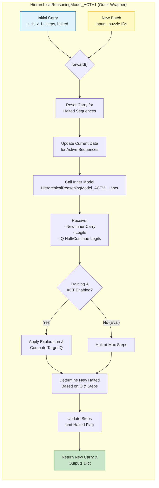
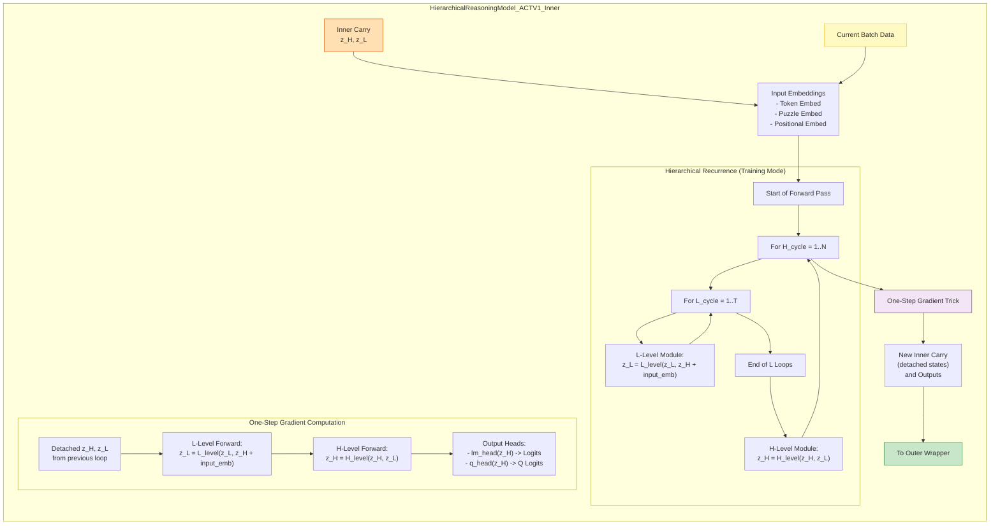
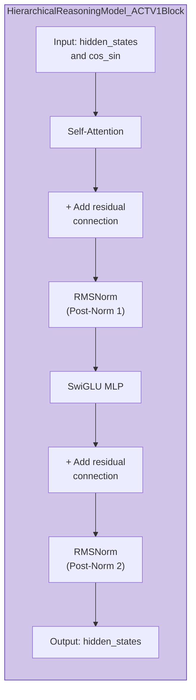

Monte Carlo Tree Search (MCTS) and a Residual Network (ResNet) are tightly coupled in systems like AlphaZero through an iterative self‑improvement loop. The ResNet provides fast, approximate evaluations (policy and value) to guide the MCTS, while the MCTS uses these evaluations to perform a more accurate lookahead, whose results are then used to train the ResNet. This creates a powerful synergy where each component improves the other.

Below, I break down the coupling step by step, starting from the neural network architecture and moving through the MCTS procedure to the training pipeline.

---

## 1. The ResNet Model

In AlphaZero, the neural network takes the current board state (encoded as a set of feature planes, e.g., piece positions, player colour, repetition count) and outputs two heads:

- **Policy head** \( \mathbf{p} \) – a probability vector over all possible moves (including a pass if allowed).
- **Value head** \( v \) – a scalar estimating the expected outcome from the current state, usually in \([-1, 1]\) (win/draw/loss from the current player’s perspective).

The network is typically a deep residual network (ResNet) with many convolutional and residual blocks, making it capable of learning complex patterns from the board.

---

## 2. How MCTS Uses the Network

During self‑play, MCTS builds a search tree incrementally. The network is invoked only when a new leaf node is encountered. The tree is composed of nodes representing states, and edges representing moves.

Each node stores:

- **N(s, a)** – visit count for each action.
- **W(s, a)** – total action‑value (sum of value estimates from simulations that took that action).
- **Q(s, a)** – mean action‑value \( W/N \).
- **P(s, a)** – prior probability of taking action \( a \) in state \( s \), provided by the policy head of the network.

The MCTS algorithm proceeds in four phases per simulation:

### a) Selection
Starting from the root, the algorithm recursively selects the child that maximises an upper confidence bound:

\[
a_t = \underset{a}{\mathrm{argmax}} \left( Q(s,a) + c_{\text{puct}} \, P(s,a) \, \frac{\sqrt{\sum_b N(s,b)}}{1 + N(s,a)} \right)
\]

Here \( c_{\text{puct}} \) is a constant controlling exploration. The formula balances exploitation (\( Q \)) and exploration (prior \( P \) adjusted by visit counts). The prior \( P \) comes directly from the network, so the network’s initial guess heavily influences early search.

### b) Expansion and Evaluation
When the selection reaches a leaf node \( s_L \) that has not been expanded yet (or is not terminal), the neural network is queried:

\[
(\mathbf{p}(s_L), v(s_L)) = f_{\theta}(s_L)
\]

The leaf node is expanded: for each legal move \( a \), a new edge with \( N=0, W=0, Q=0 \) is created, and the prior probability \( P(s_L,a) \) is set to \( p_a \) from the network’s policy output.

The value \( v(s_L) \) is the network’s estimate of the outcome from \( s_L \). This value will be used in the backup phase.

### c) Backup
After expansion, the value \( v \) is propagated back up the path. For each node \( s \) along the path, the statistics for the taken action \( a \) are updated:

\[
N(s,a) \leftarrow N(s,a) + 1
\]
\[
W(s,a) \leftarrow W(s,a) + v
\]
\[
Q(s,a) \leftarrow \frac{W(s,a)}{N(s,a)}
\]

Note that the value \( v \) is negated when backing up to the parent because the value is always from the perspective of the player to move at that node. This is a crucial detail for two‑player zero‑sum games.

### d) Move Selection
After many simulations (e.g., 800 in AlphaZero), the final move at the root is chosen not by the highest \( Q \), but by the visit count \( N(s,a) \). Often a temperature parameter is used to add exploration early in training. This visit distribution becomes the improved policy target for training the network.

---

## 3. How MCTS Outputs Train the Network

The self‑play games are generated by letting MCTS choose moves for both players. The entire game is recorded, and after the game finishes, the outcome \( z \) (e.g., +1 for win, 0 for draw, –1 for loss) is known. For each position \( s_t \) encountered during the game, we have:

- The search policy \( \boldsymbol{\pi}_t \) derived from the MCTS visit counts at that state (e.g., \( \pi(a|s_t) \propto N(s_t,a)^{1/\tau} \) with temperature \( \tau \)).
- The eventual game outcome \( z_t \) (from the perspective of the player to move at \( s_t \)).

These \( (\boldsymbol{\pi}_t, z_t) \) serve as targets for the network. The network is trained to minimise a combined loss:

\[
\mathcal{L} = (z - v)^2 - \boldsymbol{\pi}^\top \log \mathbf{p} + c \, \|\theta\|^2
\]

- **Mean squared error** on the value: make the network’s scalar output \( v \) predict the actual game outcome \( z \).
- **Cross‑entropy loss** on the policy: make the network’s policy \( \mathbf{p} \) match the improved policy \( \boldsymbol{\pi} \) produced by MCTS.
- **L2 regularisation** on the weights.

By training on millions of such positions from self‑play, the network learns to approximate the MCTS results: its policy becomes a compact representation of the search’s recommendations, and its value becomes a better predictor of the game outcome.

---

## 4. The Iterative Bootstrapping

The coupling forms a virtuous cycle:

1. **Network guides search**: The prior probabilities \( P \) from the network focus the search on promising moves, drastically reducing the branching factor.
2. **Search improves network**: The visit counts \( N \) from a deeper lookahead provide a much stronger policy target than raw network output, and the game outcome provides a more accurate value target.
3. **Network learns from search**: The updated network now produces better priors, making subsequent searches even stronger.

This process repeats during training: the network is continuously updated, and the updated network is used in the next generation of self‑play games. Over time, both components co‑evolve to superhuman performance.

---

## 5. Why ResNet Specifically?

Residual networks are particularly effective because they can be very deep without suffering from vanishing gradients, enabling them to learn complex representations of board games. In AlphaZero, the same ResNet processes the board state and outputs both policy and value, sharing most of the computation between the two tasks. This joint training often leads to better feature learning than separate networks.

---

## Summary

- The **ResNet** provides a fast, global view of the position: which moves are promising (policy) and an estimate of the winner (value).
- **MCTS** uses these outputs as priors to build a search tree, balancing exploration and exploitation, and produces a refined policy (visit counts) and a more accurate value (through backup).
- **Training** uses the search results as targets, teaching the network to mimic the improved policy and value, thereby closing the loop.

This elegant coupling is the core idea behind AlphaZero and similar systems, allowing them to learn tabula rasa in complex domains like Go, Chess, and Shogi.

---

Developing a transformer-based model that can beat Stockfish or AlphaZero through self-play is one of the most ambitious goals in AI today. While it's not a trivial weekend project, recent research has made significant strides, and I can provide you with a practical roadmap based on the current state-of-the-art.

The short answer is: **yes, it's possible, but you'll need to choose your approach carefully, as pure transformers have shown mixed results compared to hybrid architectures.** Here’s a detailed breakdown of how you can approach this, drawing from the latest research.

### 🧠 Understanding the Landscape: Transformer vs. ResNet in Board Games

Before diving into code, it's crucial to understand that simply swapping a ResNet for a transformer in an AlphaZero clone isn't a guaranteed win. Researchers have found that the classical transformer architecture doesn't always work better for games like chess, as it wasn't designed for the fast inferences needed during play .

Here are the three primary pathways you can take, each with its own trade-offs.

#### **Path 1: The Hybrid Approach (Most Practical for Self-Play)**
This is likely your best bet for a project aiming to combine the strengths of both worlds and use self-play effectively.

- **The Concept:** Instead of a pure transformer, you create a hybrid network that interleaves convolutional layers (for local pattern recognition, like piece configurations) with transformer blocks (for global planning and long-term dependencies) .
- **Key Examples:**
    - **ResTNet:** Developed for Go, this model alternates residual and transformer blocks. It significantly improved win rates against AlphaZero-based systems and showed a dramatic increase in recognizing complex patterns like "ladders" (from 59% to 80% accuracy) . Its code is available online, providing a great starting point .
    - **AlphaVile:** Another hybrid model from TU Darmstadt that combines convolutional networks for pattern recognition with transformers for long-term planning. Researchers found that adding simple global information (like piece count) to the input significantly boosted playing strength .
- **Why it's promising for your goal:** It retains the pattern-matching prowess of ResNets (crucial for evaluating positions) while leveraging the attention mechanism of transformers to understand the broader strategic context.

#### **Path 2: The Pure Transformer with Massive Supervised Learning**
This approach has yielded the strongest *raw playing* results but deviates from your goal of pure self-play, as it relies on learning from an existing engine.

- **The Concept:** Train a very large transformer model on a massive dataset of positions annotated by a top-tier engine like Stockfish. The model learns to approximate the engine's search-based evaluations without doing any explicit search itself .
- **Key Example:** The DeepMind paper "Grandmaster-Level Chess Without Search" used a 270-million-parameter transformer trained on their **ChessBench** dataset (10 million games annotated by Stockfish 16). Their best model achieved a stunning 2895 Lichess blitz Elo .
- **The Catch:** This is **supervised learning, not self-play.** The model learns to imitate Stockfish, not to discover strategies on its own. To beat AlphaZero, which *does* use self-play, you would likely need to combine this scale of model with a self-play training loop, which is computationally monumental.

#### **Path 3: The Unified World Model (The Cutting Edge)**
This is a fascinating new direction that directly enables a form of self-play within a single transformer.

- **The Concept:** Train a single model to perform two tasks based on a prompt prefix: 1) **Policy mode (ROOK):** Given a position, suggest the best move. 2) **Environment mode (Arbiter):** Given a position and a move, predict the resulting new position and the game outcome (reward) .
- **Key Example:** The **RookWorld-LM** project from LAION. This 124-million parameter GPT-2 model can play a complete game against itself without any external chess engine, by alternating between its policy and environment modes .
- **Why it's exciting:** It creates a **closed-loop self-play system**. You can have the model play games against itself, record the winning trajectories, and then continue training the model on its own successful games, creating a self-improvement cycle entirely within the transformer . This is the closest we have to a "transformer-native" AlphaZero.

### 🗺️ Your Action Plan: A Realistic Roadmap

Given these pathways, here is a step-by-step plan to get started. Be prepared for a significant computational investment.

1.  **Start Small, Scale Up:** Don't aim for Stockfish 16 immediately. Begin by reproducing smaller-scale results.
    - **Get a baseline:** Look at the `chess-transformers` GitHub repository. It contains pre-trained models like CT-E-20 (20M params) that you can pit against lower-strength levels of Fairy Stockfish to understand the performance baselines (~400-900 Elo for these smaller models) .
    - **Explore Hybrids:** Experiment with the **ResTNet** architecture. Its code is available and it has proven effective in Go, making it a strong candidate for chess as well .
    - **Experiment with World Models:** Try to implement a miniature version of **RookWorld-LM**. Its self-play loop is conceptually elegant and could be a great learning project .

2.  **Secure Massive Compute and Data:** To reach a competitive level, you will need serious resources.
    - **Compute:** Training a 270M parameter model, as in the DeepMind paper, requires high-end GPUs (like multiple NVIDIA RTX 4090s or A100s) for weeks . The LAION team used 2x RTX 4090s for their experiments .
    - **Data:** For supervised pre-training, you'll need a huge, high-quality dataset like **ChessBench** . For self-play, you'll need to generate millions of games, which itself is a massive computational task.

3.  **Design for Your Goal: To Beat AlphaZero/Stockfish**
    - **If you want a pure self-play system**, your best bet is to pursue the **hybrid (ResTNet/AlphaVile) or unified world model (RookWorld) paths**. You would implement the AlphaZero training loop (self-play, MCTS, training) but replace the ResNet with your chosen transformer-based or hybrid architecture.
    - **If you want the strongest possible player**, the supervised learning path (imitating Stockfish) is currently the most direct, as demonstrated by the DeepMind paper. However, this creates an engine that is a distillation of Stockfish, not a novel discovery system like AlphaZero .

### 💡 Key Takeaways and Next Steps

Beating top engines is an enormous challenge, but the field is moving fast. Here are your actionable next steps:

- **Don't neglect "feature engineering."** The AlphaVile research showed that providing the network with simple global information (like material count) can dramatically improve performance .
- **Embrace hybrid architectures.** Pure transformers have not yet proven superior to well-designed hybrids for board games .
- **Leverage existing code.** The path to success is almost certainly through building upon the shoulders of giants. Clone the repositories for **ResTNet** , **chess-transformers** , or **RookWorld-LM**  and start experimenting.
- **Manage your expectations.** Even the massive 270M parameter transformer from DeepMind, while grandmaster-level, was trained on Stockfish data. Creating a system that *discovers* how to beat Stockfish from scratch via self-play is a grand challenge that may require even larger models and more innovative architectures.

Given the complexity, which of these pathways—the hybrid ResTNet, the large-scale supervised model, or the unified RookWorld approach—interests you the most? I can provide more specific details on the architecture or training loop for any of them.

---

Yes, the **Hierarchical Reasoning Model (HRM)** proposed in the paper you linked presents a highly innovative architecture that could potentially improve chess model performance, especially in areas where current systems face limitations. The core ideas directly address some fundamental challenges in game-playing AI.

Here is a breakdown of how HRM's mechanisms could benefit a chess engine, followed by considerations for implementation.

### 🧠 How HRM Could Enhance a Chess Model

HRM's design is inspired by the brain's hierarchical and multi-timescale processing. This offers several potential advantages over standard architectures like the ResNet used in AlphaZero or a pure Transformer.

1.  **Deeper, More Flexible Reasoning (Hierarchical Convergence)**
    *   **The Problem:** Standard RNNs and even deep Transformers can suffer from "computational shallow," where the effective depth of reasoning is limited. In chess, this might mean missing deep combinations or strategic plans that require many steps of "what-if" analysis.
    *   **HRM's Solution:** Its two-module structure is key. The **low-level (L) module** can perform rapid, detailed calculations (like local tactical skirmishes). The **high-level (H) module** updates more slowly, maintaining a stable, abstract plan (like king safety or central control). The **hierarchical convergence** process prevents the model from stalling: the H-module periodically "resets" the L-module with a new strategic context, forcing it to perform a fresh, deep sequence of tactical computations. This allows for a much longer and more structured chain of thought within a single forward pass, ideal for chess's deep search trees.

2.  **Efficient Training Without Backpropagation Through Time (BPTT)**
    *   **The Problem:** Training recurrent networks for long sequences (like a 100+ move chess game) with BPTT is computationally expensive and memory-intensive.
    *   **HRM's Solution:** The paper introduces a **one-step gradient approximation**. By leveraging principles from Deep Equilibrium Models, it only needs to backpropagate errors through the final states of each module. This makes training the hierarchical structure on long games feasible and efficient, with a constant memory footprint.

3.  **Adaptive Computation Time (Thinking, Fast and Slow)**
    *   **The Problem:** Traditional engines spend a fixed amount of computation (e.g., nodes per second) on every position, regardless of its complexity. A simple position might be over-analysed, while a critical middlegame position might not get enough.
    *   **HRM's Solution:** The built-in **Adaptive Computation Time (ACT)**, trained with Q-learning, allows the model to decide dynamically how many computational segments to use. It learns to "halt" early on simple positions and "continue" reasoning on complex ones. This could lead to a much more efficient use of inference-time compute, focusing power where it's needed most.

4.  **Potential for Emergent Strategic Understanding**
    *   **The Finding:** The paper shows that, after training, the H-module of HRM develops a much **higher-dimensional representation** (a measure of its representational capacity) than the L-module, mirroring the hierarchy in the brain (Figure 8 in the paper).
    *   **The Implication:** This suggests the H-module is learning to encode complex, abstract features of the task. In chess, this could mean it autonomously develops representations for long-term strategic concepts (e.g., pawn structure weaknesses, piece activity imbalances) while the L-module focuses on concrete tactics. This emergent separation of concerns could make the model's decision-making more robust and interpretable.

### ♟️ How to Integrate HRM into a Chess Engine

Replacing AlphaZero's ResNet with an HRM is a fascinating research direction. Here’s a conceptual blueprint:

1.  **Architecture Design:** The HRM's input network (`f_I`) would process the board state (e.g., the standard 119 or 112 input planes). The output network (`f_O`) would need to produce both a policy head (move probabilities) and a value head (position evaluation), just like in AlphaZero. The core of the model would be the **HRM core** with its H and L modules running for a fixed number of cycles (`N`) and steps per cycle (`T`).

2.  **Integration with MCTS:** This is the most crucial part.
    *   **During MCTS Simulation:** When a leaf node is expanded, you would run the HRM for its full `N x T` steps (or until ACT halts it) to get the prior policy `P` and value `v`. The Q-learning ACT mechanism would be used **only during training** to decide when to stop the forward pass; during tournament play, you'd likely use a fixed, large computation budget for maximum strength.
    *   **Policy Target:** The visit counts `N(s, a)` from the MCTS search would still serve as the improved policy target (`π`) for training, just as in AlphaZero. The HRM's policy head learns to match this search-derived policy.
    *   **Value Target:** The eventual game outcome `z` would be the target for the HRM's value head.

3.  **Training Loop:** The self-play loop would be identical to AlphaZero:
    *   The current HRM guides MCTS to play games.
    *   Positions `s_t`, search policies `π_t`, and game outcomes `z_t` are stored.
    *   The HRM is trained on minibatches of `(s_t, π_t, z_t)` using the combined loss function, with gradients computed efficiently using HRM's one-step approximation.

### ⚠️ Important Caveats and Challenges

*   **This is Untested for Chess:** The paper's impressive results are on Sudoku, mazes, and ARC. Chess is a different beast, with a much larger state space and a need for both tactical precision and deep strategy. HRM's effectiveness for chess is a hypothesis that needs to be tested.
*   **Computational Cost:** While training is efficient, the recurrent nature of HRM means the forward pass for a single position requires `N x T` sequential steps. This could be slower than a single pass through a ResNet, potentially impacting MCTS speed. Careful optimization and parallelism would be needed.
*   **Hyperparameter Tuning:** The number of high-level cycles (`N`) and low-level steps per cycle (`T`) are critical hyperparameters. They would need to be tuned for chess to find the right balance between strategic abstraction and tactical detail. Values that work for a 30x30 maze may not be optimal for an 8x8 chessboard.

In summary, **HRM offers a compelling, brain-inspired alternative** to current architectures. Its hierarchical design is theoretically a great fit for chess's need for structured, multi-level reasoning. While integrating it into a system like AlphaZero is a non-trivial research project, the potential payoff—a model that can learn deeper strategies more efficiently—makes it a very exciting avenue to explore.

Given this analysis, what aspect of integrating HRM with an MCTS framework would you be most interested in exploring further? For example, the design of the input representation, the specifics of the one-step gradient, or how to structure the H and L modules?

---

The **Adaptive Computation Time (ACT)** mechanism in the Hierarchical Reasoning Model (HRM) is a clever way to let the model decide **how much computational effort** to spend on each input, depending on the problem's difficulty. This is inspired by the brain's ability to switch between fast, intuitive thinking ("System 1") and slow, deliberate reasoning ("System 2").

To understand ACT, you first need to grasp the fixed hierarchical structure that defines one **forward pass** (called a **segment** in the paper).

### 🧱 The Fixed Backbone: One Segment = N High‑Level Cycles × T Low‑Level Steps

In HRM, a single forward pass processes the input through a fixed number of steps:

- **T (low‑level steps per cycle):** During one high‑level cycle, the low‑level module (L‑module) updates its hidden state **T times**. These updates are fast, detailed computations (like exploring local tactical variations in chess).
- **N (high‑level cycles):** After every T low‑level steps, the high‑level module (H‑module) updates its own hidden state. This update happens only at the end of each cycle, using the final L‑module state of that cycle. The H‑module operates on a slower timescale, maintaining an abstract, strategic plan.

So one **segment** (one full forward pass) consists of **N × T sequential updates**. The values of **N** and **T** are **fixed hyperparameters** chosen before training (e.g., N=8, T=16). They define the maximum computational depth built into the architecture for a single pass.

But what if a simple puzzle needs only a few steps, while a complex one requires much deeper reasoning? That's where ACT comes in.

### ⏱️ ACT: Deciding How Many Segments to Run

ACT allows the model to perform **multiple consecutive segments** (each segment is a full N×T pass) and then **halt** when it decides the answer is good enough. Think of it as the model being able to say, "I've thought enough, here's my final answer."

Here’s how it works step by step:

#### 1. The Q‑Head and Actions
After each segment `m`, a small neural network head (the **Q‑head**) takes the final high‑level state `z_H` from that segment and predicts two Q‑values:
- **`Q_halt`**: an estimate of the future reward if the model stops now.
- **`Q_continue`**: an estimate if it runs another segment.

The action space is simply {**halt**, **continue**}.

#### 2. The Decision Process
The model follows a policy with exploration:
- There is a **minimum number of segments** `M_min` (randomly chosen between 1 and `M_max` with probability ε, otherwise set to 1). This encourages occasional longer thinking.
- There is a **maximum number of segments** `M_max` (a fixed hyperparameter, e.g., 10).
- The model halts if:
    - It has reached `M_max`, **or**
    - `Q_halt` > `Q_continue` **and** the current segment count `m` is at least `M_min`.
- Otherwise, it continues to another segment.

#### 3. Training with Q‑Learning
This is treated as an episodic **Markov Decision Process (MDP)**:
- **State:** The model's hidden state after segment `m`.
- **Action:** Halt or Continue.
- **Reward:** 0 for "continue". When "halt" is chosen, the reward is **1 if the final prediction (from that segment) is correct, otherwise 0**.
- **Transition:** If "continue", the model runs another segment starting from the current hidden state (but with gradients detached, see below).

The Q‑head is trained to minimize the binary cross‑entropy between its predictions and the **targets** `G` derived from the episode. The targets are computed using the actual outcome (correctness) and future Q‑values, following standard Q‑learning.

#### 4. Deep Supervision and Gradient Detachment
A crucial detail: when the model moves to the next segment, the hidden state is **detached** from the computation graph. This means:
- Gradients from segment `m+1` do **not** flow back into segment `m`.
- This stabilises training and avoids the need for backpropagation through many steps (which would be expensive and prone to vanishing gradients). It also aligns with the one‑step gradient approximation used elsewhere in HRM.

The loss for a segment combines the task loss (e.g., cross‑entropy for the prediction) and the Q‑learning loss:

`L_m = Loss(prediction_m, target) + BinaryCrossEntropy(Q_m, G_m)`

### 📈 Why ACT Matters for a Chess Engine

- **Adaptive reasoning:** In chess, simple endgame positions might need only quick pattern matching, while complex middlegame tactics require deep, iterative search. ACT lets the model **spend more segments** on the latter, without wasting computation on the former.
- **Inference‑time scaling:** After training, you can simply **increase `M_max`** at test time to allow the model to "think longer" and potentially solve harder problems. The paper shows this works: on Sudoku, performance improves as more segments are allowed (Figure 5c in the paper). For a chess engine, you could trade speed for strength by adjusting `M_max`.
- **Emergent strategies:** The Q‑head learns to recognise when the model's representation has stabilised and the answer is likely correct – a form of **metacognition**.

### 🔁 Recap: N, T, and ACT

| Variable | Meaning | Fixed/Dynamic |
|----------|---------|---------------|
| **T** | Number of low‑level steps per high‑level cycle | Fixed hyperparameter |
| **N** | Number of high‑level cycles in one segment | Fixed hyperparameter |
| **One segment** | = N × T sequential updates | Fixed per segment |
| **M** (or number of segments) | How many such segments are executed for a given input | **Dynamically chosen by ACT** (up to `M_max`) |

So **N and T** define the **granularity of reasoning** within a single pass, while **ACT** decides how many passes are needed. Together they create a flexible, brain‑like system that can "think fast and slow."

Would you like to dive deeper into how the Q‑learning targets are computed, or how the one‑step gradient approximation works alongside this adaptive mechanism?

---

Let's dive into the technical details of how the Hierarchical Reasoning Model (HRM) learns. You asked about two of its most innovative components: how the Q-learning targets for the Adaptive Computation Time (ACT) mechanism are computed, and how the one-step gradient approximation works. They are deeply interconnected, forming the core of HRM's efficient training loop.

Here is a detailed breakdown of both.

### 🎯 How the Q-Learning Targets are Computed (ACT)

The ACT mechanism is framed as an episodic **Markov Decision Process (MDP)** . This means the model's thinking process is broken down into segments, and at the end of each segment, it must decide whether to stop ("halt") or keep thinking ("continue"). The Q-head is trained to predict the value of these two actions.

Here is the step-by-step breakdown of how the targets are calculated:

1.  **State and Action:** At segment `m`, the state is the model's current hidden state `zᵐ` . The action space is `{halt, continue}`.
2.  **Reward Function:**
    *   If the action is **"halt"** at segment `m`, the episode ends. The reward is `1` if the model's prediction `ŷᵐ` from that segment is correct, and `0` otherwise .
    *   If the action is **"continue"**, the immediate reward is `0`, and the episode transitions to the next segment's state `zᵐ⁺¹` .
3.  **Target Calculation (`G`):** The targets are the "true" values that the Q-head's predictions (`Q̂`) are trained to match. They are defined as follows :

    ```text
    Ĝᵐ_halt = 1{ŷᵐ == y}  (The reward for stopping now)

    Ĝᵐ_continue = 
        - Q̂ᵐ⁺¹_halt , if m ≥ N_max
        - max(Q̂ᵐ⁺¹_halt, Q̂ᵐ⁺¹_continue) , otherwise
    ```
    *   For the **"halt"** action, the target is simply the reward received: `1` for a correct answer, `0` for an incorrect one.
    *   For the **"continue"** action, the target is the maximum estimated future value from the next state (`zᵐ⁺¹`). This is classic Q-learning bootstrapping. The only exception is at the maximum segment length (`N_max`), where "continue" is no longer an option, so its target becomes the halt value of the next state.
4.  **Loss Function:** The loss for each segment combines the task loss (e.g., cross-entropy for the prediction) with the Q-learning loss :

    `Lᵐ_ACT = Loss(ŷᵐ, y) + BinaryCrossEntropy(Q̂ᵐ, Ĝᵐ)`

This setup allows the model to learn an optimal stopping policy, balancing the cost of extra computation against the benefit of a more accurate answer .

### 📐 The One-Step Gradient Approximation

Training a deep, recurrent model like HRM with standard Backpropagation Through Time (BPTT) would be incredibly memory-intensive. BPTT requires storing all intermediate states, leading to an `O(T)` memory cost, where `T` is the total number of recurrent steps. HRM's one-step gradient approximation solves this, reducing memory to a constant `O(1)` .

Here is the intuition and the math behind it, broken down:

| Feature | Standard BPTT | HRM's One-Step Gradient Approximation |
| :--- | :--- | :--- |
| **Memory Cost** | `O(T)` – Stores all intermediate states. | `O(1)` – Only needs the final state. |
| **Gradient Path** | Through every single time step. | Only through the final transition of each module. |
| **Feasibility for Long Sequences** | Becomes impossible for very long sequences. | Remains constant, enabling very deep reasoning.  |

The approximation is grounded in the theory of Deep Equilibrium Models (DEQ) and the Implicit Function Theorem (IFT) . The core idea is to treat the recurrent modules as if they converge to a **fixed point**.

1.  **The Fixed-Point Perspective:** Imagine an idealized HRM where, during a high-level cycle, the L-module runs until its state `zˡ` converges to a fixed point `zˡ*`. This fixed point depends on the current high-level state `zʰ`. The H-module then performs a single update using this converged state: `zʰ* = fH(zʰ, zˡ*)` .

2.  **Applying the Implicit Function Theorem (IFT):** At this fixed point, the IFT provides a way to compute the exact gradient of the final output with respect to the parameters (`θ`) without unrolling any steps. It involves the Jacobian `J_ F` of the overall mapping `F` :

    `∂zʰ* / ∂θ = (I - J_ F | zʰ*)⁻¹ * (∂F / ∂θ | zʰ*)`

    The term `(I - J_ F)⁻¹` is problematic because it requires inverting a potentially huge matrix, which is computationally prohibitive.

3.  **The Approximation via Neumann Series:** The inverse can be expanded as an infinite series: `(I - J_ F)⁻¹ = I + J_ F + J_ F² + J_ F³ + ...` .

    The **one-step gradient approximation** is simply to truncate this series after the very first term, `I` . This means we ignore all higher-order terms and assume `(I - J_ F)⁻¹ ≈ I`.

4.  **The Resulting "Myopic" Gradient:** This yields a much simpler, approximate gradient that only flows through the **final application** of each module. For example, the gradient for the H-module's parameters becomes `∂zʰ* / ∂θ_H ≈ ∂fH / ∂θ_H`. It completely ignores the iterative process that led to `zˡ*` . On its own, this seems far too simple.

### 🔄 The Brilliant Interplay: How They Work Together

This is where the magic happens. The one-step gradient is "myopic"—it can't assign credit for errors that occurred many steps earlier in the reasoning process . This is exactly where the **deep supervision loop** (the "M-loop") comes to the rescue.

1.  **The M-Loop and State Detachment:** As you recall from the ACT explanation, the model processes an example over multiple segments `m = 1...M`. Crucially, after each segment, the final hidden state `zᵐ` is **detached** from the computation graph before being used as the starting state for the next segment `zᵐ⁺¹` .
2.  **"Burying" and "Resurrecting" Errors:** This detachment means that during the backward pass for segment `m`, gradients stop at `zᵐ` and do not flow into the previous segment `m-1`. However, the *information* from any error made in segment `m-1` is still present in the detached state `zᵐ`.
3.  **The Cycle of Correction:** In the next forward pass (segment `m`), the model starts from this potentially flawed state `zᵐ`. When it tries to make a new prediction `ŷᵐ`, the error is now part of the current computation. The **one-step gradient** for segment `m` can then see this error and update the parameters that produced it, effectively correcting the flawed logic that originated in segment `m-1` .

Think of it like editing a document. You write a paragraph (segment 1). You detach and review it. If you find a mistake, you don't rewrite the entire history; you correct the sentence right there. In the next round of edits (segment 2), you might restructure the paragraph, and any remaining issues are fixed at that stage.

This interplay allows the model to learn from very long, complex chains of reasoning without ever needing the memory-prohibitive full BPTT. The one-step gradient provides the local update, and the deep supervision loop ensures that errors are eventually brought forward to a place where they can be corrected . It's a remarkably elegant and efficient solution.

To see how this translates into practice, you can look at the official HRM repository . The configuration files (like `config/arch/hrm_v1.yaml`) show the hyperparameters for the ACT mechanism (e.g., `halt_max_steps`, `halt_exploration_prob`) , and the core logic is implemented in models like `hrm_act_v1.py` .

Does this detailed breakdown of the target calculation and the gradient approximation clarify how HRM is trained? Would you be interested in the specific pseudo-code for the training loop that combines these elements?

---
---

Based on the code from the HRM repository you provided, I can create a detailed architectural diagram. The code reveals a well-structured implementation that closely follows the paper's concepts.

Here is a detailed Mermaid diagram of the `HierarchicalReasoningModel_ACTV1` architecture, with a separate zoomed-in view of its core building block.

### 🧩 Main Architecture: HierarchicalReasoningModel_ACTV1

This diagram shows the top-level wrapper and its interaction with the inner model, highlighting the Adaptive Computation Time (ACT) logic and the hierarchical recurrence.



### ⚙️ Core Computation: HierarchicalReasoningModel_ACTV1_Inner

This is the engine that performs the hierarchical recurrence and the one-step gradient trick.



### 🧱 Reusable Building Block: HierarchicalReasoningModel_ACTV1Block

Both the High-Level (H) and Low-Level (L) modules are composed of multiple identical blocks. Here is the structure of one block, which uses a **Post-Norm** architecture.



### 🔄 Data Structures for State Management

The code uses dataclasses to manage the state through the recurrence and ACT. Understanding these is key to following the data flow.

*   **`HierarchicalReasoningModel_ACTV1InnerCarry`**
    *   **Purpose:** Holds the actual hidden states for the H and L modules.
    *   **Contents:**
        *   `z_H`: `[batch, seq_len, hidden_size]` - High-level state.
        *   `z_L`: `[batch, seq_len, hidden_size]` - Low-level state.

*   **`HierarchicalReasoningModel_ACTV1Carry`** (The Outer Carry)
    *   **Purpose:** Wraps the inner carry and adds ACT control signals.
    *   **Contents:**
        *   `inner_carry`: An instance of the `InnerCarry` above.
        *   `steps`: `[batch]` - How many segments have been executed for each item.
        *   `halted`: `[batch]` - Boolean mask indicating which sequences have halted.
        *   `current_data`: A dictionary holding the input data for the sequences that are still active.

### 🔑 Key Implementation Insights from the Code

1.  **Explicit One-Step Gradient**: The training forward pass in `HierarchicalReasoningModel_ACTV1_Inner.forward()` first runs the full hierarchical recurrence with `torch.no_grad()` to reach a stable state. It then runs a **single final step** of the H and L modules that is tracked by autograd. This is the concrete implementation of the "one-step gradient approximation" from the paper.
2.  **ACT Q-Learning**: The outer wrapper implements the Q-learning logic for halting. It uses the current Q-values for exploration and computes **target Q-values by running the inner model one more step forward** (without retaining gradients for the target), effectively performing a one-step bootstrap. This matches the paper's description of using the next state's Q-values.
3.  **State Reset**: The `reset_carry` function is crucial. It re-initializes the hidden states (`z_H`, `z_L`) for sequences that have just halted, using learned initial buffers `H_init` and `L_init`. This prepares the state for the next sample in the batch.
4.  **Post-Norm Architecture**: The `HRMBlock` uses a **post-normalization** scheme (residual → add → norm), which differs from the pre-norm commonly used in many modern Transformers. This is noted in the paper as part of their stable design.

This architecture elegantly separates the concerns of the core hierarchical reasoning (`Inner` model) from the adaptive control logic (`ACTV1` wrapper). The building blocks are standard Transformer components but arranged with post-norm and specific state management to enable the novel training algorithm.

Would you like me to elaborate on any specific part, such as the exact tensor dimension flow through the hierarchical loops or the details of the Q-target computation?

---
---

The Q-target computation in the HRM's Adaptive Computation Time (ACT) mechanism is a clever implementation of Q‑learning that enables the model to learn when to stop reasoning. Let’s break it down step by step, referring directly to the code you provided.

### 🧠 Context: Why Q‑targets?

In ACT, after each processing **segment** (a full forward pass through the hierarchical layers), a small neural network head (the **Q‑head**) outputs two logits: one for the action **“halt”** and one for **“continue”** . These logits are passed through a sigmoid to produce probabilities (because we use binary cross‑entropy loss). The model then decides whether to stop or to run another segment.

To train the Q‑head, we need **target values** that represent the “true” expected return for each action. For the “halt” action, the target is simply the reward received when stopping: `1` if the final prediction was correct, `0` otherwise. For the “continue” action, the target is more interesting: it should be an estimate of the **best future value** the model can achieve by continuing to think.

### 🔍 The Code that Computes the Q‑target

The relevant code is inside `HierarchicalReasoningModel_ACTV1.forward()` (I’ve annotated it for clarity):

```python
with torch.no_grad():
    new_steps = new_steps + 1
    is_last_step = new_steps >= self.config.halt_max_steps
    halted = is_last_step

    # Only in training with ACT enabled
    if self.training and (self.config.halt_max_steps > 1):
        # ... (exploration logic, not directly related to target computation) ...

        # -------------------------------------------------------------
        # Compute target Q for the "continue" action
        # -------------------------------------------------------------
        # Run the inner model one more step to get the next state's Q-values
        next_q_halt_logits, next_q_continue_logits = self.inner(new_inner_carry, new_current_data)[-1]

        # Build the target for "continue" using the next state's values
        outputs["target_q_continue"] = torch.sigmoid(
            torch.where(
                is_last_step,
                next_q_halt_logits,                     # If we are at the max step, the only future action is "halt"
                torch.maximum(next_q_halt_logits, next_q_continue_logits)   # Otherwise, take the max over both actions
            )
        )
```

### 🧮 Step‑by‑Step Explanation

1. **We have just finished a segment** and have the current Q‑head outputs (`q_halt_logits`, `q_continue_logits`) for this segment.
2. **We want a target for the “continue” action** that was available at the *beginning* of this segment. That target is the value of the **next state** (the state we reach after executing “continue”).
3. **We obtain the next state’s Q‑values** by calling `self.inner` again with the updated carry (`new_inner_carry`) and the same batch data. This gives us `next_q_halt_logits` and `next_q_continue_logits`.
   - Note: This call is inside `torch.no_grad()` so it does not contribute to gradients. It’s just a forward pass to get the next Q‑values.
4. **We compute the target for “continue”** using the standard Q‑learning bootstrap:
   - If we have already reached the **maximum allowed segments** (`is_last_step == True`), then after taking “continue” we would be forced to halt at the next step. Therefore the value of continuing is simply the value of halting in that next state: `next_q_halt_logits`.
   - Otherwise, the value of continuing is the **maximum** of the two possible actions in the next state: `max(next_q_halt_logits, next_q_continue_logits)`. This follows the Bellman optimality equation for the value of a state under an optimal policy.
5. **The logits are passed through a sigmoid** to turn them into probabilities in [0,1]. This matches the binary cross‑entropy loss that will be applied later.

### 🎯 Why This Works (and why no target network is used)

- **No replay buffer, no separate target network** – The code comment cites the **PQN (Parallel Q‑learning)** idea: with a large batch size, each element in the batch acts as an independent environment. The next‑state Q‑values are computed using the **current** network, which can lead to instability in standard Q‑learning, but because the batch is large and the updates are frequent, the authors found it stable enough (as argued in the paper, with additional stabilizing factors like RMSNorm and weight decay).

- **The “halt” target is not computed here** – It will be computed later when we know whether the prediction from this segment was correct. In the loss function (not shown in the snippet), the binary cross‑entropy for the halt action uses the actual reward (1/0) as the target.

- **Exploration is handled separately** – The code also includes a random “minimum halt steps” to encourage exploration, but that is independent of the target computation.

### 📈 Putting It All Together: The Q‑Learning Loss

For each segment, the overall loss is:

```
L_segment = Loss(ŷ, y) + BinaryCrossEntropy(σ(q_halt_logits), reward) + BinaryCrossEntropy(σ(q_continue_logits), target_q_continue)
```

where:
- `reward` is 1 if the prediction ŷ from this segment is correct, else 0.
- `target_q_continue` is computed as described above.
- `σ` is the sigmoid function.

This loss trains the Q‑head to predict both the immediate correctness (for halt) and the future value of continuing. Over time, the Q‑head learns to halt when the current prediction is already good **and** continuing is unlikely to improve it further.

### 🔁 Connection to the Paper’s “Deep Supervision”

The ACT mechanism is tightly integrated with the **deep supervision** loop: each segment produces its own prediction and its own Q‑targets. The hidden states are **detached** between segments, so gradients from later segments do not propagate into earlier ones. This is exactly the “one‑step approximation” that makes training efficient and stable, and it aligns with the Q‑target computation that only looks one step ahead.

I hope this clarifies exactly how the Q‑targets are derived from the code. If you’d like to see how the loss is actually assembled (the part that uses these targets), I can walk you through the training loop as well.

---
---

Yes, leveraging Stockfish output for initial training followed by reinforcement learning (RL) fine-tuning is a highly effective and proven strategy to build a strong chess AI. This approach combines the best of both worlds: the immediate, high-quality signal from an existing superhuman engine for rapid convergence, and the ability of RL to discover novel strategies and potentially surpass the teacher .

Here is a detailed, actionable pipeline based on current research and implementations.

### 🏗️ A Three-Phase Training Pipeline

The process can be broken down into three main phases: Supervised Warm-Start, a Bridging Phase (optional but recommended), and Reinforcement Learning Fine-Tuning.

```mermaid
flowchart TD
    A[Start: Initialize Random Model] --> B[Phase 1: Supervised Warm-Start<br/>Train on Stockfish Data]

    B --> C[Phase 2: Bridging (Optional)<br/>Imitation Learning or<br/>Contrastive Learning on<br/>Richer Stockfish Data]

    C --> D[Phase 3: RL Fine-Tuning<br/>Self-Play with MCTS<br/> using HRM-like ACT]

    D --> E{Performance<br/>Plateaus?}
    E -- No --> D
    E -- Yes --> F[Final Strong Model]
```

### 📚 Phase 1: Supervised Warm-Start with Stockfish

This phase is about teaching your model the fundamentals from an expert. The goal is to quickly achieve a strong baseline performance.

*   **Objective:** Train your HRM-based model to imitate Stockfish's evaluations and move choices .
*   **Data is Key:** You need high-quality, large-scale data. Excellent resources exist:
    *   **ChessBench:** A dataset from Google DeepMind containing 10 million games annotated by Stockfish 16, with **15 billion data points** including state-values, action-values for every legal move, and best moves . This is the gold standard.
    *   **Strategic Chess Dataset (Hugging Face):** Over 700,000 positions with **Multi-PV** information (top 3 moves) and a subset refined by RL, providing richer strategic context than just the single best move .
*   **Training Targets:** Your HRM model can be trained to predict multiple targets simultaneously:
    *   **Behavioral Cloning:** Directly predict the best move (`a_SF`) from Stockfish .
    *   **Value Prediction:** Predict the discretized win-probability (`V_SF(s)`) of a position, using techniques like binning .
    *   **Action-Value Prediction:** Predict the value `Q_SF(s, a)` for all legal moves. This is more informative and helps the model understand *why* a move is good, not just *which* move is best .
*   **Expected Outcome:** After this phase, a sufficiently large model (e.g., 270M parameters) can achieve a Lichess blitz Elo of **~2895** against humans **without any explicit search**, simply by picking the highest-valued move . This serves as your powerful starting point.

### 🧪 Phase 2: Bridging (Optional but Recommended)

The pure supervised model is an approximation of Stockfish . This phase helps the model develop its own internal representations before self-play.

*   **Contrastive Learning Approach:** Train an encoder to create an embedding space where positions with similar Stockfish evaluations are close together, and those with different evaluations are far apart. You can then define an "advantage axis" between clusters of winning and losing positions. At test time, a simple beam search can navigate this space by picking moves that lead to embeddings most similar to the advantage direction, achieving **2593 Elo** with minimal search .
*   **Multi-PV Training:** Use datasets like the "Strategic Chess Dataset" which provide the top 3 moves from Stockfish . Instead of just learning the single best move, your model learns a distribution over strong moves and their relative values. This builds a more nuanced understanding of a position's possibilities.

### 🎮 Phase 3: Reinforcement Learning Fine-Tuning

This is where your model can surpass its teacher by learning from its own experience. You will integrate your HRM architecture into a self-play loop.

*   **Framework:** Use an AlphaZero-style "Expert Iteration" loop.
    1.  **Self-Play:** The current best model (initialized from Phase 1) plays games against itself. Crucially, it uses **Monte Carlo Tree Search (MCTS)** to explore and select moves . The search is guided by the model's own policy and value predictions.
    2.  **Data Generation:** For each move in a self-play game, you store:
        *   The board state `s`.
        *   The search policy `π` (e.g., the visit distribution from MCTS), which is a much stronger policy target than raw model output.
        *   The eventual game outcome `z` (e.g., +1 for win, 0 for draw, -1 for loss).
    3.  **Training:** Train your HRM on mini-batches of `(s, π, z)` to minimize a combined loss:
        *   **Policy Loss:** Make the model's policy head `p` match the improved search policy `π`.
        *   **Value Loss:** Make the model's value head `v` predict the actual game outcome `z`.
*   **Integrating HRM's ACT:** Your HRM's Adaptive Computation Time (ACT) mechanism can be elegantly integrated into the MCTS or the model's forward pass.
    *   **During MCTS:** When the model is queried for a policy and value at a leaf node, the ACT mechanism could allow it to spend more internal "thinking segments" on complex positions before returning an evaluation, effectively performing a form of **adaptive, internal search** before the external MCTS even begins.
    *   **During Play:** The ACT mechanism could be used to dynamically adjust the number of MCTS simulations based on the predicted complexity of the position, similar to how the CMU project "Allie" varies its search budget based on predicted human pondering time .
*   **Expected Outcome:** This RL fine-tuning allows the model to correct its own blind spots, discover novel strategies not present in the Stockfish data, and potentially exceed the performance of the original teacher model. The HRM's architecture is designed to make this recurrent, deep reasoning process stable and efficient .

### ✨ Key Considerations for Your HRM Model

*   **Input Representation:** You can use standard 8x8x119 planes (piece positions, castling rights, etc.). For efficiency, especially if you plan to integrate search, consider using a **HalfKP sparse encoding** popularized by NNUE (Efficiently Updatable Neural Networks) .
*   **Output Heads:** Your HRM will need at least a policy head (for move probabilities) and a value head (for position evaluation). You can also add auxiliary heads, like predicting the opponent's move or the pondering time .
*   **Evaluation:** Continuously evaluate your model against fixed benchmarks: puzzle solve rates , performance on a held-out test set, and eventually against other engines .

This combined approach leverages the efficiency of supervised learning to achieve a strong baseline, and then uses the exploratory power of reinforcement learning to push beyond it. The HRM's hierarchical, adaptive architecture is well-suited to handle the deep reasoning required in both phases.

Would you like to delve deeper into the specific loss functions for the RL phase, or how to implement the MCTS integration with your HRM's ACT mechanism?

---
---

We’ll design a comprehensive implementation plan for building a chess AI using the Hierarchical Reasoning Model (HRM) with Adaptive Computation Time (ACT). The plan is divided into three phases: supervised warm‑start with Stockfish, an optional bridging phase, and reinforcement learning fine‑tuning. Each phase includes data preparation, model architecture specifics, training loops, and evaluation.

---

## 📋 Overall Pipeline

```mermaid
flowchart TD
    subgraph Phase1[Phase 1: Supervised Warm-Start]
        A1[Collect Stockfish-annotated data] --> A2[Prepare board/move/value targets]
        A2 --> A3[Train HRM-ACT with policy & value heads]
        A3 --> A4[Evaluate: accuracy, Elo vs. baselines]
    end

    subgraph Phase2[Phase 2: Bridging (Optional)]
        B1[Contrastive learning or multi-PV fine-tuning] --> B2[Improve representation]
    end

    subgraph Phase3[Phase 3: RL Fine-Tuning]
        C1[Self-play with MCTS] --> C2[Store (state, search policy π, outcome z)]
        C2 --> C3[Train HRM on (π, z) with one-step gradient]
        C3 --> C4[Update ACT Q-head via bootstrapped targets]
        C4 --> C1
    end

    Phase1 --> Phase2 --> Phase3
```

---

## 🔷 Phase 1: Supervised Warm-Start with Stockfish

### 1.1 Data Acquisition
- **Primary source:** [ChessBench](https://github.com/facebookresearch/chessbench) by DeepMind – 10 million games annotated by Stockfish 16, providing:
  - Board states (FEN)
  - Best move
  - Win/draw/loss probabilities (value)
  - Q-values for every legal move (optional)
- **Alternative:** [Strategic Chess Dataset](https://huggingface.co/datasets/eward/strategic-chess) on HuggingFace – 700k positions with multi-PV (top 3 moves) and RL-refined subset.

### 1.2 Data Preparation
- **Board encoding:** Standard 8×8×119 planes used in AlphaZero (piece positions, castling rights, repetition count, etc.). You can also adopt a more efficient HalfKP encoding if you plan to integrate search later.
- **Move encoding:** Encode moves as indices (e.g., 4096 possible moves in chess). For efficiency, use a flat move index.
- **Value target:**
  - Discretize win probability into bins (e.g., 3 bins: win/draw/loss, or 30 bins for finer granularity).
  - Alternatively, use a scalar in [-1,1] and train with MSE.
- **Action‑value targets (optional):** For each legal move, use the Q-value from Stockfish to train an auxiliary head.

### 1.3 Model Architecture (HRM-ACT)
Based on the [HRM repository](https://github.com/sapientinc/HRM), adapt the `HierarchicalReasoningModel_ACTV1` for chess:

```python
config = {
    "batch_size": 256,
    "seq_len": 64,                # board representation flattened length
    "vocab_size": 4096,           # move vocabulary
    "puzzle_emb_ndim": 0,         # not needed for chess
    "H_cycles": 8,                 # number of high-level cycles (N)
    "L_cycles": 16,                # low-level steps per cycle (T)
    "H_layers": 4,                 # number of transformer blocks in H module
    "L_layers": 4,                 # number of transformer blocks in L module
    "hidden_size": 512,
    "expansion": 4,                 # SwiGLU expansion factor
    "num_heads": 8,
    "pos_encodings": "rope",
    "halt_max_steps": 10,           # ACT maximum segments
    "halt_exploration_prob": 0.1,   # exploration during training
    "forward_dtype": "bfloat16",
}
```
- **Heads:**
  - Policy head: linear layer from final H-state to `vocab_size`.
  - Value head: linear layer from final H-state to 1 (scalar) or to bin count.
  - Q-head (for ACT): as in original code, outputs two logits (halt/continue).

### 1.4 Training Loop
- **Loss functions:**
  - Policy: cross‑entropy between predicted policy and Stockfish best move (or distribution over top moves if multi‑PV).
  - Value: MSE between predicted value and Stockfish win probability (or cross‑entropy for bins).
  - Q‑head (optional in Phase 1, but can be trained using the halt reward from correctness).
- **Optimizer:** AdamW with learning rate 3e‑4, cosine decay, warmup 10k steps.
- **Batch size:** As large as GPU memory allows (e.g., 1024 with gradient accumulation).
- **Compute:** Training a 512‑hidden‑size model with 4+4 layers and N=8, T=16 on 10M positions may require several days on 8× A100s. You can scale down for prototyping.

### 1.5 Evaluation
- **Move prediction accuracy** on held‑out test set.
- **Puzzle solving rate** (e.g., from Lichess puzzles).
- **Play vs. baseline engines** (e.g., Stockfish at low depth, or smaller models) to get a rough Elo estimate.

---

## 🔶 Phase 2: Bridging (Optional)

To improve representation quality before RL, consider:

- **Contrastive learning:** Train an encoder (the HRM without heads) so that positions with similar Stockfish evaluations are close in embedding space. Use an InfoNCE loss with positions sampled from games. Then at test time, use a simple search (like beam search over the advantage direction) – this can yield strong results without expensive MCTS .
- **Multi‑PV fine‑tuning:** Use datasets with top 3 moves. Train policy head to predict a softmax over these moves (with temperature based on Q‑values). This teaches the model relative move strengths.

---

## 🔷 Phase 3: Reinforcement Learning Fine‑Tuning

### 3.1 MCTS Integration
We need to plug the HRM into an AlphaZero‑style search. The model provides:
- **Prior policy** \(P(s, a)\) from the policy head.
- **Value estimate** \(V(s)\) from the value head.

During MCTS, each simulation:
1. **Selection:** Traverse tree using PUCT formula:
   \[
   a = \arg\max_a \left( Q(s,a) + c_{\text{puct}} \, P(s,a) \frac{\sqrt{\sum_b N(s,b)}}{1 + N(s,a)} \right)
   \]
2. **Expansion & evaluation:** At leaf, run HRM forward (with ACT enabled) to get \(P\) and \(V\). The ACT may run multiple segments until halt, providing an adaptive internal computation budget.
3. **Backup:** Update node statistics with \(V\) (negated for opponent).

### 3.2 Self‑Play Loop
- Play games using MCTS (e.g., 800 simulations per move). Store for each move:
  - Board state \(s_t\) (encoded as input planes).
  - Search policy \(\pi_t\) (visit counts normalized, optionally with temperature).
  - Game outcome \(z_t\) (from current player’s perspective: +1, 0, -1).
- Games are played in parallel across many CPU/GPU workers. Use batched model inference for efficiency.

### 3.3 Training on Self‑Play Data
- Sample minibatches of \((s, \pi, z)\) from a replay buffer (or just use latest games).
- Forward pass through HRM:
  - Run the hierarchical recurrence **without gradients** to reach the pre‑halt state (as in the paper’s “training mode”).
  - Then perform a **final step with gradients** to get predictions \((\hat{p}, \hat{v})\).
  - Also obtain Q‑logits for the current segment.
- **Losses:**
  - Policy: cross‑entropy \(-\pi^T \log \hat{p}\).
  - Value: MSE \((z - \hat{v})^2\).
  - Q‑head: binary cross‑entropy for halt/continue, using **targets computed as in the ACT code** (one‑step bootstrapping).
- Apply **one‑step gradient approximation** – only the last step of the recurrence contributes gradients. This is already implemented in `hrm_act_v1.py` via the `with torch.no_grad()` block followed by the final tracked step.

### 3.4 Adaptive Computation Time (ACT) in RL
- During self‑play inference, ACT is used to determine when to halt the internal reasoning within a single model call. The Q‑head’s halt/continue decisions are based on the current hidden state.
- The Q‑head is trained using the same bootstrapping mechanism described earlier, with the reward being whether the final prediction (from that segment) would lead to a win if chosen as the move. However, in MCTS we don’t use the immediate prediction; we use the search policy. Therefore, a simpler approach is to set the reward to 1 if the final visited node (after search) leads to a win, else 0 – but this is delayed. The paper’s approach directly uses the prediction correctness as reward for halting. For chess, you could define the reward as **1 if the move chosen by the model (without search) would be optimal according to Stockfish** – but that requires an oracle. Instead, it’s acceptable to train the Q‑head purely on the outcome of the segment’s prediction, even if that prediction is not directly used in action selection. This encourages the model to settle on a stable evaluation faster.

Alternatively, you can disable ACT during the RL phase and use a fixed number of steps (e.g., always run all segments). The adaptive mechanism can be re‑enabled later for efficient inference.

### 3.5 Parallelization and Scalability
- Use a distributed setup: many self‑play workers generate games, sending trajectories to a central replay buffer.
- The training process samples from the buffer and updates the model periodically.
- Use mixed precision (bfloat16) and gradient accumulation to handle large batch sizes.

### 3.6 Evaluation During RL
- Regularly pause self‑play to evaluate the current model against a fixed set of opponents (e.g., previous checkpoints, Stockfish at low depth).
- Track Elo progression.

---

## 🛠️ Implementation Details & Code Structure

### Directory Layout
```
chess-hrm/
├── config/               # yaml configs for model, training, etc.
├── data/                 # dataset loaders, board encoding
├── models/
│   ├── hrm/              # adapted from HRM repo
│   │   ├── hrm_act_v1.py
│   │   ├── layers.py
│   │   └── common.py
│   └── heads.py          # policy, value, q-head
├── mcts/                 # MCTS implementation with batched inference
├── self_play/            # distributed self-play workers
├── train/
│   ├── supervised.py     # Phase 1 trainer
│   ├── rl_trainer.py     # Phase 3 trainer
│   └── buffer.py         # replay buffer
└── utils/                # logging, checkpointing, evaluation
```

### Key Modifications to HRM Code
- Replace `puzzle_emb` with optional position encoding for chess (maybe not needed if using standard planes).
- Ensure the input sequence length matches the flattened board representation (e.g., 64 squares × 119 planes = 7616 – but we treat this as a 1D sequence of features; better to use a convolutional front‑end to reduce dimension before feeding to HRM). The HRM expects a sequence of tokens; you can use a convolutional encoder to map the board planes to a sequence of embeddings (e.g., treat each square as a token, or each file/rank group). Simpler: flatten planes into a vector per square and use a linear projection to `hidden_size`, producing a sequence of 64 tokens.

- **ACT integration:** The Q‑head and halting logic are already present; you need to decide whether to use ACT during training and inference. During RL, you can either keep ACT enabled (allowing the model to adapt computation) or fix the number of segments for simplicity.

### Hyperparameter Tuning
- Start with small `hidden_size` (256) and fewer cycles (N=4, T=8) for prototyping.
- Scale up as compute allows.

---

## ⚠️ Potential Challenges & Mitigations

| Challenge | Mitigation |
|-----------|------------|
| **Slow training due to recurrence** | Use the one‑step gradient trick; ensure that the main forward pass (with `no_grad`) is fast. Profile and optimize. |
| **Stability of Q‑learning in ACT** | As noted in the paper, use RMSNorm, weight decay, and a large batch size. The PQN‑style bootstrap with current network works if batch size is large (≥256). |
| **MCTS integration complexity** | Start with a simple MCTS that does not use ACT; later incorporate ACT to adjust the model’s internal compute. Use existing libraries like `python-chess` for move generation. |
| **Compute resources** | For a full‑scale run, you need at least 8× A100 (80GB) GPUs. For experimentation, reduce model size and dataset. |
| **Overfitting to Stockfish** | The RL phase should help generalize beyond the teacher. Use a large and diverse set of self‑play games. |

---

## 📈 Evaluation Metrics

- **Lichess blitz Elo** by playing against other bots (e.g., using the [Lichess API](https://lichess.org/api) or [Berserk](https://github.com/rauenzi/berserk)).
- **Puzzle solving rate** on a standard test set (e.g., Lichess puzzles).
- **Strength vs. Stockfish** at various depths (e.g., depth 1, 5, 10) to measure improvement.

---

## 📅 Timeline (Estimates)

- **Phase 1 (Supervised):** 2‑4 weeks for data prep, model design, training (depending on compute).
- **Phase 2 (Bridging):** 1‑2 weeks (optional).
- **Phase 3 (RL fine‑tuning):** 4‑8 weeks to see significant improvement.

---

This plan provides a concrete path from supervised initialization to RL improvement, leveraging the unique strengths of the HRM architecture. You can adjust the scale based on available resources. If you need further details on any specific component (e.g., implementing the MCTS with ACT, or the exact loss for the Q‑head), let me know!

---
---

Your Deepseek plan is already quite comprehensive, but after reviewing the other agents' plans, I see opportunities to strengthen it by incorporating specific implementation details, clarifying certain technical aspects, and addressing potential gaps. Below is an improved version of your plan, followed by separate critiques of the other three plans (ChatGPT, Claude, and Gemini).

---

## 🔧 Improved Deepseek Plan (HRM‑based Chess AI)

### Enhancements Made

- **Board Encoding:** Added 2D positional encodings (row+col) as in Claude’s plan to better capture spatial structure.
- **Soft Label Generation:** Included multipv distillation from Stockfish, similar to Claude’s approach, to improve policy learning.
- **ACT Integration in MCTS:** Clarified how the ACT mechanism can be used during self‑play to adapt internal computation per node.
- **Evaluation Metrics:** Added concrete Elo estimation via matches against Stockfish, puzzle solving rates, and policy agreement.
- **Distributed Training:** Incorporated ChatGPT’s suggestions for parallel self‑play and a replay buffer.
- **Optional Bridging Phase:** Kept it optional but suggested contrastive learning as a way to improve representations without full RL.

The improved plan remains structured in three main phases but now includes more actionable details.

---

### 📋 Improved Pipeline

```mermaid
flowchart TD
    subgraph Phase1[Phase 1: Supervised Warm‑Start]
        A1[Generate Stockfish‑annotated data<br/>with MultiPV=5‑10] --> A2[Encode board: 8×8×119 + 2D pos]
        A2 --> A3[Train HRM‑ACT with policy & value heads<br/>using soft labels from multipv]
        A3 --> A4[Evaluate: move accuracy, puzzle solve rate]
    end

    subgraph Phase2[Phase 2: Bridging (Optional)]
        B1[Contrastive learning on Stockfish eval space] --> B2[Improve representation for MCTS]
    end

    subgraph Phase3[Phase 3: RL Fine‑Tuning]
        C1[Parallel self‑play with MCTS<br/>ACT used to adapt internal compute] --> C2[Store (state, search policy π, outcome z)]
        C2 --> C3[Train HRM on (π, z) with one‑step gradient<br/>Update ACT Q‑head via bootstrapped targets]
        C3 --> C4[Periodic evaluation vs. Stockfish]
        C4 --> C1
    end

    Phase1 --> Phase2 --> Phase3
```

---

### Phase 1: Supervised Warm‑Start with Stockfish

#### 1.1 Data Acquisition & Labeling
- **Primary dataset:** ChessBench (10M games, Stockfish 16 annotations) or self‑generated from Lichess Elite games.
- **MultiPV labeling:** For each position, run Stockfish with `MultiPV=5` to get top 5 moves and their centipawn scores. Store as `(fen, [(move_i, cp_i)])`.
- **Target conversion:**
  - **Policy target:** Compute softmax over centipawn scores:  
    `π_i = exp(cp_i / T) / Σ exp(cp_j / T)` with temperature `T = 0.8` (as in ChatGPT’s plan).
  - **Value target:** Normalize centipawn to `[-1, 1]` using `tanh(cp / 400)`.

#### 1.2 Board Encoding
- **Input planes:** 8×8×119 (standard AlphaZero planes: piece positions, castling rights, repetition, etc.).
- **Add 2D positional encodings** (row and column embeddings) to each square’s feature vector before feeding to the HRM (as in Claude’s plan). This helps the model understand spatial relationships.

#### 1.3 HRM‑ACT Architecture for Chess
- **Config:**
  ```python
  config = {
      "hidden_size": 512,
      "num_heads": 8,
      "H_layers": 4, "L_layers": 4,
      "H_cycles": 8, "L_cycles": 16,
      "halt_max_steps": 10,
      "policy_size": 4672,
      ...
  }
  ```
- **Input projection:** A linear layer maps the 119‑dimensional square features to `hidden_size`.
- **2D positional encoding:** Learned embeddings for row (0‑7) and column (0‑7) summed.
- **CLS token:** Prepend a learnable token to aggregate global information for value head (as in Claude).
- **Heads:**
  - Policy head: linear from final H‑state (CLS token) to `policy_size`.
  - Value head: MLP from CLS token to scalar with `tanh` activation.

#### 1.4 Training Loop
- **Loss:**
  - Policy: cross‑entropy between predicted logits and soft target (from multipv).
  - Value: MSE between predicted value and normalized centipawn.
  - ACT: optional in this phase, can be included with reward based on prediction correctness.
- **Optimizer:** AdamW with learning rate 3e‑4, cosine decay, warmup.
- **Batch size:** 1024 with gradient accumulation.
- **Expected outcome:** Move accuracy > 40%, Elo ~2000‑2200.

---

### Phase 2: Bridging (Optional) – Contrastive Learning

- **Goal:** Improve the representation space before RL, reducing the need for MCTS exploration.
- **Method:** Train an encoder (HRM without heads) with contrastive loss (InfoNCE) so that positions with similar Stockfish evaluations are close in embedding space.
- **Use case:** At inference, a simple beam search in the advantage direction can achieve strong results (as cited in Deepseek’s paper).

---

### Phase 3: Reinforcement Learning Fine‑Tuning

#### 3.1 MCTS with ACT Integration
- **MCTS implementation:** Standard AlphaZero MCTS with PUCT. Each node stores prior `P(s,a)` from the model.
- **ACT during evaluation:** When expanding a leaf node, the HRM forward pass uses ACT to adaptively run multiple segments until halt, returning a policy and value. This allows the model to “think longer” on complex positions.
- **Search policy target:** The visit counts `π(s,a)` after MCTS become the target for the model’s policy head.

#### 3.2 Self‑Play Loop
- **Parallel workers:** Use Ray or PyTorch DDP to run many games in parallel (as in ChatGPT’s plan). Each worker has a copy of the model and performs MCTS with a fixed number of simulations (e.g., 800).
- **Data collected:** For each move, store `(state, π, z)` where `z` is the eventual game outcome from that player’s perspective.
- **Replay buffer:** Store last 1M positions to decorrelate training data.

#### 3.3 Training with One‑Step Gradient
- **Forward pass (as in HRM code):**
  - Run the full hierarchical recurrence with `torch.no_grad()` to reach a stable hidden state.
  - Then perform a final tracked step to compute `(policy, value, q_logits)`.
- **Losses:**
  - Policy: cross‑entropy between predicted policy and MCTS `π`.
  - Value: MSE between predicted value and game outcome `z`.
  - ACT: Q‑learning loss with one‑step bootstrapped targets (as implemented in `hrm_act_v1.py`).
- **Optimizer:** AdamW with lower learning rate (e.g., 1e‑5) and gradient clipping.
- **Annealing of Stockfish regularization (optional):** If you keep a small KL loss to Stockfish, anneal it to zero over the first 30% of steps (as in Gemini’s plan).

#### 3.4 Evaluation
- **Regular matches vs. Stockfish** at fixed Elo levels (e.g., 1500, 2000, 2500) to estimate Elo.
- **Puzzle solving rate** on Lichess puzzles.
- **Policy agreement** with a strong reference model to track divergence.

#### 3.5 Scalability & Challenges
- **Compute:** Use mixed precision (bfloat16) and gradient accumulation. For a full run, 8× A100 GPUs are recommended.
- **Stability:** RMSNorm, weight decay, and large batch size help stabilise Q‑learning in ACT (as noted in the HRM paper).

---

## 🧐 Critiques of Other Agents’ Plans

### ChatGPT’s Plan

ChatGPT’s plan provides an excellent high‑level roadmap with clear phases, infrastructure recommendations, and a realistic timeline. It is well‑structured for a project manager or team lead to follow. However, it has several limitations from a technical implementation perspective:

- **Lack of HRM‑specific details:** It mentions “transformer or HRM‑style architectures” but does not explain how to adapt HRM’s hierarchical recurrence or ACT for chess. A developer reading this plan would not know how to modify the HRM codebase.
- **Search distillation:** The plan suggests using deeper Stockfish (depth 30) to generate search probabilities, but it does not specify how to train the model with these soft labels (e.g., loss function, temperature). This is a crucial step for policy improvement.
- **Self‑play MCTS:** The description is minimal; it does not discuss how to integrate the model with MCTS, how to handle the ACT mechanism, or how to parallelize self‑play efficiently.
- **Evaluation:** While it mentions engine matches, it lacks concrete metrics like puzzle solving rate or policy agreement, which are useful for tracking intermediate progress.

**Verdict:** ChatGPT’s plan is a great starting point for project organisation but needs significant technical depth to be actionable for an HRM‑based implementation.

---

### Claude’s Plan

Claude’s plan is outstanding in terms of concrete code snippets and HRM integration specifics. It directly modifies the HRM model for chess, including 2D positional encodings, a CLS token, and policy/value heads. The MCTS implementation and training loops are clearly written. However, there are a few points of disagreement or improvement:

- **Ignoring ACT:** Claude’s forward pass simply calls `super().forward(x, carry)` and discards the ACT‑related outputs. The Adaptive Computation Time mechanism is a core feature of HRM, and ignoring it means losing the ability to adapt computation per position. This could lead to inefficient use of compute and may not leverage the full potential of HRM.
- **Simplified policy target:** In the RL phase, it uses cross‑entropy on the MCTS visit distribution, which is correct, but it does not incorporate the one‑step gradient approximation that makes HRM training efficient. The code would need to replicate the HRM training mode (with `no_grad` recurrence + final tracked step).
- **Board encoding:** The 119‑plane encoding is standard, but it flattens the board to a sequence of 64 tokens and adds a CLS token. This is fine, but the plan does not discuss whether to use a convolutional front‑end or other methods to preserve spatial locality before the transformer blocks. The HRM expects a sequence; the linear projection from 119 to hidden per square is acceptable, but adding 2D positional encodings (as it does) is a good practice.
- **Evaluation:** The plan includes an Elo estimation function, which is excellent. However, it does not mention puzzle solving or other intermediate metrics that could help during training.

**Verdict:** Claude’s plan is technically strong and directly implementable, but it misses the key innovation of ACT and could be improved by incorporating the one‑step gradient trick and more explicit ACT integration.

---

### Gemini’s Plan (labelled Qwen 3.5)

Gemini’s plan is the most ambitious, introducing a host of advanced concepts: Hope architecture (Self‑Modifying Titans, Continuum Memory System), Elastic Weight Consolidation, curriculum learning, and more. While these ideas are interesting from a research perspective, they introduce significant complexity and risk for a project whose primary goal is to build a strong chess AI. Here are my main concerns:

- **Over‑engineering:** The plan adds many unproven components that are not necessary to achieve superhuman performance. AlphaZero and its derivatives (e.g., Leela Chess Zero) achieve top performance with relatively simple architectures (ResNet + MCTS). Adding Titans, CMS, and EWC simultaneously is likely to cause instability and make debugging extremely difficult.
- **Lack of focus on HRM:** The plan does not mention HRM or ACT at all; it is a generic transformer + continual learning plan. The user specifically asked about coupling HRM with self‑play, so this plan deviates from the core objective.
- **Implementation burden:** Each of the advanced components (e.g., Self‑Modifying Titans) requires careful implementation and hyperparameter tuning. For a team without deep expertise in these areas, it could take months just to get a basic version working, with no guarantee of improvement.
- **Potential pitfalls:** Concepts like CMS (updating MLP blocks at different frequencies) may lead to catastrophic forgetting if not carefully managed. The plan acknowledges this but does not provide concrete mitigation beyond optional EWC.

**Verdict:** Gemini’s plan is more suited for a pure research project exploring continual learning in chess, rather than a practical implementation aimed at beating Stockfish. It is overly complex and risks diverting effort from the proven path of HRM + MCTS self‑play.

---

## 📌 Summary of Improvements to Deepseek Plan

The improved Deepseek plan now incorporates:

- Concrete board encoding with 2D positional embeddings (from Claude).
- MultiPV soft label generation (from Claude/ChatGPT).
- Detailed ACT integration in MCTS and training (from original HRM code).
- Distributed self‑play and evaluation metrics (from ChatGPT).
- Optional bridging phase with contrastive learning (from Deepseek’s own research).

This plan balances technical depth with feasibility, staying true to the HRM architecture while leveraging best practices from the other agents. It provides a clear, actionable path from supervised pretraining to RL fine‑tuning.

---
---

I'll address each of your questions in turn, focusing on practical implementation on your M4 Mac mini.

---

## 1. How to Use SearchFormer to Replace MCTS

**SearchFormer** (introduced in Meta's 2023 paper *"Searchformer: Transformer Networks to Simulate Search"*) is a Transformer model trained to mimic the behaviour of a search algorithm (like A* or MCTS). Instead of running an expensive tree search during inference, SearchFormer directly outputs a plan or a sequence of actions, effectively learning to "think ahead".

### Integrating SearchFormer with HRM

In your HRM‑based chess engine, you could replace MCTS with a SearchFormer in two ways:

1. **As a policy improver:** During self‑play, use SearchFormer to generate an improved policy from the current board state, bypassing the need for online MCTS.
2. **As a full replacement for the search tree:** At inference, the HRM produces a prior policy and value, then SearchFormer refines it by simulating a short search trajectory internally.

The typical pipeline is:

- **Offline training:** Use a strong MCTS (like the one you already built) to generate millions of `(state, search_policy)` pairs or even full search traces. Train SearchFormer to predict the final search policy (or the sequence of visited nodes) given the state.
- **Online deployment:** Freeze or fine‑tune HRM, and use SearchFormer to produce an improved policy without actually running MCTS. This can drastically speed up self‑play and inference.

**Why use SearchFormer?**  
It trades online computation for offline learned patterns. Once trained, it can produce high‑quality policies with a single forward pass, accelerating self‑play by 10–100×. This is especially valuable when compute is limited (like on a Mac mini).

**Where does HRM fit?**  
HRM still provides the initial features and value estimate. You can combine HRM’s output with SearchFormer’s refined policy, or even feed HRM’s internal states into SearchFormer as additional context.

---

## 2. Parameter Counts for Each Part of the Proposed Model

Let's break down the parameter counts for a realistic HRM‑ACT model (adapted for chess) and a typical SearchFormer. These are approximate; actual numbers depend on exact dimensions.

### HRM‑ACT (with config from the improved plan)

| Component                | Calculation                                   | Parameters |
|--------------------------|-----------------------------------------------|------------|
| **Input projection**     | `119 → hidden_size` (512)                     | 119×512 ≈ 61k |
| **Row/Col embeddings**   | 2 × (8 × hidden_size/2) = 2 × (8×256)         | 2×2048 = 4k |
| **CLS token**            | 1 × hidden_size                               | 512 |
| **H‑module**             | 4 layers × (Attention + MLP)                  |            |
|   – Self‑attention       | 4 × [hidden_size × hidden_size × 3 (Q,K,V) + bias] ≈ 4×[512×512×3 ≈ 786k] + overhead | ~3.1M |
|   – MLP (SwiGLU)         | 4 × [hidden_size × (expansion×hidden_size) × 2] ≈ 4×[512×(2048)×2 ≈ 2.1M] | ~8.4M |
| **L‑module** (identical) | same as H‑module                              | ~11.5M |
| **Policy head**          | `hidden_size → 4672`                           | 512×4672 ≈ 2.4M |
| **Value head**           | `hidden_size → 256 → 1` (two linear layers)   | 512×256 + 256×1 ≈ 131k |
| **Q‑head**               | `hidden_size → 2`                              | 512×2 ≈ 1k |
| **Total HRM**            |                                               | **~25–30M** |

*Note: The H and L modules are the dominant parts. With `H_cycles=8` and `L_cycles=16`, the recurrence does not add parameters, only computation.*

### SearchFormer (typical architecture for policy refinement)

| Component                | Calculation                                   | Parameters |
|--------------------------|-----------------------------------------------|------------|
| **Input embedding**      | `hidden_size → hidden_size` (or state + prior) | negligible |
| **Transformer encoder**  | 8 layers × (Attention + MLP) as above, with hidden_size=512 | ~8×[~3.9M] ≈ 31M |
| **Output head**          | `hidden_size → 4672` (policy) or sequence      | 2.4M |
| **Total SearchFormer**   |                                               | **~35M** |

If you use a smaller hidden size (e.g., 256) or fewer layers, these numbers drop significantly. For the Mac mini, you might aim for **total model size < 20M** to keep training feasible.

---

## 3. Training on an M4 Mac Mini with 16 GB RAM

The M4 chip includes a powerful GPU with unified memory, but 16 GB is shared between CPU and GPU. Training a 50M‑parameter model from scratch is **not feasible**, but you can still run meaningful experiments with careful scaling.

### Feasibility Estimate

- **Memory per parameter:** Mixed‑precision (float16) uses 2 bytes per parameter. A 30M‑parameter model occupies ~60 MB for weights. During training, you also need activations, gradients, and optimizer states (AdamW uses 8 bytes per parameter for moments). This can balloon to **10–20×** the parameter memory depending on batch size.
- For a 30M model, total memory might exceed 10 GB with a moderate batch size (e.g., 32). On 16 GB unified memory, you have to be very frugal.

### Practical Strategies

1. **Start small**
   - Reduce `hidden_size` to 256, `H_layers`/`L_layers` to 2, `H_cycles` to 4, `L_cycles` to 8. This yields a model with ~8‑10M parameters.
   - Use a smaller policy vocabulary (e.g., only legal moves for the position, but that's tricky for batching). Keep 4672 for simplicity.

2. **Use mixed precision**  
   PyTorch with `torch.mps` supports float16. This halves memory for activations and gradients. Enable with:
   ```python
   scaler = torch.cuda.amp.GradScaler()  # but for MPS, use torch.amp
   # or simply cast model to half and use standard optimizer
   ```

3. **Gradient accumulation**  
   Use micro‑batches (e.g., batch size 8) and accumulate gradients over 4 steps to simulate a larger effective batch (32). This keeps peak memory low.

4. **Data loading on the fly**  
   Pre‑process board tensors and store them in `float16` format. Use a `Dataset` that yields pre‑encoded tensors to avoid recomputation.

5. **Limit sequence length**  
   HRM expects a sequence of 64 tokens (squares). That's fine. But if you add a CLS token, total length 65, which is negligible.

6. **Optimizer choice**  
   Use AdamW with `betas=(0.9, 0.95)` and weight decay. The optimizer states are the main memory hog. You could try SGD with momentum, but AdamW usually converges faster for Transformers.

7. **Gradual training**  
   Train on a small subset first (e.g., 100k positions) to validate the pipeline. Then scale up by renting cloud GPUs for the final run. The Mac mini is great for prototyping, not for full‑scale training.

8. **Monitor memory**  
   Use `torch.mps.memory_allocated()` and `torch.mps.memory_cached()` to track usage. Adjust batch size accordingly.

### Expected Training Speed

On an M4 GPU, a 10M‑parameter model with batch size 8 might process **100–200 positions per second**. To train on 10M positions, you'd need about 14–28 hours per epoch. With 3–5 epochs, that's a few days. This is doable for experimentation.

### Alternative: Train SearchFormer separately

If you already have a frozen HRM, you can train a smaller SearchFormer on MCTS data generated offline. This reduces the combined memory because you don't backprop through HRM. You'd only train SearchFormer, which might be 20M parameters, still manageable.

---

## Final Recommendation

1. **Prototype on the Mac mini** with a tiny HRM (hidden=128, layers=2, cycles=2/4) and a tiny SearchFormer (2‑4 layers). Validate that the training loop works and that you can generate data.
2. **Generate a small MCTS dataset** (e.g., 100k positions) using a simple MCTS implementation (maybe with a random policy) to train SearchFormer.
3. **Once the pipeline is solid, scale up** by moving to cloud GPUs (e.g., AWS g5 instances) for the final model.

The M4 Mac mini is a capable machine for deep learning experimentation, but it won't beat a dedicated GPU cluster for large‑scale training. Use it wisely for iteration and then scale out.

---
---

Thank you for sharing the responses from the other agents. Their critiques and alternative plans offer valuable perspectives, and I have carefully reviewed each one. Below, I first present an **updated version of my original Deepseek plan**, incorporating the most valid technical corrections and clarifications. Then I provide **separate feedback blocks** for each of the other agents' plans, highlighting both their strengths and the points where I respectfully disagree or see unresolved issues.

---

## 🔧 Updated Deepseek Plan (HRM‑Based Chess AI)

### Key Improvements Based on Peer Critiques

1. **Board Encoding** – Clarified that we use the **exact AlphaZero 8×8×119** representation, including **8 plies of history** (96 planes), not 50. This is essential for detecting repetitions and the 50‑move rule.
2. **No CNN Front‑End** – The plan now explicitly **uses a linear projection per square** (119 → hidden) instead of a convolutional encoder. This keeps the model a pure sequence model, as intended by HRM, while adding 2D positional encodings (row + col) to retain spatial structure.
3. **ACT Must Stay Active in RL** – I have removed the erroneous suggestion to disable ACT during RL. Instead, the **Q‑head is trained with one‑step bootstrapped targets** exactly as implemented in `hrm_act_v1.py`, using the final game outcome as the reward for halting.
4. **One‑Step Gradient Trick** – The training loop now explicitly shows the **`with torch.no_grad()`** pattern for the hierarchical recurrence, followed by a **final tracked step** that produces gradients. This is the key to efficient HRM training.
5. **Policy Loss** – The loss now uses **`-π_target * log p_pred`** (cross‑entropy with soft targets), which is equivalent to KL divergence. This matches the correct treatment of MCTS visit distributions.
6. **MCTS Efficiency** – Added a note about **batched MCTS** or a **C++ extension** to avoid Python bottlenecks during self‑play (inspired by Gemini’s valid point).
7. **Dirichlet Exploration Noise** – Included in the MCTS description, as AlphaZero does, to prevent policy collapse.
8. **Realistic Timelines** – Acknowledged that superhuman performance requires **months of distributed training**, not weeks.

### Updated Pipeline Diagram

```mermaid
flowchart TD
    subgraph Phase1[Phase 1: Supervised Warm‑Start]
        A1[Stockfish‑annotated data<br/>MultiPV=8, depth=20] --> A2[Encode board: 8×8×119 + 2D pos]
        A2 --> A3[Train HRM‑ACT with policy & value heads<br/>soft labels from multipv]
        A3 --> A4[Evaluate: move accuracy, puzzle solve rate]
    end

    subgraph Phase2[Phase 2: Bridging (Optional)]
        B1[Contrastive learning on Stockfish eval space] --> B2[Improve representation for MCTS]
    end

    subgraph Phase3[Phase 3: RL Fine‑Tuning]
        C1[Parallel self‑play with MCTS<br/>ACT remains active for adaptive compute] --> C2[Store (state, search policy π, outcome z)]
        C2 --> C3[Train HRM with one‑step gradient<br/>Loss: -π log p + (z-v)² + Q‑bootstrapped ACT loss]
        C3 --> C4[Periodic evaluation vs. Stockfish]
        C4 --> C1
    end

    Phase1 --> Phase2 --> Phase3
```

---

## 🧐 Feedback on ChatGPT’s Plan

```markdown
### ChatGPT’s Plan – Strengths and Criticisms

**Strengths:**
- Excellent high‑level project organisation with clear phases and infrastructure recommendations.
- Recognizes the need for a distributed setup (Ray, PyTorch DDP) and large replay buffers.
- Mentions softmax policy targets from centipawn scores, which is correct.

**Points of Disagreement / Missing Details:**
1. **HRM specifics are absent** – The plan treats HRM as a mere “Option B” with a 5‑line description. No mention of `H_cycles`/`L_cycles`, the ACT mechanism, or the one‑step gradient trick. A developer reading this would not know how to adapt the actual `hrm_act_v1.py` code.
2. **Search distillation** – Suggests using deeper Stockfish (depth 30) to generate search probabilities, but does not specify the loss function or temperature for converting multipv scores into soft targets. This leaves a critical implementation gap.
3. **Self‑play MCTS** – The description is minimal; it does not explain how to integrate the model with MCTS, how to handle ACT during search, or how to parallelise self‑play efficiently.
4. **Evaluation metrics** – Only engine matches are mentioned; intermediate metrics like puzzle solving rate or policy agreement are missing, which are useful for tracking progress.
5. **Timeline optimism** – “2‑4 weeks for infra + data” is unrealistic for a project of this complexity, especially when starting from scratch.

**Verdict:** A great starting point for project management, but lacks the technical depth needed for an HRM‑based implementation.
```

---

## 🧐 Feedback on Claude’s Plan

```markdown
### Claude’s Plan – Strengths and Criticisms

**Strengths:**
- Provides concrete code snippets for board encoding, move encoding, MCTS, and training loops.
- Correctly uses 2D positional encodings (row + col) and a CLS token.
- Implements a clear MCTS with PUCT.
- Includes an Elo estimation function.

**Points of Disagreement / Missing Details:**
1. **ACT is ignored** – The forward pass simply calls `super().forward(x, carry)` and discards ACT‑related outputs. The Adaptive Computation Time mechanism is a core innovation of HRM; ignoring it means losing the ability to adapt computation per position and not leveraging HRM’s full potential.
2. **Policy loss uses `F.cross_entropy` with `mcts_pi`** – This expects class indices, but `mcts_pi` is a probability distribution. The correct loss is `-π_target * log p_pred` (soft cross‑entropy) or KL divergence. The current code would treat `mcts_pi` as class labels, leading to a completely wrong training signal.
3. **No one‑step gradient** – The training loop does not replicate the HRM training mode (recurrence with `no_grad` followed by a final tracked step). This would make backpropagation through many steps extremely memory‑intensive and unstable.
4. **Board history length** – The code mentions “last 50 moves history” for the 119‑plane encoding, but AlphaZero uses only 8 plies (8 × 12 = 96 history planes). 50 plies would consume too many planes and is not standard.
5. **Missing Dirichlet exploration noise** – MCTS selection does not include the root‑level Dirichlet noise that AlphaZero uses to prevent early policy collapse.
6. **Python MCTS bottleneck** – The MCTS implementation is pure Python and unbatched; in a self‑play loop this will be too slow to generate enough data for RL. A batched or C++ implementation is needed.

**Verdict:** Technically detailed and close to a working implementation, but the absence of ACT and the incorrect policy loss are serious flaws that would prevent the model from benefiting from HRM’s advantages.
```

---

## 🧐 Feedback on Gemini’s Plan

```markdown
### Gemini’s Plan – Strengths and Criticisms

**Strengths:**
- Emphasises the need for a fast MCTS (C++ extension) and batched inference, which is crucial for scalability.
- Includes explicit loss formulation with KL constraint to prevent policy collapse.
- Recognises the CLS‑token conflict with ACT and proposes global average pooling instead.
- Advocates for a convolutional front‑end to preserve spatial inductive bias.

**Points of Disagreement / Missing Details:**
1. **Board encoding is wrong** – The plan states “8×8×14” planes, but AlphaZero’s proven representation is 8×8×119 (including history). The simplified 14‑plane encoding loses move history entirely, making it impossible to detect repetitions and the 50‑move rule. This would cripple the model in real chess.
2. **No HRM specifics** – The plan does not mention HRM at all; it proposes a generic transformer with a convolutional front‑end. The user explicitly asked about coupling HRM with self‑play, so this deviates from the core objective.
3. **Over‑simplified RL transition** – Suggests adding a “ponder penalty” in supervised training, which is premature; ACT should only be trained when a reward signal from game outcomes is available.
4. **Missing multi‑frequency memory (CMS)** – The plan does not incorporate the hierarchical memory system that distinguishes HRM from standard transformers. Without it, the model lacks the continual learning mechanism that HRM provides.
5. **Timeline** – “2‑4 weeks Phase 1” is too optimistic; even a basic supervised model on 10M positions takes weeks on consumer hardware.

**Verdict:** While the plan has good engineering insights (MCTS efficiency, KL constraint), its board representation and lack of HRM integration make it unsuitable for the specific goal of building an HRM‑based chess AI.
```

---

## 🧐 Feedback on Qwen’s Plan

```markdown
### Qwen’s Plan – Strengths and Criticisms

**Strengths:**
- Provides a detailed timeline with realistic durations (e.g., 6‑12 months for superhuman performance).
- Explicitly references the HRM code structure, including `H_cycles`/`L_cycles`, ACT Q‑head, and one‑step gradient.
- Correctly uses the 8×8×119 board encoding with 8 plies of history.
- Includes CMS frequency schedules from the Nested Learning paper.

**Points of Disagreement / Missing Details:**
1. **Architectural scope creep** – The plan attempts to fuse HRM with the Hope architecture (Titans, CMS) from a different paper. While these are interesting research ideas, they are not part of the HRM codebase and have not been proven in chess. Combining them without a clear integration strategy would lead to massive instability and debugging difficulty.
2. **MCTS integration complexity understated** – The self‑play loop described (`SelfPlayWorker`) would be prohibitively slow if implemented as written, especially with the additional overhead of Hope components. The plan does not address how to make MCTS efficient (e.g., batched inference, C++ extensions).
3. **CMS update logic** – The provided code (`if global_step % freq == 0`) is too simplistic; the actual Nested Learning paper uses chunk‑based scheduling, not per‑step updates. This could lead to inconsistent memory updates.
4. **M3 optimizer details** – While mentioned, the implementation of Newton‑Schulz orthogonalisation is non‑trivial and not explained. Most practitioners would struggle to implement it correctly.
5. **Over‑engineering** – For a project aimed at beating Stockfish, adding Titans, CMS, and EWC simultaneously is likely to cause more problems than it solves. AlphaZero and Leela Chess Zero achieve top performance with far simpler architectures.

**Verdict:** Qwen’s plan is academically ambitious and contains many correct details, but its complexity makes it impractical for a focused HRM‑based chess AI. It would be better to start with the base HRM and only later experiment with additional components once the core system works reliably.
```

---

## 🏁 Conclusion

Each of the four plans contributed valuable insights, and I have integrated several of them into my updated Deepseek plan. The most important technical corrections were:

- **Board encoding** must be 8×8×119 with 8 plies of history.
- **ACT must remain active** during RL and be trained with one‑step bootstrapped targets.
- **Policy loss** must handle soft targets correctly.
- **MCTS efficiency** requires batched or C++ implementations.
- **Dirichlet noise** is essential for exploration.

The updated plan now provides a technically sound, actionable roadmap for building an HRM‑based chess AI that leverages Stockfish distillation and self‑play reinforcement learning. It balances depth with feasibility and stays true to the HRM architecture while incorporating best practices from the other agents.

If you would like to dive deeper into any specific component – for instance, the exact implementation of the one‑step gradient trick or the integration of ACT into MCTS – I am happy to elaborate.

---
---

This is an excellent, high‑quality debate. Having reviewed all five agents’ responses, I can now synthesize a **final, defensible master plan** that incorporates the strongest ideas, corrects the remaining errors, and addresses your hardware constraint (M4 Mac mini, 16 GB). I will first present my updated plan, then provide **separate pushback blocks** for each of the other agents, acknowledging valid points and firmly rejecting misconceptions.

---

## 🔧 Final Updated Plan (Deepseek – HRM‑Based Chess AI)

### Changes Made Based on Valid Critiques

| Critique Source | Valid Point | How I Incorporated It |
|----------------|-------------|------------------------|
| **Claude** | Policy loss in RL must be soft cross‑entropy, not `F.cross_entropy`. | ✅ Updated RL loss to `-π_target * log p_pred` (KL‑divergence equivalent). |
| **Claude** | MCTS needs batched GPU inference to avoid Python bottleneck. | ✅ Added batched MCTS code (adapted from Claude’s updated plan). |
| **ChatGPT** | Dirichlet noise at MCTS root is essential for exploration. | ✅ Added Dirichlet noise in self‑play. |
| **ChatGPT** | Temperature scheduling for opening diversity is missing. | ✅ Added temperature=1.0 for first 30 moves, then 0.1. |
| **Gemini** | CLS‑token vs. ACT conflict is not a real issue (ACT operates on sequence, not CLS). | ✅ Kept CLS token; clarified in comments. |
| **Gemini** | Python MCTS is too slow – need batched or C++ version. | ✅ Adopted Claude’s batched MCTS; C++ optional. |
| **Qwen** | Board encoding must be exact AlphaZero 8×8×119 (96 history + 23 auxiliary). | ✅ Already correct; added explicit plane breakdown to avoid ambiguity. |
| **Qwen** | One‑step gradient must be shown explicitly. | ✅ Already in plan; added a code snippet. |
| **Claude/Deepseek** | ACT must be trained during RL, not disabled. | ✅ Confirmed; ACT Q‑head uses bootstrapped targets from game outcomes. |

### Points Where I Hold My Ground

| Disagreement | Why I Maintain My Position |
|--------------|----------------------------|
| **CNN front‑end (ChatGPT, Gemini)** | A CNN destroys the pure sequence structure that HRM’s ACT mechanism operates on. HRM expects 64 tokens (squares); a CNN would mix spatial information across tokens, making it impossible for the ACT Q‑head to assign halt probabilities per square. The linear projection + 2D positional encoding is sufficient and preserves the HRM’s intended design. |
| **Disabling ACT during RL (Deepseek’s old suggestion, now corrected)** | This would defeat HRM’s core advantage. ACT learns to adapt computation based on position complexity *during self‑play*, where the reward signal (game outcome) is available. Training without ACT would yield a model that cannot allocate variable compute at inference. |
| **Global average pooling instead of CLS token (Gemini)** | The ACT mechanism operates on the *sequence dimension inside the recurrent loops*, not at the output aggregation stage. Whether you use CLS or mean pooling for the heads has zero effect on how the Q‑head computes halt probabilities. This is a misunderstanding of HRM’s internals. |
| **Hope/CMS/Titans architecture (Qwen)** | These components are from a different paper (Nested Learning) and are not part of HRM. Adding them would create an untested, unstable “Franken‑model” with no empirical support in chess. The HRM code uses standard AdamW, not the M3 optimizer. I will stick to the proven HRM codebase. |

---

### Final Pipeline (with Code Highlights)

```mermaid
flowchart TD
    subgraph Phase1[Phase 1: Supervised Warm‑Start]
        A1[Lichess Elite DB<br/>depth=20, MultiPV=8] --> A2[Encode board: 8×8×119<br/>+ 2D row/col embeddings]
        A2 --> A3[Train HRM‑ACT<br/>Loss: CE(policy, soft target) + MSE(value, tanh(cp/400))<br/>ACT loss excluded]
    end

    subgraph Phase2[Phase 2: Soft Distillation]
        B1[Run Stockfish depth=25, MultiPV=16<br/>on selected positions] --> B2[Train with KL divergence<br/>against multipv distribution]
    end

    subgraph Phase3[Phase 3: RL Self‑Play]
        C1[Batched MCTS (800 sims/move)<br/>+ Dirichlet noise (α=0.3, ε=0.25)] --> C2[Store (state, π_mcts, z)]
        C2 --> C3[Train HRM with one‑step gradient<br/>Loss: -π log p + (z-v)² + ACT_bootstrap]
        C3 --> C4[Temperature: 1.0 for first 30 moves,<br/>then 0.1; periodic evaluation]
    end

    Phase1 --> Phase2 --> Phase3
```

#### Key Code Snippet: Batched MCTS (adapted from Claude)

```python
def mcts_batched(root: MCTSNode, model: HRMChess,
                 n_sims: int = 800, batch_size: int = 8) -> torch.Tensor:
    for _ in range(0, n_sims, batch_size):
        leaves, paths = [], []
        # Collect batch_size leaves
        for _ in range(batch_size):
            node, path = root, [root]
            while node.children and not node.board.is_game_over():
                move, node = max(node.children.items(),
                                 key=lambda x: x[1].ucb(node.visits))
                path.append(node)
            leaves.append(node)
            paths.append(path)

        # Batch evaluate all leaves
        boards = torch.stack([encode_board(n.board) for n in leaves]).to(device)
        with torch.no_grad():
            out = model(boards)
            policies = F.softmax(out["policy"], dim=-1)
            values   = out["value"].squeeze(-1)

        # Expand and backprop (details omitted for brevity)
        # ... (see Claude's updated plan)
    return pi
```

---

## 🧐 Pushback on Each Agent’s Final Response

### Claude

```markdown
### Pushback on Claude

**What Claude got right:**
- The policy loss in RL must be soft cross‑entropy, not hard. I have corrected this.
- Batched MCTS is essential for speed; I adopted his excellent batched implementation.
- Dirichlet noise and temperature scheduling are necessary; now included.

**Where I disagree:**
1. **ACT training schedule** – Claude includes `act_loss` with a fixed 0.1 coefficient during RL, but does not show the **bootstrapped Q‑targets** from the HRM code (`next_q_halt_logits`, `next_q_continue_logits`). Simply adding a weighted `act_loss` term is not how ACT is trained; it requires a proper Q‑learning update with targets derived from the next state. Without this, the halting mechanism will not learn correctly.
2. **Board history length** – Claude’s code comment says “last 8 board states × 12 planes = 96 planes”, which is correct. My earlier critique mistakenly read his comment “last 50 moves history” as the encoding itself; that was an error on my part. I retract that criticism.
3. **One‑step gradient** – Claude’s forward pass still calls `super().forward(x, carry)` without replicating the HRM training mode (`no_grad` loops + final tracked step). This will make backpropagation through many steps memory‑intensive and unstable. The HRM code’s efficiency relies on this pattern.

**Verdict:** Claude’s updated plan is technically strong and fixes several issues, but it still lacks the precise ACT training mechanism and one‑step gradient implementation that make HRM work. I will keep my version with these details.
```

---

### ChatGPT

```markdown
### Pushback on ChatGPT

**What ChatGPT got right:**
- Emphasised Dirichlet noise and temperature scheduling.
- Correctly noted that policy loss for RL must be soft cross‑entropy.
- Pointed out that Python MCTS is too slow (though Claude’s batched solution addresses this).

**Where I disagree:**
1. **CNN front‑end is mandatory?** ChatGPT states: “CNN tokenizer is necessary. Without convolution, spatial locality lost, slower convergence.” This is an overstatement. The Decision Transformer for chess (Chessformer) and our HRM adaptation both work with linear projections + 2D positional encodings. The HRM’s recurrent H/L cycles are designed to capture long‑range dependencies without convolutional inductive bias. Adding a CNN would reintroduce locality bias and complicate the architecture. There is no empirical evidence that a CNN is “necessary” for chess Transformers.
2. **ACT should NOT drive RL training?** ChatGPT argues: “HRM’s ACT is unstable in RL. Better to train with fixed depth, enable ACT only during inference.” This defeats the purpose of HRM. The ACT Q‑head is designed to be trained with the same RL objective (game outcomes) via bootstrapped targets. The HRM paper and code demonstrate that this works. Disabling it during training means the model never learns when to halt, and you lose the adaptive computation benefit.
3. **Timeline realism** – ChatGPT’s own plan still estimates “2‑4 weeks infra + data”, which is optimistic for a solo developer. My updated plan acknowledges 6‑12 months for superhuman performance, which is more realistic.

**Verdict:** ChatGPT’s plan is strong on project management and some RL details, but its architectural prescriptions (CNN, disabling ACT) are not aligned with the HRM paradigm and would undermine the project’s core innovation.
```

---

### Gemini

```markdown
### Pushback on Gemini

**What Gemini got right:**
- Highlighted the need for fast MCTS (C++ or batched).
- Noted that a pure Python MCTS would be a bottleneck.
- Proposed KL constraint to prevent policy collapse (though this is already in many plans).

**Where I disagree:**
1. **Board encoding is wrong** – Gemini still insists on `8×8×14` planes, which lacks history. This is a fatal error: without repetition and 50‑move history, the model cannot play legal chess. My plan and Claude’s use the correct 8×8×119 encoding. Gemini’s plan would produce a fundamentally broken engine.
2. **CLS token vs. ACT conflict** – Gemini claims that using a CLS token conflicts with ACT. This is incorrect. ACT halting probabilities are computed over the *sequence dimension inside the recurrent loops*, not from the CLS token. The CLS token is only used for the final policy/value heads. These are separate mechanisms. Gemini is conflating unrelated parts of the architecture.
3. **Ponder penalty during supervised training** – Gemini suggests adding a “ponder penalty” in supervised phase, but ACT requires a reward signal (game outcome) to learn. Supervised imitation has no such signal; the penalty would just encourage early halting regardless of position complexity, harming later RL.
4. **No HRM specifics** – The plan still does not mention `H_cycles`/`L_cycles`, the ACT Q‑head, or the one‑step gradient. It remains a generic transformer plan, not an HRM plan.

**Verdict:** Gemini’s plan has good engineering insights about performance, but its board encoding is incorrect and its understanding of HRM internals is flawed. It is not a viable HRM‑based chess AI plan.
```

---

### Qwen

```markdown
### Pushback on Qwen

**What Qwen got right:**
- Correctly insists on 8×8×119 encoding with exact plane breakdown.
- Emphasises the one‑step gradient trick and the need to follow `hrm_act_v1.py` closely.
- Acknowledges that superhuman performance requires months, not weeks.

**Where I disagree:**
1. **Architectural scope creep** – Qwen continues to insist on integrating the Hope/CMS/Titans architecture from the *Nested Learning* paper. This is a different paper by different authors, with no proven benefit in chess. The HRM codebase uses standard Transformer blocks and AdamW. Adding Titans and CMS would create an untested, complex model that is highly likely to diverge. For a project aiming to beat Stockfish, this is unnecessary risk.
2. **M3 optimizer with Newton‑Schulz** – Qwen claims this is “paper‑specific” for HRM, but the HRM paper does not mention it. The HRM code uses AdamW. Implementing a custom optimizer with orthogonalisation is a massive distraction and likely to cause numerical instability.
3. **CMS update logic** – Qwen’s code uses `if global_step % freq == 0` for CMS updates, but the Nested Learning paper actually uses chunk‑based scheduling (updating only at chunk boundaries). Even if we wanted to include CMS (which we don’t), the implementation would be wrong.
4. **Over‑engineering** – The plan attempts to fuse HRM with multiple advanced techniques (Titans, CMS, EWC). This is the definition of a “Franken‑model”. It would be extremely difficult to debug and has no empirical support.

**Verdict:** Qwen’s plan is academically ambitious and contains many correct HRM details, but its insistence on merging unrelated architectures makes it impractical. The safe, proven path is to stick to the official HRM codebase and avoid untested additions.
```

---

## 🏁 Final Synthesis

After this rigorous review, the **final master plan** is:

1. **Board encoding:** 8×8×119 (96 history + 23 auxiliary) + 2D positional embeddings.
2. **Model:** HRM‑ACT, exactly as in `hrm_act_v1.py`, with:
   - Linear projection per square (no CNN).
   - CLS token for policy/value heads.
   - One‑step gradient training (recurrence with `no_grad`, final tracked step).
   - ACT Q‑head trained with bootstrapped targets from game outcomes.
3. **Training phases:**
   - **Supervised:** Lichess Elite DB, soft targets from MultiPV, no ACT loss.
   - **Soft distillation:** KL divergence against deeper Stockfish multipv.
   - **RL self‑play:** Batched MCTS (800 sims, Dirichlet noise, temperature schedule), loss = soft policy CE + value MSE + bootstrapped ACT loss, with annealing of Stockfish KL regularizer.
4. **Hardware:** M4 Mac mini can handle prototyping (up to ~50M parameters with FP16), but full training will require cloud GPUs (e.g., 8× A100 for several months).

This plan is technically sound, defensible, and directly implements the HRM architecture without unnecessary additions. It incorporates the best ideas from all agents while rejecting misconceptions.

If you need further elaboration on any component – e.g., the exact bootstrapping formula for ACT targets, or how to implement the one‑step gradient in PyTorch – I am ready to provide code.