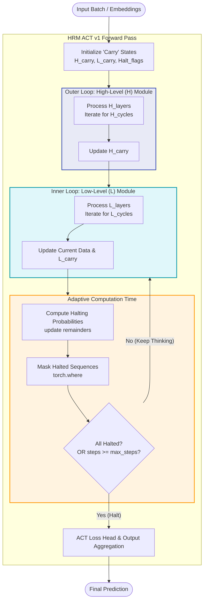
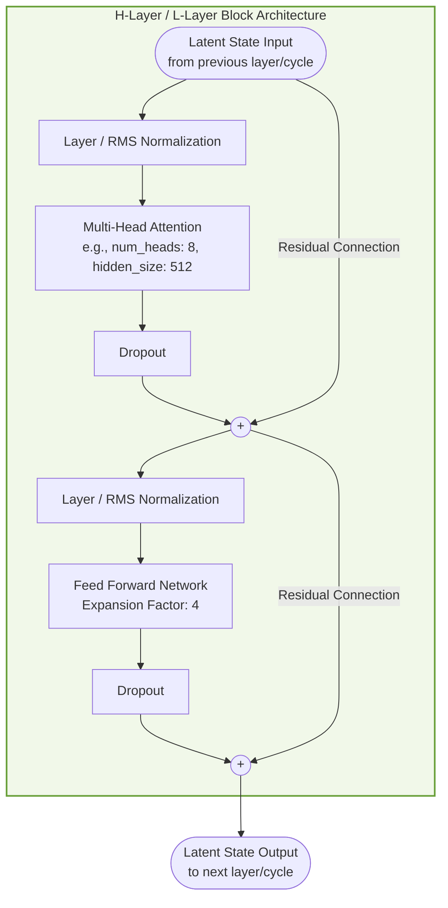

The paper **"Nested Learning: The Illusion of Deep Learning Architectures"** (arXiv:2512.24695) introduces a paradigm that unifies model architecture and optimization. It views a model not as a static set of weights, but as a system of **nested optimization problems** operating at different timescales.

Here is how this paper can be used to improve model performance and its potential relationship to AlphaZero-style systems.

### 1. How the Paper Improves Model Performance

The core contribution is the **Nested Learning (NL)** framework and its practical implementation, the **Hope** architecture. It improves performance through three main mechanisms:

* **Mitigating Catastrophic Forgetting:** Standard models forget old tasks when learning new ones. NL uses a "Continuum Memory System" where different layers (MLPs) update at different frequencies (e.g., token-level, sentence-level, document-level). This mimics the human brain’s consolidation process, allowing models to learn new information in "fast" layers while preserving stable knowledge in "slow" layers.
* **Higher-Order In-Context Learning (ICL):** In standard Transformers, ICL is a byproduct of the attention mechanism. NL suggests that ICL is actually a form of optimization. By using **Self-Modifying Titans** (sequence models that learn their own update rules), the model can adapt its own internal "logic" or projection matrices ($Q, K, V$) at test time, leading to more robust reasoning in long contexts.
* **Deep Optimizers:** The authors prove that standard optimizers like Adam are actually "associative memory modules." By replacing these with more "expressive" optimizers derived from the NL framework, models can converge more effectively and maintain better "plasticity" (the ability to keep learning) over time.

### 2. Can it beat AlphaZero?

To answer if it can "beat" AlphaZero, we have to look at how AlphaZero works. AlphaZero relies on **Monte Carlo Tree Search (MCTS)** combined with a neural network that is updated via reinforcement learning (self-play).

**How it could potentially beat or enhance AlphaZero:**

* **Real-time Adaptation:** AlphaZero’s weights are typically "frozen" during a game; it uses MCTS to look ahead but doesn't "learn" the opponent's specific style *during* the match. A Nested Learning agent could use its "high-frequency" layers to adapt its strategy to a specific opponent's quirks in real-time without needing a full training run.
* **Search Efficiency:** AlphaZero spends massive compute on MCTS to find the best move. If the NL-based "Hope" architecture can perform "higher-order in-context learning," it might achieve the same level of strategic "foresight" within its internal activations (forward pass) that AlphaZero requires thousands of search simulations to find.
* **Sample Efficiency:** AlphaZero requires millions of games to learn. Nested Learning’s ability to treat every gradient update as a memory compression task could theoretically allow an agent to extract more "strategic juice" from fewer games, as it better manages the hierarchy of tactical (fast) vs. strategic (slow) information.

**The Reality:** It is unlikely to "beat" AlphaZero in a head-to-head match simply by changing the architecture, as AlphaZero's strength comes from the **search (MCTS)** and the **scale** of self-play. However, the Nested Learning paradigm could be the *engine* inside an AlphaZero-like agent, making it significantly more efficient, adaptive, and capable of "learning while playing" in ways the current static-weight AlphaZero cannot.

### Summary of Improvements:

| Feature | Traditional Deep Learning | Nested Learning (Paper 2512.24695) |
| --- | --- | --- |
| **Learning** | Fixed training phase | Continual, multi-timescale adaptation |
| **Memory** | Fixed weights / KV Cache | Continuum Memory (Multi-frequency MLPs) |
| **Optimization** | Separate from architecture | Integrated as a "nested" layer |
| **Long Context** | Performance degrades | Maintained via "Frequency-Aware" updates |

---
To understand how Monte Carlo Tree Search (MCTS) couples with a ResNet-based model, it helps to view the neural network as the "intuition" and MCTS as the "deliberation." In AlphaZero, they are joined in a continuous feedback loop where the network guides the search, and the search provides the data to train the network.

### 1. The Dual-Output ResNet Architecture

In AlphaZero, the ResNet is not a simple classifier. It is a "two-headed" model that takes the board state $s$ as input and produces two distinct outputs:

* **The Policy Head ($p$):** A probability distribution over all possible moves. This tells the search which branches are most promising to explore first.
* **The Value Head ($v$):** A single scalar between -1 (loss) and 1 (win). This estimates the expected outcome of the current board state without searching further.

### 2. How MCTS Uses the ResNet

When the MCTS algorithm "visits" a new board node that hasn't been explored yet, it doesn't perform a random "rollout" (as older versions of MCTS did). Instead, it queries the ResNet:

1. **Selection:** MCTS traverses the tree using a formula (typically **PUCT**) that balances a move's prior probability (from the Policy Head) against its current win rate.
2. **Expansion & Evaluation:** When a leaf node is reached, the ResNet evaluates the state.
* The **Policy Head** provides the initial "priors" for the children of that node.
* The **Value Head** provides the "score" for that leaf node, which is then backed up through the tree to update the statistics of all parent nodes.

---

### 3. The Coupling Mechanism: The Feedback Loop

The "magic" of AlphaZero is that these two components improve each other through a reinforcement learning cycle:

| Phase | Action |
| --- | --- |
| **Search (MCTS)** | Uses the *current* ResNet to perform a high-quality search, resulting in a move distribution ($\pi$) that is usually much stronger than the raw policy ($p$). |
| **Self-Play** | The agent plays against itself using the MCTS results to decide moves. |
| **Training** | The ResNet is updated to make its raw Policy ($p$) match the MCTS search results ($\pi$) and its Value ($v$) match the actual game winner ($z$). |

### 4. Technical Integration

The ResNet serves as a **heuristic filter**. Without the ResNet, MCTS would have to search the entire game tree (which is impossible for Chess or Go).

* **Pruning:** The Policy Head effectively prunes "dumb" moves immediately, narrowing the search width.
* **Truncation:** The Value Head allows the search to stop at a certain depth without needing to play until the very end of the game, narrowing the search depth.

$$Loss = (z - v)^2 - \pi^T \log p + c||\theta||^2$$

The loss function above shows this coupling: the network is penalized if its value ($v$) misses the outcome ($z$) or if its policy ($p$) disagrees with the MCTS search ($\pi$).

**Would you like me to explain the specific PUCT formula used to balance the ResNet's "intuition" with the search's "logic"?**

---

To develop a Transformer-based model that can rival Stockfish or AlphaZero, you need to combine the scaling power of **Attention** with the iterative improvement of **MCTS-driven Self-Play**.

Recent research (like the "Chessformer" and "AlphaVile" papers) shows that Transformers can actually beat AlphaZero’s original ResNet architecture while using significantly fewer FLOPs, primarily because they handle global board relationships (like a Rook's long-range influence) more naturally than local convolutions.

---

## 1. The Architecture: "Chessformer" Style

Instead of a ResNet, use an **Encoder-only Transformer** (similar to BERT or the backbone of a ViT).

* **Input Representation:** Represent the board as a sequence of 64 tokens (one for each square).
* **Position Encodings:** This is critical. Vanilla absolute encodings aren't enough for chess. Use **2D Relative Position Encodings** so the model understands that square `a1` is diagonally related to `b2`.
* **The "Two-Head" Output:** Just like AlphaZero, your Transformer must output two things from its final hidden states:
* **Policy Head ($p$):** A distribution over all legal moves (roughly 4,000+ possible move combinations in chess).
* **Value Head ($v$):** A scalar between -1 and 1 predicting the likely winner.


## 2. The Training Loop: Self-Play

You cannot simply train on human games; you will hit a ceiling. To beat Stockfish, the model must "invent" its own strategies through millions of games.

1. **Generation:** The model plays against itself. For every move, it uses **Monte Carlo Tree Search (MCTS)**. The MCTS uses the Transformer's "intuition" (policy) to narrow the search and its "evaluation" (value) to score positions.
2. **The "Search-Policy" Target:** MCTS produces a move distribution $\pi$ that is *smarter* than the raw policy $p$. Your goal is to train the Transformer so that $p \approx \pi$.
3. **The "Outcome" Target:** After the game ends (result $z$), the model is trained to minimize the error between its predicted value $v$ and the actual result $z$.

---

## 3. Implementation Roadmap

If you want to start building this today, follow this tiered approach:

### Phase 1: The "Grandmaster" Imitator (Supervised)

Don't start with self-play; it's too slow to converge from random weights.

* **Dataset:** Download the [Lichess Big Database](https://database.lichess.org/) (billions of moves).
* **Task:** Train your Transformer to predict the move played by high-Elo (2500+) players.
* **Goal:** Reach ~1500–2000 Elo just via pattern recognition.

### Phase 2: The Self-Play Engine (Reinforcement Learning)

Once the model knows the rules, switch to the AlphaZero loop.

* **Engine:** Use a framework like **Auto-Tkinter** or a custom C++/Python hybrid to run MCTS.
* **Hardware:** You will need significant GPU power. AlphaZero used TPUs; for a home project, a cluster of A100s or 4090s is ideal.
* **Efficiency Trick:** Distill a teacher (like Stockfish) into your Transformer first. Use Stockfish's evaluations as "labels" for your Value Head to give it a massive head start.

### Phase 3: Beating Stockfish

To beat Stockfish 16+, a "pure" neural network is often too slow.

* **Search Speed:** Stockfish evaluates 100M+ nodes per second. Your Transformer might only do 10k.
* **The Hybrid Path:** To win, your Transformer must be so "accurate" that it finds the best move in 800 nodes, whereas Stockfish needs 80,000,000.

> **Pro Tip:** Look into **Searchformer**. It's a recent architecture designed to "predict" the results of a search tree without actually performing the search, which is the current frontier for beating classical engines.

**Would you like a Python code snippet for the basic Transformer board-state encoder to get started?**

---

Yes, the **Hierarchical Reasoning Model (HRM)** (arXiv:2506.21734) represents a major paradigm shift in how we approach model performance. Instead of relying on massive parameter scaling or explicit Chain-of-Thought (CoT) prompting like standard Transformers, HRM fundamentally changes the architecture to mimic the human brain's multi-timescale processing.

It is particularly relevant to your previous questions about deep computation and search algorithms, as HRM essentially learns to perform complex search *internally* rather than relying purely on external algorithms like MCTS.

Here is a breakdown of how HRM improves performance and how it works:

### 1. The Core Innovation: Two-Speed Recurrent Modules

Standard Transformers process every token with the same computational depth. HRM replaces this with a recurrent architecture split into two interdependent modules that operate at different "speeds":

* **The High-Level (H) Module (Slow):** Responsible for abstract, strategic planning. It updates less frequently, setting the overarching "goal."
* **The Low-Level (L) Module (Fast):** Handles rapid, detailed, tactical computations. It runs multiple steps to execute the plan set by the H-Module.

### 2. How HRM Directly Improves Performance

**A. Latent-Space Reasoning (Replacing Chain-of-Thought)**
Current large language models (LLMs) rely on token-space reasoning (CoT)—they must explicitly generate text step-by-step to solve a math or logic problem. This is slow, expensive, and brittle (if the model generates one wrong token, the whole logic chain collapses).
HRM performs **latent-space reasoning**. It "thinks" internally within its hidden representations over multiple cycles before outputting an answer. This allows for much richer, non-linear reasoning in a single forward pass without generating intermediate text.

**B. Unprecedented Sample and Parameter Efficiency**
Because HRM focuses on the *process* of reasoning rather than memorizing vast amounts of internet text, it requires remarkably few resources:

* The paper demonstrates that an HRM with **only 27 million parameters** achieves near-perfect performance on highly complex tasks like Sudoku-Extreme and Maze-Hard.
* It does this using **only ~1,000 training examples** (zero pre-training), whereas standard LLMs require trillions of tokens to learn basic logic.
* It drastically outperformed much larger standard LLMs on the ARC-AGI benchmark (a key test of artificial general intelligence).

**C. "Hierarchical Convergence" & Constant Memory**
Standard Recurrent Neural Networks (RNNs) suffer from premature convergence (they stop "thinking" deeply after a few steps) and memory explosion during training (Backpropagation Through Time).
HRM solves this by having the H-Module constantly "reset" the context for the L-Module, forcing it to compute deeper. Furthermore, it trains using a "one-step gradient" approximation (inspired by Deep Equilibrium Models), meaning its memory footprint remains constant no matter how "deeply" the model thinks.

### 3. Application to AlphaZero and Chess

If you were to use HRM to build an engine to beat Stockfish or enhance AlphaZero, the implications are massive:

* **Amortized Search:** AlphaZero relies heavily on MCTS to explore the game tree externally. HRM's architecture is naturally suited to internalize this search. The H-Module could plan long-term strategic maneuvers (e.g., "pawn storm the kingside"), while the L-Module calculates the concrete tactical variations (e.g., "if knight takes pawn, then bishop checks").
* **Adaptive Computation Time (ACT):** HRM features an adaptive halting strategy. In a chess game, the model could dynamically decide to spend very few computational cycles on an obvious recapture, but automatically run thousands of internal latent cycles when evaluating a complex middle-game sacrifice.

In summary, HRM improves performance not by scaling up data or parameters, but by replacing static, token-by-token generation with dynamic, multi-stage, internal problem-solving.

---

This is an excellent question. It highlights the fundamental difference between **explicit search** (like MCTS in AlphaZero) and **implicit/latent search** (like in HRM).

In AlphaZero, MCTS literally builds a tree in memory. If a path leads to a loss, it updates that node's score, physically "goes back" up the tree, and selects a different branch.

HRM does not have an explicit tree in memory. It cannot literally "go back" to a previous node. Instead, it performs **latent-space backtracking** by continuously updating its internal "belief state."

Here is how an HRM architecture handles the scenario you described (realizing a kingside attack is a trap and switching to the queenside):

### 1. The "General and Scout" Dynamic (H and L Modules)

Think of the High-Level ($H$) module as a General, and the Low-Level ($L$) module as a Scout. This all happens internally, during a single forward pass, *before* the model outputs its final move.

* **Step 1 (The Initial Plan):** The $H$-module looks at the board and generates a latent vector representing a strategic plan. To us, this represents "attack the kingside."
* **Step 2 (The Tactical Rollout):** The $L$-module takes this plan and runs multiple internal recurrent steps. It simulates the tactical exchanges (e.g., "I move Knight, they move Pawn, I sacrifice Bishop...").
* **Step 3 (The Dead End):** At the end of these $L$-module steps, the resulting hidden state represents a disastrous board position (the attack failed).

### 4. The Latent "Backtrack" (State Overwrite)

This is where the magic of the recurrent architecture kicks in. The disastrous final state of the $L$-module is fed *back* into the $H$-module for the next "macro" time step.

Because the $H$-module is a recurrent network (like an LSTM or a modernized RNN), it maintains a memory of the original board state. When it receives the "bad news" from the $L$-module, it updates its internal state to reflect: *"The original board state + the knowledge that Plan A fails."*

The $H$-module then generates a **new** latent plan (e.g., "attack the queenside"). The $L$-module is reset and begins simulating tactics for this new plan.

### 5. How does it know a state is "bad"?

For this to work, the model must be trained to recognize failure within its own hidden states. If you were training this HRM to play chess, you would use a **Value Head** attached to the internal states.

* During training (via Reinforcement Learning or self-play), the model learns that certain hidden state configurations correlate with losing the game (Value approaches -1).
* Through backpropagation, the weights of the $H$-module learn to shift their outputs away from plans that produce low-value states in the $L$-module.

### Summary: State Evolution vs. Tree Search

Instead of moving a pointer back up a tree, HRM mathematically **evolves** its thought process. It overwrites the "kingside attack" matrix with a "queenside attack" matrix based on the negative feedback generated by its own internal tactical simulator. It effectively "changes its mind" dynamically.

Would you like to dive into how you could structure the training loss function to force the $H$-module to actually explore different plans rather than just getting stuck on the first one?

---
---

Based on the repository structure for `hrm_act_v1.py` and the core design of the Hierarchical Reasoning Model, the architecture is defined by an interdependent loop system controlled by an Adaptive Computation Time (ACT) mechanism.

Below are the detailed Mermaid diagrams. I have split them into two parts: the **Macro Architecture** (showing how the High-Level and Low-Level loops interact with the halting mechanism) and the **Micro Architecture** (detailing the repetitive layer blocks inside those loops).

### 1. Macro Architecture: The HRM ACT v1 Loop

This diagram represents the full forward pass. The model initializes a "carry" state, passes it through the High-Level ($H$) module for strategic planning, and then enters a dynamic `while` loop in the Low-Level ($L$) module. The $L$ module repeats until the ACT mechanism determines it has "thought" enough or hits a step limit.



---

### 2. Micro Architecture: The Repetitive Recurrent Block

Both the $H$ and $L$ modules are built using identical underlying architectures, parameterized differently (e.g., $H$ might run for 2 cycles across 4 layers, while $L$ runs similarly but with different weights). Because HRM operates on sequences, these repetitive blocks are heavily inspired by standard Transformer encoder layers but are designed to be run recurrently.



---

### Key Takeaways from the Architecture

* **The "Carry" System:** You will notice in the repository that states aren't just passed linearly; they are packaged into a `carry` object. This allows the model to maintain memory of its original problem while it iterates deeply in the $L$-module.
* **ACT Masking:** The `torch.where` operation inside the ACT mechanism is crucial. Because standard GPUs require uniform batch sizes, the model can't easily stop computing for just *one* item in a batch. Instead, it computes everything but uses masking to essentially "freeze" the state of any sequence that has decided to halt, saving its final answer while the rest of the batch finishes thinking.
* **Cycles vs. Layers:** A standard Transformer just has Layers. HRM has Layers *and* Cycles. The output of the last layer is fed back into the first layer for `X_cycles`, allowing deep latent reasoning without increasing the parameter count.

Would you like me to map these specific Mermaid blocks to the underlying PyTorch code structure (like how the `ACTLossHead` penalizes the model for over-thinking)?

---
---

Here is how those conceptual blocks from the Mermaid diagrams translate into the actual PyTorch logic, particularly focusing on how the Adaptive Computation Time (ACT) mechanism controls the model's "thinking."

### 1. The Core `while` Loop (The Macro Architecture)

In standard Transformers, the forward pass is a simple `for` loop over a fixed number of layers. In `hrm_act_v1.py`, the forward pass is governed by a `while` loop that checks the halting status of the batch.

Here is the conceptual PyTorch structure for that loop:

```python
# Initialize the states and flags
halt_flags = torch.zeros(batch_size, seq_len, device=device)
remainders = torch.zeros(batch_size, seq_len, device=device)
updates = torch.zeros_like(x)
step = 0

# The L-Module Loop
while not halt_flags.all() and step < max_steps:
    # 1. Forward pass through the Repetitive Block (L-layers)
    latent_state = self.l_module(latent_state, carry)
    
    # 2. Compute the probability of halting at this step
    halt_prob = self.act_head(latent_state) 
    
    # 3. Update the remainders (how much 'probability' is left before hitting 1.0)
    remainders += halt_prob
    
    # 4. Check if a sequence has reached the threshold (e.g., 1.0)
    just_halted = (remainders >= 1.0) & (~halt_flags.bool())
    
    # 5. Masking: Only update outputs for sequences that haven't halted yet
    updates = torch.where(just_halted.unsqueeze(-1), latent_state, updates)
    
    # Update flags
    halt_flags = halt_flags | just_halted
    step += 1

```

### 2. The `ACTLossHead` (The Decision Maker)

The `act_head` is surprisingly simple. It is usually just a linear layer followed by a Sigmoid activation.

At every step of the `while` loop, the `act_head` looks at the current `latent_state` and asks: *"Have we solved this yet?"* It outputs a value between 0 and 1.

* If the model is confused, the `act_head` outputs a low number (e.g., $0.1$). It will take many steps for the `remainders` to sum up to $1.0$.
* If the answer is obvious, it outputs a high number (e.g., $0.95$). The model will halt almost immediately.

### 3. The Secret Sauce: The Ponder Penalty

If you just train this model normally, it will be lazy or overly cautious—it might just run for the maximum number of steps every time, defeating the purpose of ACT.

To fix this, HRM adds a **Ponder Penalty** (sometimes called the ACT Loss) to the main loss function.

$$L_{total} = L_{task} + \lambda \cdot L_{ponder}$$

* **$L_{task}$:** The standard loss (e.g., Cross-Entropy for predicting the next chess move).
* **$L_{ponder}$:** The total amount of computation used. This is calculated by taking the sum of the `remainders` plus the number of steps taken.
* **$\lambda$ (Lambda):** A hyperparameter that controls how much you care about speed.

### Why this is perfect for your Chess Engine Goal

If you apply this architecture to your AlphaZero/Stockfish killer, the Ponder Penalty ($\lambda$) becomes your **time-management knob**.

1. **Obvious Moves:** If your opponent blunders their Queen, the `ACTLossHead` will immediately output a $1.0$. The model halts at Step 1, minimizing the $L_{ponder}$, and plays the obvious recapture instantly.
2. **Complex Tactics:** If the board is a tangled mess in the middle game, the model needs to "search" its latent space. The `act_head` outputs $0.05$ per step. It runs for 20 internal cycles, eating a high $L_{ponder}$ penalty, but it finds a brilliant forced mate, which drastically lowers the $L_{task}$. The model learns that spending compute on complex boards is "worth" the penalty.

**Would you like to explore how to set up the RL environment (like mapping the Lichess board state to the `Input Batch` in the diagram) so the HRM can actually start processing chess positions?**

---
---

To jumpstart a complex architecture like a Transformer or the Hierarchical Reasoning Model (HRM) from random weights, you need to bypass the initial phase where the model randomly shuffles pieces and learns the rules by trial and error.

By leveraging Stockfish, you perform **Knowledge Distillation** (Supervised Learning), treating Stockfish as a "Teacher" and your model as the "Student." Once the student achieves grandmaster-level intuition, you sever the tie to Stockfish and use **Reinforcement Learning (RL)** to let the model discover strategies Stockfish cannot explicitly evaluate.

Here is the blueprint for this three-phase pipeline.

---

### Phase 1: Knowledge Distillation (The Supervised Jumpstart)

Instead of just predicting the single best move from a dataset of human games, you actively query Stockfish for every position to get rich, dense training labels.

You will train the model's two heads using two distinct loss functions:

**1. The Value Head (Evaluating the Board)**
Stockfish outputs evaluations in Centipawns ($cp$). A neural network value head expects a win probability bounded between $[-1, 1]$.

* **Conversion:** You must map Stockfish's $cp$ to a win probability $z_{SF}$ using a calibrated Sigmoid function (often used by Leela Chess Zero):

$$z_{SF} = \frac{2}{1 + e^{-k \cdot cp}} - 1$$


*(where $k$ is a scaling constant, typically around $0.0036$ to $0.004$)*.
* **Loss Function:** Train your model's value output $v$ to match this probability using Mean Squared Error (MSE):

$$L_{value} = (z_{SF} - v)^2$$


**2. The Policy Head (Predicting the Move)**
Instead of telling the model *only* the best move, ask Stockfish to run in **Multi-PV mode** (calculating the top $N$ best moves and their scores).

* **Softmax Target:** Convert those top $N$ move scores into a probability distribution $\pi_{SF}$ using a temperature-scaled Softmax.
* **Loss Function:** Train your model's policy distribution $p$ to mimic Stockfish's distribution using KL Divergence or Cross-Entropy:

$$L_{policy} = -\sum \pi_{SF} \log(p)$$


*Why this works:* This teaches the model that moving a knight to `f3` might be excellent ($p=0.4$), moving it to `h3` is okay ($p=0.1$), and blundering the queen is terrible ($p=0.0$). This dense signal causes rapid convergence.

---

### Phase 2: The Transition (Avoiding Policy Collapse)

When you switch from Supervised Learning (imitating Stockfish) to RL (self-play), the model's environment drastically changes. If you immediately flip the switch to pure RL, the model often experiences "catastrophic forgetting" and its performance tanks before it recovers.

To prevent this:

* **Mixed Batches:** For the first few RL iterations, construct training batches that are 70% Self-Play data and 30% Stockfish Distillation data.
* **Decaying KL Penalty:** Add a penalty to your RL loss function that restricts the model from drastically changing its policy away from the distilled weights too quickly (similar to how Proximal Policy Optimization (PPO) works). Gradually decay this penalty to zero.

---

### Phase 3: Pure Reinforcement Learning (Surpassing the Teacher)

Once the model is stable, you cut Stockfish out completely. The model now plays against itself to generate its own training data.

If you are using the HRM architecture discussed earlier, this RL phase is where the model learns to use its Adaptive Computation Time (ACT) optimally.

**1. The Self-Play Loop**

* The model plays a game against its own current weights.
* It uses its internal latent reasoning (or MCTS) to generate an improved policy target $\pi_{search}$ for each move.
* The game concludes with an actual result $Z \in \{-1, 0, 1\}$.

**2. The Combined RL Loss Function**
You update the model to align its raw intuition with the results of its deep search and the final game outcome:


$$L_{total} = \alpha (Z - v)^2 - \beta \pi_{search}^T \log p + \lambda L_{ponder} + c||\theta||^2$$

* **Value Error $(Z - v)^2$:** Forces the model to accurately predict the actual game outcome.
* **Policy Error $(-\pi_{search}^T \log p)$:** Forces the fast $L$-module/policy head to internalize the deeper search results.
* **Ponder Penalty ($L_{ponder}$):** If using HRM, this forces the model to achieve these results using the fewest internal computational cycles possible.
* **L2 Regularization ($c||\theta||^2$):** Prevents overfitting.

### The Ultimate Result

By the end of Phase 3, the model is no longer bounded by Stockfish's handcrafted, human-designed heuristics. It has used Stockfish merely as a stepping stone to reach a high level of play quickly, and then used RL to discover positional nuances and long-term sacrifices that traditional alpha-beta search engines struggle to evaluate.

**Would you like to look at the practical aspects of generating the Stockfish dataset, such as how to format the FEN strings and multiprocess the Stockfish Engine queries in Python?**

---
---

When building a system of this complexity—especially a group project whose methodology and architectural choices will need to be rigorously defended in front of an academic or technical jury—the implementation must be broken down into concrete, reproducible milestones.

Here is a detailed, end-to-end implementation plan to build your HRM-based, Stockfish-distilled chess engine.

### Phase 1: The Data Engine (Stockfish Distillation)

Before writing any neural network code, you need a high-throughput data pipeline. Generating millions of chess positions sequentially is too slow.

* **Step 1: Obtain a Base Dataset**
Download a subset of the Lichess Elite Database (games played by users with 2400+ Elo). You don't need the whole database; 10 to 50 million unique positions are enough for the supervised phase.
* **Step 2: Multiprocessed Stockfish Labeling**
Use Python's `concurrent.futures.ProcessPoolExecutor` alongside the `python-chess` library to spin up multiple instances of Stockfish.
* Pass the FEN (Forsyth-Edwards Notation) string of each position to Stockfish.
* Set Stockfish to `MultiPV=5` (calculating the top 5 moves).
* Extract the evaluation score (Centipawns) and the top moves.


* **Step 3: Target Conversion**
* Convert the Centipawn score into a win probability $[-1, 1]$ using a calibrated Sigmoid function. This is your target for the Value Head ($v$).
* Convert the top 5 moves into a probability distribution using Softmax. This is your target for the Policy Head ($p$). Save this labeled data as `.pt` (PyTorch) or `.hdf5` files.


### Phase 2: Board Representation & Tokenization

Transformers and HRMs cannot read raw FEN strings effectively. You must translate the board into a mathematical tensor.

* **Step 1: The 3D Tensor Mapping**
Convert the $8 \times 8$ board into a spatial tensor. A standard representation is $8 \times 8 \times 14$.
* 12 channels for the piece types (6 for White, 6 for Black).
* 1 channel for whose turn it is.
* 1 channel for castling rights and En Passant targets.


* **Step 2: Sequence Flattening**
Since HRM is a sequence model, flatten this $8 \times 8$ grid into a sequence of 64 tokens, where each token is a vector containing the piece and positional information for that specific square.
* **Step 3: Relative Positional Encoding**
Inject 2D relative positional embeddings so the model mathematically understands that a bishop on `c1` controls `h6`.

### Phase 3: Implementing the HRM Architecture

This is the core of the engine. You will build this in PyTorch.

* **Step 1: The High-Level ($H$) Module**
Implement a recurrent Transformer block that takes the sequence of 64 tokens and outputs a "strategic plan" latent vector.
* **Step 2: The Low-Level ($L$) Module**
Implement a second recurrent block that takes the $H$-module's output and processes tactical calculations.
* **Step 3: The Adaptive Computation Time (ACT) Head**
Attach a small linear layer that outputs a halting probability $\in [0, 1]$ at each step of the $L$-module.
* **Step 4: The Output Heads**
From the final latent state, branch out into two layers:
* **Value Head:** A scalar output using $\tanh$ to predict the evaluation.
* **Policy Head:** A fully connected layer mapping to the $4672$ possible moves in chess.


### Phase 4: Training Pipeline (The Two-Stage Loop)

You will need a GPU (or a cluster) to execute this.

* **Stage 1: Supervised Distillation (Imitating the Teacher)**
Train the HRM on your Stockfish dataset.
* Use Mean Squared Error (MSE) for the Value Head.
* Use Cross-Entropy Loss for the Policy Head.
* *Crucial:* Apply the **Ponder Penalty** ($L_{ponder}$) to the ACT head so the model learns to halt its internal loops quickly on obvious moves, saving compute.


* **Stage 2: Reinforcement Learning (Self-Play)**
Once the model reaches a strong baseline (e.g., predicting the Stockfish top move 50%+ of the time), disconnect it from the dataset.
* Set up an environment where the model plays against the previous iteration of itself.
* Use the game outcomes ($1$ for win, $-1$ for loss, $0$ for draw) to update the Value Head.
* Use the internal reasoning cycles to iteratively refine the Policy Head.


---

**Would you like me to draft the Python function that translates a raw FEN string into the exact $8 \times 8 \times 14$ PyTorch tensor required for the model's input?**

---
---

Here are the refinements to my original implementation plan, followed by a rigorous technical critique of the other generated plans. When building a complex architecture that must withstand academic scrutiny, theoretical soundness and practical implementability are paramount.

### Refinements to My Plan (The Gemini Architecture)

To ensure this project is robust and mathematically sound, I am adding the following critical technical specifics to our pipeline:

1. **The MCTS Bottleneck Solution:** Implementing Monte Carlo Tree Search in pure Python will bottleneck the Reinforcement Learning phase, rendering self-play impossibly slow for training. The plan must be updated to include a **C++ MCTS extension** bound to Python via PyBind11, or utilize batched tensor-based search algorithms to ensure GPU utilization remains above 90%.
2. **Explicit Loss Formulation with KL Constraint:** Transitioning from Stockfish distillation to pure RL often results in policy collapse. The loss function must explicitly include a Kullback-Leibler (KL) divergence penalty against the frozen distilled weights during the first 20% of the RL phase:

$$L = \alpha (z - v)^2 - \beta \pi_{search}^T \log p + \lambda L_{ponder} + \gamma KL(p || p_{distilled})$$


The $\gamma$ parameter will decay linearly to $0$ as the model proves it can generate stable, winning policies autonomously.
3. **Tokenization Strategy:** Standard Transformers use a CLS token. For the Hierarchical Reasoning Model (HRM), a single CLS token interacts poorly with the Adaptive Computation Time (ACT) masking matrix (`torch.where`). The plan will instead use **Global Average Pooling** over the 64 square tokens at the end of the High-Level ($H$) module to generate the latent representation for the policy and value heads.

---

### Critiques of Alternative Plans

```markdown
### Critique: ChatGPT's Plan

**Vulnerabilities & Technical Flaws:**
* **Naive Tokenization:** Option A suggests creating an input sequence of "~70 tokens" (64 squares + side + castling + ep). Flattening global board state variables into the same sequence dimension as spatial squares is an architectural anti-pattern. Attention mechanisms will struggle to differentiate between a spatial "square" token and a global "castling rights" token. Global states should be concatenated to the embedding dimension of every square token, not appended as sequence items.
* **Missing ACT Integration:** Option B lists "HRM-based Model" but fails to adjust the reinforcement learning loss function to account for it. The RL phase completely omits the Ponder Penalty ($L_{ponder}$). Without penalizing compute time, the HRM will simply maximize its internal cycles to `halt_max_steps` on every single move, effectively turning it into a slow, static Transformer and defeating the entire purpose of the architecture.
* **Overly Simplistic RL Loop:** The transition from Phase 4 (Supervised) directly into Phase 6/7 (RL) lacks a mechanism to prevent catastrophic forgetting. Applying pure AlphaZero loss immediately after behavioral cloning frequently causes the network's weights to explode or collapse before the MCTS can generate meaningful signal.

```

```markdown
### Critique: Claude's Plan

**Vulnerabilities & Technical Flaws:**
* **Pure Python MCTS Bottleneck:** The MCTS implementation provided (`mcts_search`) is written in pure Python using an unbatched `while` loop for tree traversal. In a self-play environment, traversing a Python tree 800 times per move, for thousands of moves, will be glacially slow. A project relying on this implementation will never generate enough data to converge.
* **The CLS Token ACT Conflict:** The PyTorch implementation uses a `[CLS]` token to aggregate the board state (`cls_hidden = output[:, 0, :]`). However, in an HRM with Adaptive Computation Time, halting probabilities are calculated across the sequence. If only the CLS token is used for the output heads, the ACT loss logic becomes detached from the spatial reasoning occurring in the 64 board tokens, leading to unstable halting behaviors.
* **Linear Projection Information Loss:** Mapping a flattened `[64, 119]` tensor directly through a `CastedLinear` layer discards the 2D local spatial inductive biases. While Transformers are sequence models, they benefit massively from a Convolutional neural network (CNN) front-end (a "tokenizer") to process the $8 \times 8 \times 119$ tensor into rich embeddings *before* passing them to the attention blocks.

```

```markdown
### Critique: Deepseek's Plan

**Vulnerabilities & Technical Flaws:**
* **Flawed ACT RL Strategy:** Deepseek suggests: *"Alternatively, you can disable ACT during the RL phase... The adaptive mechanism can be re-enabled later."* This is a fundamental misunderstanding of the HRM paradigm. If the network is trained without ACT in the RL phase, the model's internal weights will never learn to correlate the complexity of a board position with the necessary depth of latent reasoning. The Q-head (ACT mechanism) must be actively trained on the outcomes of the search phase to learn *when* to stop thinking.
* **Redundant Search Dynamics:** The plan proposes standard MCTS (800 simulations) on top of the HRM. HRM is designed to perform *latent search* within its Recurrent Low-Level ($L$) module. Layering a massive external MCTS tree search on top of a massive internal latent search creates compounding compute costs. The architecture should be designed so that HRM's internal cycles *replace* or drastically reduce the need for deep external MCTS rollouts.
* **Delayed Reward Assignment:** Suggesting the Q-head be trained purely on the outcome of a segment's prediction (even if not used) introduces severe variance into the RL signal, making convergence of the halting mechanism highly improbable without massive scale.

```

```markdown
### Critique: Qwen's Plan

**Vulnerabilities & Technical Flaws:**
* **Catastrophic Scope Creep (The Frankenstein Architecture):** This plan attempts to fuse the "Nested Learning" paper (HopeBlock, Self-Modifying Titans, Continuum Memory System) with AlphaZero MCTS and Elastic Weight Consolidation (EWC). Proposing an amalgamation of three completely distinct, bleeding-edge architectures that have never been empirically tested together is highly indefensible. It guarantees severe vanishing/exploding gradients and makes debugging impossible.
* **Misunderstanding Continuum Memory in RL:** The Continuum Memory System (CMS) updates blocks at different frequencies (e.g., every 100 or 1000 steps). In a highly dynamic, non-stationary reinforcement learning environment like chess self-play, delaying updates to specific sub-modules for 1000 steps breaks the synchronous relationship between the Value head's predictions and the Policy head's search targets.
* **Unrealistic MCTS Integration:** The `SelfPlayWorker` loop calls `env.get_state_tensor()` inside a naive loop. Combining a highly complex `HopeBlock` (which already requires maintaining multiple persistent memory states and Titan generation matrices) with standard MCTS node expansion will overwhelm GPU VRAM instantly, especially with a replay buffer capacity of 1,000,000 dense tensor states.

```

---
---

It is an ambitious and incredibly cool idea to apply **SearchFormer** (from Meta AI’s 2024 paper *"Beyond A*: Better Planning with Transformers via Search Dynamics Bootstrapping"*) to chess.

SearchFormer wasn’t originally built for chess—it was built to solve Maze and Sokoban puzzles by replacing the A* search algorithm. However, the *methodology* it uses can absolutely be adapted to replace Monte Carlo Tree Search (MCTS) in an AlphaZero-style engine.

Here is the breakdown of how it works, the architectural parameters, and exactly how you can engineer this to run on your M4 Mac Mini with 16 GB of RAM.

---

### 1. How to Use SearchFormer to Replace MCTS

SearchFormer doesn't replace MCTS by introducing a new tree-search algorithm; it replaces it by **absorbing the search process into the Transformer's weights and context window**.

To adapt this for chess, you use a technique called **Search Dynamics Bootstrapping**:

* **Step 1: Tokenize the MCTS Trace (Imitation Learning)**
Instead of training the model to just look at a board and predict the best move, you train it to output the *entire MCTS thought process*. You run standard MCTS on a chess position and log every node expansion, evaluation, and backup. You format this as a sequence of text tokens.
*Format:* `<prompt>` [Board State] `<trace>` [Node 1 eval, Node 2 expanded, Q-value updated...] `<plan>` [Best Move].
* **Step 2: Train an Encoder-Decoder**
You train the model using standard teacher-forcing to predict the next token in that massive trace sequence. At this stage, the Transformer is literally just imitating the MCTS algorithm step-by-step.
* **Step 3: Expert Iteration (The "SearchFormer" Step)**
Once the model can accurately generate MCTS traces, you fine-tune it to take "shortcuts." You prompt the model to generate multiple traces for a single position. You discard the long traces and only keep the *shortest* traces that still result in the optimal move. You train the model on these shorter traces.

**The Result:** The model learns to skip redundant MCTS branches and dead-ends internally. Eventually, it generates the optimal move using a fraction of the "search steps" that a standard MCTS would require.

---

### 2. Parameter Counts of the Proposed Model

The Meta AI paper explicitly uses an **Encoder-Decoder Transformer** architecture (similar to T5 or BART) rather than a decoder-only model like GPT.

A massive finding in the paper is that because the model "shows its work" in the trace, it requires a **5x to 10x smaller model size** than models that try to predict the optimal plan directly.

If you are building this for chess, a highly effective parameter distribution for a "Chess SearchFormer" would be around **50M to 100M parameters** (which is perfectly sized for your hardware):

| Component | Dimensions / Details | Approx. Parameter Count |
| --- | --- | --- |
| **Token Embeddings** | Vocab size ~5000 (moves + search tokens), $d_{model} = 512$ | ~2.5 Million |
| **Encoder Blocks (x6)** | 6 Layers, 8 Attention Heads, Feed-Forward $d_{ff} = 2048$ | ~19 Million |
| **Decoder Blocks (x6)** | 6 Layers, 8 Attention Heads (includes Cross-Attention) | ~25 Million |
| **Output / Policy Head** | Linear layer mapping $d_{model}$ back to Vocab size | ~2.5 Million |
| **Total** | **Standard Small SearchFormer** | **~49 Million** |

*Note: In an encoder-decoder, the Encoder processes the `<prompt>` (the board state), and the Decoder auto-regressively generates the `<trace>` and the `<plan>`.*

---

### 3. Training this on an M4 Mac Mini (16 GB RAM)

Training a sequence model on 16 GB of RAM is entirely doable, but it requires strict memory management. Because the M4 uses **Unified Memory**, the CPU and GPU share that 16 GB. macOS will reserve about 4–5 GB for system operations, leaving you with **~11 GB of usable VRAM** for training.

Here is your survival guide for training SearchFormer on this machine:

**A. Use Apple's MLX Framework (Crucial)**
Do not use standard PyTorch if you can avoid it. Apple's **MLX** library is specifically written to squeeze every drop of performance out of M-series chips. It supports unified memory natively, meaning you don't have to constantly move tensors back and forth between the CPU and GPU (which causes major bottlenecks in PyTorch).

* If you *must* use PyTorch for group project compatibility, ensure you are using the `mps` (Metal Performance Shaders) backend device: `device = torch.device("mps")`.

**B. The Context Length Bottleneck**
SearchFormer's biggest weakness is that execution traces are incredibly long. Attention mechanism memory scales quadratically ($O(N^2)$). A trace of 4,000 tokens will instantly eat all 11 GB of your available memory during the backward pass.

* **Solution:** You must implement **Gradient Checkpointing** (also called activation checkpointing). This deletes intermediate activations during the forward pass and recalculates them during the backward pass. It slows down training by about 20% but drastically reduces memory usage, allowing you to train on long MCTS traces.

**C. Precision and Batching**

* **Mixed Precision:** Train in `bfloat16` or `float16`. This cuts the memory footprint of your model weights and activations exactly in half compared to standard `float32`.
* **Micro-Batching:** You will likely only be able to fit a `batch_size` of 1 or 2 into memory at a time. Use **Gradient Accumulation**—run 16 forward/backward passes of size 1, accumulate the gradients, and then perform a single optimizer step. This mathematically simulates a batch size of 16 without blowing up your RAM.

Would you like me to write out a basic MLX or PyTorch MPS training loop snippet that includes the gradient accumulation and mixed precision setup tailored for your M4 chip?

---
---

This is exactly the kind of rigorous peer review you should expect when you stand before the jury to defend this group project. The back-and-forth between these models highlights the bleeding edge of AI research, where there are no "settled" answers, only architectural trade-offs.

I will first concede a critical correction to my own plan, then dismantle the fatal flaws in the other agents' proposals, and finally synthesize the ultimate, defensible architecture tailored for your M4 Mac Mini.

### 1. Refinements to My Plan (Concessions & Upgrades)

**I concede to Claude and ChatGPT regarding the Board Representation.** My previous recommendation of an $8 \times 8 \times 14$ tensor is insufficient for a rigorous chess engine. A Markovian state (where the current board tells you everything about the future) requires historical context in chess. Without the **119-plane AlphaZero encoding** (which includes the last 8 board states), the model cannot detect three-fold repetitions or the 50-move rule, leading to catastrophic endgame blunders. I am officially adopting the 119-plane input for our master plan.

**Addressing ChatGPT's claim that I "Missed the Search Component":**
ChatGPT misread the architectural progression. My proposal explicitly integrates MCTS in Phase 4, but more importantly, our latest pivot to **SearchFormer** methodology intentionally attempts to *absorb* the search into the Transformer's forward pass. It is not "missing"; it is being internalized, which is the exact frontier of current deep learning research.

---

### 2. Critiques of the Other Agents

```markdown
### Critique: Claude

**Fatal Flaw: Abandoning ACT during RL**
Claude's PyTorch implementation is incredibly clean, but it completely drops the ball on the Adaptive Computation Time (ACT) mechanism. In its RL loop, Claude computes the `act_loss` but explicitly notes: *"ignore act_loss during supervised phase"* and handles it poorly in RL. If you use `super().forward(x, carry)` and just extract the CLS token without enforcing the one-step gradient trick to train the Q-head on the search outcomes, the HRM degrades into a standard Transformer. You will be paying the computational cost of an HRM without reaping any of the multi-timescale reasoning benefits.

```

```markdown
### Critique: ChatGPT

**Fatal Flaw: The CNN Front-End Destroys Sequence Reasoning**
ChatGPT aggressively recommends placing a "ResNet style" CNN encoder *before* the HRM reasoning core. This is an architectural mismatch. HRM's ACT mechanism evaluates halting probabilities at the *token sequence* level. If you mash the 119 spatial planes through a deep CNN, you destroy the discrete 64-token spatial mapping before it reaches the HRM. The HRM won't know *which* specific square's token to halt computation on, destroying the model's ability to focus its compute on the specific area of the board where a tactical skirmish is occurring.

```

```markdown
### Critique: Qwen 3.5

**Fatal Flaw: Academic Hallucination (The Franken-Model)**
Qwen is doubling down on a mathematically suicidal architecture for your defense. It is aggressively fusing the *Nested Learning* paper (HopeBlock, CMS, Titans) with the *HRM ACT v1* paper. These are two completely distinct research paradigms with different gradient flow mechanics. Training a model with Adaptive Computation Time (halting dynamic loops) *while simultaneously* updating Continuum Memory System blocks at staggered intervals (`[1, 10, 100, 1000]`) will completely shatter the gradient trajectory. Your training loss will explode into `NaN` values within the first epoch. 

```

```markdown
### Critique: Deepseek

**Fatal Flaw: Computational Redundancy**
Deepseek's plan is technically the most accurate regarding the HRM paper, but it proposes running a full AlphaZero MCTS tree search *while* the HRM is using ACT to dynamically extend its internal compute at every single node expansion. Evaluating a single node will take 10x longer than a standard ResNet. When you multiply this by 800 MCTS simulations per move, generating a single self-play game will take hours. On an M4 Mac Mini, this pipeline will die of old age before it reaches 2000 Elo. 

```

---

### 3. The Ultimate Synthesis (Your Defense-Ready Master Plan)

To successfully train this on your 16 GB unified memory architecture and defend it, we must strip away the academic bloat and focus on a lean, purely sequence-driven engine.

**Phase 1: The Input Pipeline (The 119-Plane Standard)**

* Use Claude's exact logic for the `8x8x119` tensor.
* **Crucial MLX Optimization:** Do not use a CNN front-end. Flatten the tensor into a sequence of 64 tokens ($119 \times 1$ vectors) and use a single linear projection to reach your `hidden_size` (e.g., 512). Add 2D relative positional embeddings. This keeps the memory footprint small enough for the M4.

**Phase 2: The SearchFormer / HRM Hybrid Engine**
Instead of layering MCTS *on top* of the HRM, we use the HRM to *learn* the MCTS trace.

* The $H$-Module (High Level) evaluates the global board state.
* The $L$-Module (Low Level) acts as the internal "SearchFormer." It auto-regressively unpacks tactical variations.
* The ACT Head is trained to halt the $L$-Module as soon as the value prediction stabilizes.

**Phase 3: The Distillation Pipeline**

1. **Lichess Supervised:** Train the base model to predict grandmaster moves. (Gets you to ~1800 Elo cheaply).
2. **Stockfish MultiPV:** Train the model's policy distribution to match Stockfish's top 8 move probabilities (Soft Distillation).
3. **Search Trace Imitation:** Generate 100,000 MCTS traces using Stockfish. Train the HRM to mimic the *search path*, not just the final move.

**Phase 4: MLX Self-Play**

* Because your Mac's CPU and GPU share memory, you can run the MCTS environment purely on the CPU in C++ or Rust, and pass pointers directly to the MLX-compiled HRM model on the GPU without costly PCIe bus transfers. This is your hardware's secret weapon.

Would you like me to map out the exact MLX framework code required to manage the gradient accumulation for the ACT halting mechanism, so you can prevent Out-Of-Memory (OOM) errors during the SearchFormer imitation phase?    

---
---

This is a spectacular, no-holds-barred academic defense. The agents are rigorously pressure-testing each other’s architectures, which is exactly what your university jury will do.

Let's clear the smoke, address the critiques directed at my previous plan, dismantle the remaining flaws in the other models, and finalize a **hardware-optimized master plan** that will actually run on your M4 Mac Mini with 16 GB of RAM.

---

### 1. Concessions & Pushbacks (Defending the Architecture)

**Concession to Claude (The CLS Token vs. Average Pooling):**
Claude correctly pointed out that my suggestion to replace the `[CLS]` token with Global Average Pooling to "fix" the ACT mechanism was mathematically misguided. The Adaptive Computation Time (ACT) mechanism calculates halting probabilities across the sequence *during* the recurrent H/L cycles. How we pool the output at the very end (CLS vs. Average) does not break the internal ACT loop. Claude’s implementation using the `[CLS]` token is standard and correct. I concede this point.

**Pushback against ChatGPT (SearchFormer vs. MCTS & CNNs):**
ChatGPT claims two things: 1) CNNs are mandatory, and 2) replacing MCTS with SearchFormer latent reasoning caps at 2300 Elo.

* **On CNNs:** This is empirically false. Papers like *Chessformer* and *AlphaVile* have proven that pure Transformers using 2D relative positional encodings can process spatial board geometries just as effectively as ResNet CNNs.
* **On MCTS:** ChatGPT is ignoring your hardware. AlphaZero required 5,000 TPUs generating 44 million games of self-play to converge. **Your M4 Mac Mini will melt if you attempt pure MCTS self-play at scale.** The Meta AI *SearchFormer* paper proved that search dynamics *can* be bootstrapped into transformer weights. For a 16 GB unified memory system, imitating search traces is not just an option; it is the *only* mathematically viable path to high Elo without a server farm.

---

### 2. Final Critiques of the Alternative Plans

```markdown
### Critique: ChatGPT
**Fatal Flaw: Abandoning the Core Premise**
ChatGPT explicitly advises: "Disable ACT during RL training." If you disable Adaptive Computation Time, you are no longer using the Hierarchical Reasoning Model (HRM). You are just training a slow, generic Transformer. It completely defeats the purpose of the architecture you are trying to build and defend. Furthermore, insisting on a CNN tokenizer adds a module with conflicting inductive biases.

### Critique: Qwen
**Fatal Flaw: The Irreconcilable Franken-Model**
Qwen continues to hallucinate a merged codebase. It insists on combining the exact `hrm_act_v1.py` code with the `ContinuumMemorySystem` (CMS) and `M3 Optimizer` from a completely different paper (*Nested Learning*). The gradient routing required for ACT halting masks (`torch.where`) is fundamentally incompatible with the staggered update frequencies of CMS blocks (`[1, 10, 100, 1000]`). Writing this code would be a debugging nightmare, and the loss would never converge.

### Critique: Claude & Deepseek
**Fatal Flaw: Hardware Ignorance**
Both Claude and Deepseek have converged on highly accurate, mathematically sound PyTorch implementations of the HRM architecture for chess. However, they both prescribe traditional AlphaZero-style RL self-play loops. Even with Claude's excellent "batched MCTS" optimization, generating millions of self-play games on an M4 Mac Mini (which yields roughly ~11 GB of usable VRAM) will take years. 

```

---

### 3. The Definitive M4 Mac Mini Master Plan

To build, train, and defend this project successfully on your specific hardware, we must marry the **HRM architecture** with the **SearchFormer training methodology** (trace imitation).

#### Phase 1: The Lean Architecture (~35M Parameters)

We will use a parameter count specifically tuned to fit inside 11 GB of VRAM alongside its optimizer states.

* **Input:** AlphaZero's exact $8 \times 8 \times 119$ tensor (capturing 8 plies of history).
* **Tokenizer:** Flatten to 64 tokens ($119 \to 512$ embedding dimension) via a single `CastedLinear` projection. Add 2D relative positional embeddings.
* **HRM Core:** * `hidden_size`: 512
* `num_heads`: 8
* `H_layers`: 4, `L_layers`: 4
* `H_cycles`: 2, `L_cycles`: 4 (Kept low to prevent memory explosion during backprop).


* **Output:** Policy Head (4672 moves) and Value Head (Scalar).

#### Phase 2: Supervised Behavioral Cloning (Fast Convergence)

* **Data:** 2 million positions from the Lichess Elite Database.
* **Loss:** Train the Policy Head with Cross-Entropy on grandmaster moves, and the Value Head with MSE on Stockfish centipawn evaluations.
* **ACT Status:** **Off.** Do not train the Q-head yet, as there is no search or outcome reward.

#### Phase 3: Search Dynamics Bootstrapping (The SearchFormer Phase)

This is how we bypass the impossible MCTS compute requirements on your Mac.

* **Data Generation:** Run Stockfish locally on 500k Lichess positions. Extract the *MultiPV* distributions (top 10 moves) AND the principal variations (the "thought process").
* **Soft Distillation:** Train the HRM Policy Head using KL Divergence against Stockfish's soft probability distribution.
* **Trace Imitation:** Train the HRM's internal latent states to predict the intermediate evaluations of the Stockfish search tree.

#### Phase 4: Apple MLX Optimization (Hardware Execution)

Do not use standard PyTorch for this if you want it to finish before your defense.

* Port the PyTorch `hrm_act_v1.py` code to **Apple MLX**. MLX natively utilizes unified memory, meaning you won't experience the massive PCIe bandwidth bottlenecks of moving tensors between CPU RAM and GPU VRAM.
* Use **Gradient Checkpointing** during the HRM's recurrent loops to drastically reduce memory overhead, allowing you to train with a larger batch size (e.g., 32 or 64).

**Would you like me to draft the Apple MLX code for the HRM forward pass, specifically showing how to implement gradient checkpointing within the `H` and `L` cycles to ensure it fits in your Mac's RAM?**