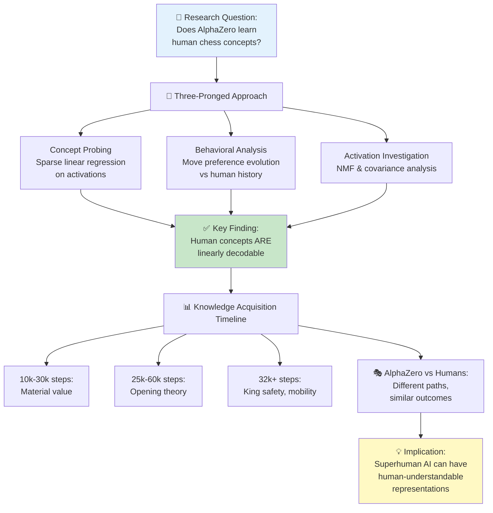
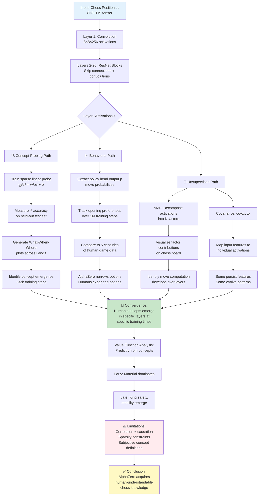
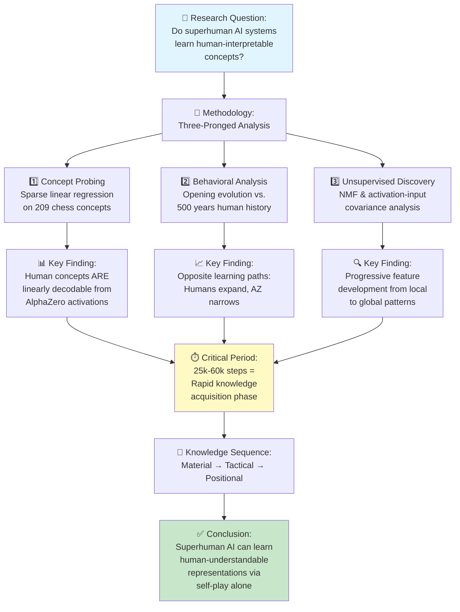
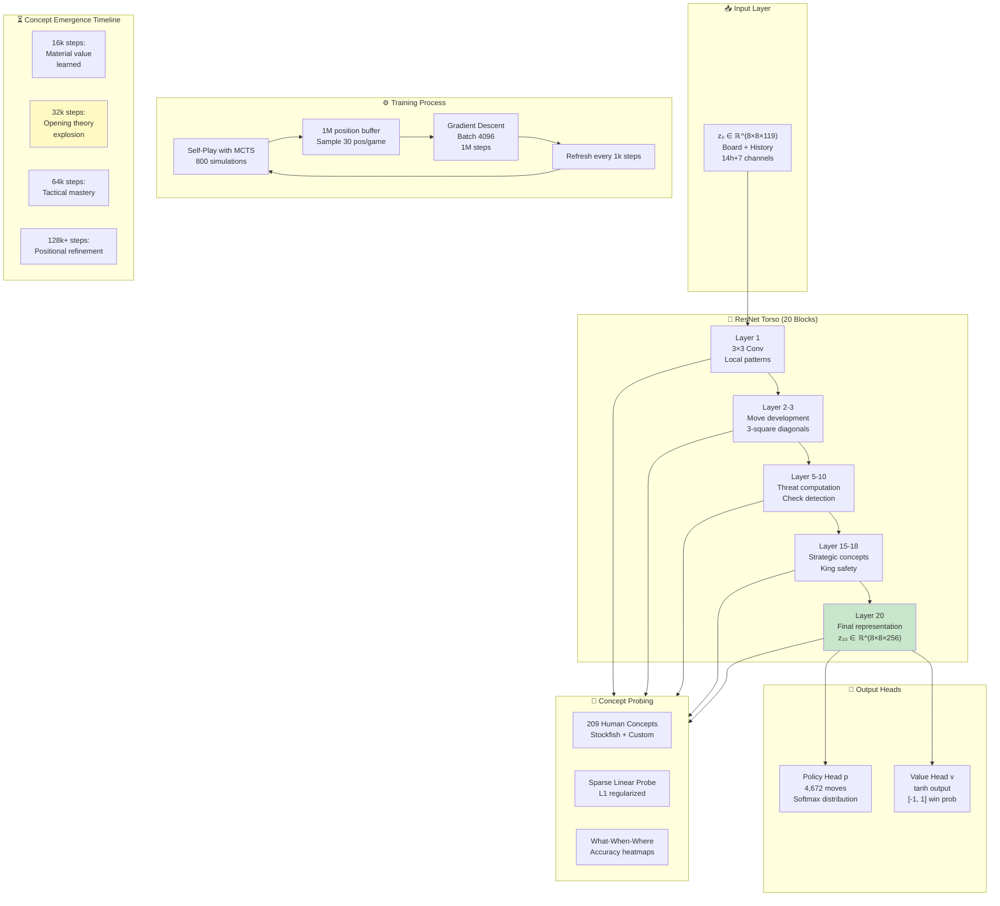

## ⚡ TL;DR
> AlphaZero's neural network **does learn human-understandable chess concepts** (like material value, king safety, and mobility) during self-play training, despite never seeing human games—challenging the assumption that superhuman AI systems develop opaque, inhuman representations.

---

## 📝 Detailed Summary (Undergraduate Level)

### **1. Research Motivation & Core Question**
- **Problem**: Machine learning systems are commonly believed to learn *opaque, uninterpretable representations* that don't match human understanding
  - *Why this matters*: If neural networks don't use human-like concepts, we can't faithfully explain their decisions
  - *Key question*: Do sophisticated neural networks like AlphaZero acquire **human-understandable concepts**?
- **Why AlphaZero?**
  - Trained via **self-play** (never exposed to human data)
  - Performs at **superhuman level** in Chess, Go, and Shogi
  - Perfect test case: if human concepts emerge here, they likely emerge elsewhere

### **2. Three-Pronged Methodology**

#### **2.1 Concept Probing (Supervised)**
- **Goal**: Determine if human chess concepts can be **linearly decoded** from network activations
- **Method**: Train **sparse linear regression probes** on network layer activations
  - For each layer `l` and training step `t`, predict concept value `c(z₀)` from activations `zₗᵗ`
  - Formula: `gⱼₗᵗ(zₗᵗ) = wᵀzₗᵗ + b` (continuous) or `σ(wᵀzₗᵗ + b)` (binary)
  - Use **L1 regularization** to avoid overfitting (16,384 activations per layer!)
- **Concept Sources**:
  - 93 concepts from **Stockfish 8's evaluation function** (material, mobility, king safety, threats, etc.)
  - 116 **custom concepts** (forks, pins, pawn structures, capture possibilities)
- **Measurement**: Track regression accuracy (`r²` for continuous, accuracy increase for binary) across layers and training time

#### **2.2 Behavioral Analysis**
- **Goal**: Study how **move preferences evolve** during training
- **Method**: Measure changes in policy head output `p` on curated chess positions
  - Compare AlphaZero's opening evolution to **5 centuries of human chess history**
  - Focus on openings (most heavily theorized part of chess)
- **Key Finding**: AlphaZero's learning trajectory **differs from human history**
  - Humans: Started with 1.e4 dominance, gradually expanded options (entropy *increased*)
  - AlphaZero: Started uniform, narrowed down options (entropy *decreased*)

#### **2.3 Activation Investigation (Unsupervised)**
- **Goal**: Discover what the network computes **without pre-defined human concepts**
- **Methods**:
  - **Non-negative Matrix Factorization (NMF)**: Decompose activations into interpretable factors
  - **Activation-Input Covariance**: Measure which input features correlate with each neuron's activation
- **Finding**: Network shows **spatial correspondence** (activations align with board positions)

### **3. Key Results**

#### **3.1 Human Concepts ARE Represented**
- Many concepts can be **regressed with high accuracy** from internal representations
  - Stockfish total score: `r² > 0.75` after 10 layers at 64,000+ training steps
  - Threat-related concepts (check, queen capture, mate threat): High accuracy in early layers
- **What-When-Where Plots**: Visualize concept emergence across training time and network depth
  - Many concepts emerge around **32,000 training steps** (period of rapid development)
  - Concepts computed **progressively over multiple layers** (accuracy increases with depth)

#### **3.2 Knowledge Acquisition Timeline**
| Training Steps | What's Learned | Evidence |
|---------------|----------------|----------|
| 10k–30k | **Material value** (piece counts) | Figure 4b: piece weights converge to conventional values |
| 25k–60k | **Basic opening theory** (1.e4, 1.d4) | Figure 7: rapid adoption of standard openings |
| 32k+ | **Complex concepts** (king safety, mobility, threats) | Figure 4c: concept weights emerge later |
| 100k+ | **Refined positional understanding** | GM Kramnik qualitative assessment |

#### **3.3 Value Function Evolution**
- **Early training**: AlphaZero focuses primarily on **material**
- **Later training**: Complex concepts emerge as important predictors
  - King safety, mobility, threats become significant at 32,000+ steps
  - Space concept emerges late with comparatively low weight
- **Implication**: Learning progression mirrors human chess learning (simple → complex)

#### **3.4 AlphaZero vs. Human History**
- **Opening move preferences**:
  - Human history (1400–2020): 1.e4 dominated early, then diversified (0.33 → 1.87 bits of entropy)
  - AlphaZero: Started uniform (4.32 bits), narrowed down (→ 2.76–3.02 bits)
- **Ruy Lopez example** (1.e4 e5 2.Nf3 Nc6 3.Bb5):
  - Humans took centuries to appreciate Berlin Defense (3...Nf6)
  - AlphaZero rapidly develops preference upon mastering basics
- **Conclusion**: AlphaZero doesn't **recapitulate human history**—different learning path, similar end results

#### **3.5 Tactical vs. Positional Skills**
- **GM Kramnik's observation**: **Tactical skills emerge before positional skills**
- **Explanation**: 
  - Tactical lines require short-term calculation (possible with high-entropy priors)
  - Positional lines require deeper search (needs low-entropy, focused priors)
- **Evidence**: ELO differences between checkpoints slightly favor tactical positions

#### **3.6 Unsupervised Discovery Findings**
- **NMF Factors** reveal:
  - Move computation develops over **multiple layers** (convolutional structure requires this)
  - Early layers detect local patterns; later layers show global features
  - Some factors correspond to **opponent move anticipation** (not just own moves)
- **Activation-Input Covariance**:
  - Some activations **persist features** through all 20 layers (e.g., piece positions)
  - Other activations **evolve** to detect increasingly complex patterns
  - Spatial alignment maintained throughout network (8×8×256 tensor structure)

### **4. Prediction Error Analysis**
- **Stockfish score outliers** reveal systematic semantic differences
  - High-residual positions: Black's queen can be captured (AlphaZero sees this, Stockfish evaluation doesn't fully account for it)
  - Outliers **cluster in activation space** (t-SNE visualization)
- **Implication**: Prediction errors aren't just noise—they reveal **differences in evaluation philosophy** between engines

---

## 🗺️ Diagram 1: High-Level Overview



---

## 🔍 Diagram 2: Detailed Process/Logic


----


---



---

## 📚 Glossary of Technical Terms

| Term | Plain-English Definition | Context in Paper |
|------|-------------------------|------------------|
| **AlphaZero** | A neural network-based AI that learns games through self-play without human data | The system being studied for chess knowledge acquisition |
| **Concept Activation Vector (CAV)** | A method to detect if human concepts are represented in neural network activations | Used to probe whether chess concepts exist in AlphaZero's layers |
| **ResNet (Residual Network)** | A neural network architecture with "skip connections" that help information flow through many layers | AlphaZero's backbone has 20 ResNet blocks |
| **MCTS (Monte Carlo Tree Search)** | A search algorithm that explores possible moves by simulating many game continuations | Used alongside AlphaZero's neural network during play |
| **Sparse Linear Probe** | A simple regression model with L1 regularization that uses only a few neurons to predict a concept | Used to test if concepts are linearly decodable from activations |
| **NMF (Non-negative Matrix Factorization)** | An unsupervised technique that decomposes data into interpretable parts | Used to discover patterns in activations without pre-defined concepts |
| **Policy Head** | The part of the network that outputs move probabilities | Analyzed to track opening preference evolution |
| **Value Head** | The part of the network that outputs position evaluation (-1 to 1) | Analyzed to understand how concepts relate to position assessment |
| **What-When-Where Plot** | A visualization showing what concept is learned, when in training, and where in the network | Key tool for tracking concept emergence |
| **Activation-Input Covariance** | Measures how correlated each input feature is with a neuron's activation | Used to understand what individual neurons detect |
| **Self-Play** | Training method where the AI plays against itself to generate training data | How AlphaZero learns without human games |
| **Entropy (in policy)** | Measure of uncertainty/randomness in move selection probabilities | Used to compare AlphaZero's exploration vs human history |

---

## ⚠️ Limitations & Critical Notes

- **Correlation ≠ Causation**: Probing shows concepts are *predictable* from activations, but doesn't prove the network *uses* them for decisions
  - High regression score could be a confounder rather than the actual concept
  - Intervention studies would be needed to establish causal relationships

- **Sparsity Constraints**: L1 regularization may artificially limit regression accuracy
  - Spatially-distributed concepts might be penalized
  - True accuracy could be higher with different probing architectures

- **Subjective Concept Definitions**: Stockfish 8's evaluation function is used as "ground truth"
  - Different engines/grandmasters might evaluate positions differently
  - Some concepts (like "threats") combine objective features with subjective value judgments

- **Limited Scope**: Analysis focuses on the neural network torso (layers 1-20), not MCTS computations
  - Deep calculations performed via MCTS are outside this study's scope
  - Many NMF factors in later layers remain unexplained

- **Training Configuration Dependence**: Results depend on specific hyperparameters
  - Different training settings might shift the knowledge acquisition timeline
  - Suboptimal configurations not examined

- **Information-Theoretic Challenge**: Neural networks can't create new information (data processing inequality)
  - Layers make information more *accessible* to computationally-bounded probes, not create it
  - This complicates intuitive understanding of what "learning a concept" means

---

## 💡 Key Takeaways

1. **Human concepts emerge in superhuman AI**: AlphaZero develops representations aligned with human chess understanding *despite never seeing human games*—challenging assumptions about AI opacity.

2. **Sequential knowledge acquisition**: Learning follows a logical progression—**material → openings → complex positional concepts**—mirroring how humans learn chess.

3. **Different paths, similar destinations**: AlphaZero's learning trajectory differs from human history (narrowing vs. expanding options), but converges on similar opening theory.

4. **Intermediate layers matter**: Some concepts peak in early layers then drop—analyzing only final layer activations would miss important computations happening mid-network.

5. **Interpretability is feasible for complex systems**: If human-understandable concepts exist in AlphaZero, they likely exist in other sophisticated neural networks—opening doors for broader AI interpretability research.


Great question! Based on the AlphaZero paper and the current state of chess AI (as of 2026), here's the breakdown:

---

## 🏗️ Chess AI Architecture Landscape

### **AlphaZero & Its Descendants: ResNet (CNN)**

| Engine | Architecture | Year | Notes |
|--------|-------------|------|-------|
| **AlphaZero** | 20-block **ResNet** | 2017 | The paper I just analyzed |
| **Leela Chess Zero (Lc0)** | **ResNet** (similar to AZ) | 2018+ | Open-source AZ implementation |
| **Stockfish NNUE** | Hybrid (traditional + small NN) | 2020+ | Uses efficient neural network for evaluation |
| **Maia Chess** | **ResNet** | 2020 | Trained on human games |

### **Why ResNet/CNN Works Well for Chess**

From the AlphaZero paper (Section 3.1):

```
Input: z₀ ∈ ℝ^(8×8×119)  ← 8×8 board with 119 channels
       ↓
Layer 1: 3×3 convolution → 8×8×256 activations
       ↓
Layers 2-20: ResNet blocks (skip connections + convolutions)
       ↓
Policy Head + Value Head outputs
```

**Key reasons CNNs fit chess:**

1. **Spatial Structure**: Chess board is naturally a 2D grid (8×8), just like images
2. **Local Pattern Detection**: 3×3 convolutions detect piece relationships, threats, pawn structures
3. **Spatial Correspondence**: Activations maintain board alignment through all layers (Section 7.2 of the paper)
4. **Parameter Efficiency**: Convolutions share weights across board positions

---

### **Transformers in Chess: Emerging but Not Dominant**

| Architecture | Status | Trade-offs |
|-------------|--------|------------|
| **ResNet/CNN** | ✅ **Dominant** | Efficient, proven, spatially-aware |
| **Transformer** | 🔬 **Experimental** | Better long-range dependencies, but computationally expensive |
| **Hybrid** | 🔬 **Research stage** | Combining CNN spatial awareness with transformer attention |

**Why transformers are less common:**

- **Computational cost**: Self-attention is O(n²) vs. O(n) for convolutions
- **Chess board is small**: 64 squares doesn't benefit as much from transformer's long-range modeling
- **CNNs already work**: ResNet achieves superhuman performance; no pressing need to switch

---

### **Key Insight from the AlphaZero Paper**

The paper explicitly notes (Section 7.1.2):

> *"The convolutional structure of the AlphaZero network means that all computations from one layer to the next involve only spatially adjacent neurons. Because of this, move computations must occur over the course of multiple layers."*

This explains why **threat-related concepts show gradual accuracy increases across early layers** (Figure 2) — a bishop's diagonal moves need multiple 3×3 convolutions to propagate across the board.

**Transformers could theoretically capture long-range moves in a single layer**, but the performance gain hasn't justified the computational cost for most chess engines.

---

## 📊 Summary

| Question | Answer |
|----------|--------|
| **Do modern chess models use CNNs?** | ✅ **Yes** — ResNet is the dominant architecture |
| **Do they use transformers?** | 🔬 **Some research**, but not mainstream yet |
| **Is it like image models?** | ✅ **Yes** — Board = 8×8 "image", pieces = channels |
| **Why CNNs over transformers?** | Efficiency + spatial structure + proven performance |

---

## 💡 Fun Fact

The AlphaZero input representation (Section 3.1) encodes the board as **119 channels**:
- 12 channels × 8 history plies = 96 (piece positions for both sides)
- 7 channels = castling rights, side to play, move counters, repetitions

So it's actually **more complex than a typical RGB image** (3 channels)! 🎯

Based on the provided paper text (specifically **Section 3: AlphaZero: Network structure and training** and **Figure 1**), here is the full architecture of the AlphaZero model used in this study.

### **1. Input Representation ($z_0$)**
*   **Dimensions:** $8 \times 8 \times (14h + 7)$
*   **History Length ($h$):** Typically $h=8$ plies (current position + 7 preceding positions).
*   **Total Channels (for $h=8$):** $119$ channels.
*   **Channel Breakdown:**
    *   **Piece Planes (96 channels):** 12 planes $\times$ 8 history steps.
        *   Encodes positions for both sides: King, Queen, Rooks, Bishops, Knights, Pawns.
        *   Binary values (1 for piece presence, 0 for absence).
    *   **Auxiliary Planes (23 channels):**
        *   Repetition count (for three-fold repetition draws).
        *   Side to play.
        *   Castling rights (4 planes: Player/Opponent $\times$ King/Queenside).
        *   Irreversible move counter (50-move rule).
        *   Total move counter.
        *   *Note:* These are scaled/encoded as binary or scaled continuous values.
*   **Orientation:** Always oriented toward the playing side (board is flipped for Black to play).

---

### **2. Neural Network Torso (Backbone)**
*   **Architecture Type:** Residual Neural Network (ResNet).
*   **Total Layers:** 20 layers (indexed $l=1, \dots, 20$).
*   **Activation Dimensions:** $z^l \in \mathbb{R}^{8 \times 8 \times 256}$ for each layer.
*   **Total Activations per Layer:** 16,384.
*   **Activation Clipping:** Activations are clipped to a maximum value of 15.

#### **Layer 1: Initial Convolution**
*   **Operation:** $3 \times 3$ Convolution.
*   **Filters:** 256 filters.
*   **Stride:** 1.
*   **Activation:** ReLU.
*   **Output:** $8 \times 8 \times 256$.

#### **Layers 2–20: ResNet Blocks (19 Blocks)**
*   **Structure:** Each block contains two convolutional layers with a skip connection.
*   **Block Computation (Equation 2):**
    $$z^l = \text{ReLU}(z^{l-1} + g^l(z^{l-1}))$$
    Where $g^l$ consists of:
    1.  $3 \times 3$ Convolution (256 filters) $\rightarrow$ Batch Normalization $\rightarrow$ ReLU.
    2.  $3 \times 3$ Convolution (256 filters) $\rightarrow$ Batch Normalization.
    3.  Add skip connection ($z^{l-1}$).
    4.  ReLU activation.
*   **Note:** Figure 1 caption describes these as "two rectified batch-normalized convolutional layers with a skip connection."

---

### **3. Output Heads**
Both heads take the final torso activations ($z^{20}$) as input.

#### **Policy Head ($p$)**
*   **Purpose:** Outputs a probability distribution over possible moves.
*   **Structure:**
    1.  $1 \times 1$ Convolution (256 filters) $\rightarrow$ ReLU.
    2.  $1 \times 1$ Convolution (73 filters) $\rightarrow$ Biases.
    3.  Flatten.
    4.  Softmax.
*   **Output Tensor:** $8 \times 8 \times 73$.
*   **Move Encoding (73 planes per square):**
    *   7 horizontal moves (left/right).
    *   7 vertical moves (up/down).
    *   7 diagonal moves (NW/SE).
    *   7 diagonal moves (NE/SW).
    *   8 Knight moves.
    *   3 Promotion options (Bishop, Knight, Rook) for single-square forward moves (Queen is default).

#### **Value Head ($v$)**
*   **Purpose:** Outputs a scalar evaluation of the position (expected game outcome).
*   **Structure:**
    1.  $1 \times 1$ Convolution (1 filter) $\rightarrow$ ReLU.
    2.  Flatten.
    3.  Linear Layer to Scalar.
    4.  Tanh activation.
*   **Output:** Scalar $v \in (-1, 1)$.

---

### **4. Training Configuration**
*   **Training Steps:** 1,000,000 gradient descent steps.
*   **Optimizer:** Stochastic Gradient Descent (SGD).
*   **Batch Size:** 4,096 positions.
*   **Learning Rate Schedule:**
    *   Initial: 0.2.
    *   Decay: Multiplied by 0.1 at 100k, 300k, 500k, and 700k steps.
*   **Loss Function (Equation 13):**
    $$L = -\pi^T \log p + (v - z)^2 + \text{regularization terms}$$
    Where $\pi$ is the MCTS probability vector and $z$ is the game outcome.
*   **Self-Play:**
    *   Networks refreshed every 1,000 training steps.
    *   800 MCTS simulations per move.
    *   Dirichlet noise added to priors for exploration.

---

### **Summary Diagram (Based on Figure 1)**
```
Input (8x8x119)
      ↓
[Layer 1] 3x3 Conv (256 filters) + ReLU
      ↓
[Layer 2] ResNet Block 1 (3x3 Conv → BN → ReLU → 3x3 Conv → BN → Add → ReLU)
      ↓
... (18 more ResNet Blocks) ...
      ↓
[Layer 20] ResNet Block 19
      ↓
      ├───────────────────────┐
      ↓                       ↓
[Policy Head]           [Value Head]
1x1 Conv (256)          1x1 Conv (1)
ReLU                    ReLU
1x1 Conv (73)           Flatten
Flatten                 Linear → Scalar
Softmax                 Tanh
      ↓                       ↓
Move Probabilities      Position Value (-1 to 1)
```

Yes, exactly! AlphaZero treats the chess board **as a multi-channel image**. Let me explain the details and compare with LLM approaches.

## How AlphaZero Represents the Board as an "Image"

From the paper (Section 3.1):

**Input Structure:**
```
z₀ ∈ ℝ^(8×8×119)  [when history h=8 plies]
```

This is analogous to an RGB image:
- **RGB Image**: 8×8 pixels × 3 channels (R, G, B)
- **AlphaZero**: 8×8 squares × 119 channels

**The 119 channels break down as:**
- **96 channels**: Piece positions (12 piece types × 8 history steps)
  - King, Queen, Rooks, Bishops, Knights, Pawns for both sides
  - Binary values (1 = piece present, 0 = absent)
- **23 auxiliary channels**: 
  - Castling rights, side to play, repetition count, move counters, etc.

**Key Design Choice:**
> "The input representation is always oriented toward the playing side, so that the board position with black to play is first flipped horizontally and vertically."

This is like data augmentation in computer vision!

---

## Architecture Comparison

| Feature | **AlphaZero (CNN)** | **LLM (Transformer)** |
|---------|---------------------|----------------------|
| **Input** | 8×8×119 tensor (spatial) | Text sequence (FEN/PGN) |
| **Core Operation** | 3×3 convolutions | Self-attention |
| **Spatial Awareness** | Built-in (convolutional) | Must be learned |
| **Long-range Dependencies** | Multiple layers needed | Single attention layer |
| **Parameter Sharing** | Yes (convolution kernels) | No (position-specific embeddings) |
| **Output** | 8×8×73 probability map | Token sequence |

---

## Critical Differences

### 1. **How Information Flows**

**AlphaZero (CNN):**
```
Layer 1: Detects local 3×3 patterns around each square
Layer 2-20: Patterns propagate spatially through convolutions
```

From the paper (Section 7.1.2):
> "The convolutional structure of the AlphaZero network means that all computations from one layer to the next involve only spatially adjacent neurons. Because of this, **move computations must occur over the course of multiple layers**."

**Example**: A bishop's diagonal move from a1 to h8 requires **7 layers** of 3×3 convolutions to propagate across the board!

**LLM (Transformer):**
```
Attention Layer 1: Any square can attend to any other square directly
```
A bishop's diagonal is captured in **one attention layer** via attention weights.

---

### 2. **Inductive Biases**

**AlphaZero's CNN has strong spatial priors:**
- ✅ **Translation invariance**: A knight fork pattern is recognized anywhere on the board
- ✅ **Spatial locality**: Nearby pieces interact more strongly
- ✅ **Hierarchical features**: Simple patterns → complex tactics

**LLM has sequential priors:**
- ✅ **Order matters**: "e4" is different from "4e"
- ❌ **No built-in spatial structure**: Must learn that "a1" is near "a2" from data
- ⚠️ **Positional encodings**: Add artificial notion of sequence position

---

### 3. **Output Representation**

**AlphaZero:**
```
Policy head → 8×8×73 tensor
- 73 move types per square (7 horizontal + 7 vertical + 7 diagonal × 2 + 8 knight + 3 promotions)
- Softmax over all legal moves
```

**LLM:**
```
Text generation → Token sequence
Example: "e2e4" or "Nf3" or "O-O"
- Must parse text to validate legality
- Can generate illegal moves (hallucinations)
```

---

### 4. **Evidence from the Paper**

The paper shows that **spatial structure is preserved** throughout the network:

> "The sequence of convolutions in the ResNet backbone has a spatial structure and each zˡ's 8×8×256 tensor aligns with the input board encoding." (Section 7.2)

They visualize **activation-input covariance** showing that:
- Early layers detect **local patterns** (pieces around e4)
- Later layers detect **evolving global features** (attacks, threats)

---

## Why CNN Works Better for Chess (Currently)

1. **Natural fit**: Chess is inherently spatial (8×8 grid)
2. **Parameter efficiency**: Convolutions share weights across board positions
3. **Computational cost**: 
   - CNN: O(n) per layer
   - Transformer: O(n²) attention (64² = 4,096 pairwise relationships)

4. **Empirical success**: AlphaZero achieves superhuman play with CNNs

---

## Could LLMs Work?

**Yes, but with trade-offs:**

**Advantages of LLM approach:**
- ✅ Can incorporate **natural language** commentary
- ✅ Pre-trained knowledge from text
- ✅ Long-range dependencies in one layer
- ✅ Multi-task learning (chess + other domains)

**Disadvantages:**
- ❌ Must **learn spatial structure** from scratch
- ❌ Higher computational cost
- ❌ Risk of **illegal move generation**
- ❌ Less parameter-efficient for pure chess

**Hybrid approaches** (like AlphaZero + language model) might combine the best of both!

---

## Summary

| Aspect | AlphaZero (CNN) | LLM |
|--------|-----------------|-----|
| **Board as** | Multi-channel image | Text sequence |
| **Strengths** | Spatial reasoning, efficiency | Language understanding, flexibility |
| **Weaknesses** | Limited to spatial domain | Must learn geometry, expensive |
| **Best for** | Pure chess play | Chess + explanation + generalization |

The paper's success with CNNs suggests that **matching the architecture to the domain structure** (spatial → convolutional) is crucial for high performance!