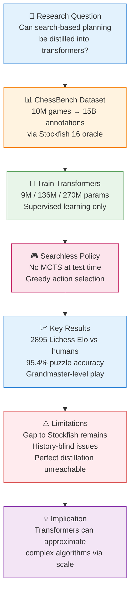
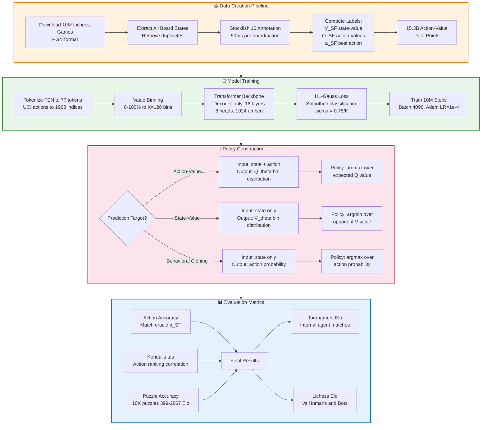

https://github.com/google-deepmind/searchless_chess

## ⚡ TL;DR
> Google DeepMind demonstrates that large-scale transformers (up to 270M parameters) trained via supervised learning on 15 billion Stockfish-annotated chess positions can achieve grandmaster-level play (2895 Lichess Elo) **without any explicit search at test time**, though perfect distillation of Stockfish's search-based algorithm remains unachieved.

---

## 📝 Detailed Summary (Undergraduate Level)

### **1. Research Problem & Motivation**
- **Core Question**: Can complex search-based planning algorithms (like Stockfish's) be *distilled* into feed-forward neural networks through supervised learning?
- **Why Chess?**
  - Chess is a *landmark planning problem* in AI history
  - Naive search is computationally intractable
  - Brute-force memorization is futile due to combinatorial explosion (~10^43 possible board states)
  - Every new game involves board states never seen during training → rules out memorization as explanation
- **Key Challenge**: Most strong chess engines combine neural networks **with** search at test time; this paper tests if search can be eliminated entirely

### **2. ChessBench Dataset Creation**
- **Source**: 10 million human games from Lichess.org (February 2023)
- **Annotation Pipeline**:
  - Extract all unique board states (`s`) from games
  - Use **Stockfish 16** as "value oracle" with 50ms time limit per board
  - Compute three types of labels for each board:
    - **State-value** `V_SF(s)`: Win probability (0%-100%) for the current position
    - **Action-value** `Q_SF(s,a)`: Win probability for each legal move `a`
    - **Best action** `a_SF(s)`: The move with highest action-value
- **Dataset Scale**:
  - ~530 million state-value estimates
  - **15.3 billion action-value estimates** (all legal moves per board)
  - Equivalent to ~8,864 days of unparallelized Stockfish evaluation time
- **Test Sets**:
  - Standard test: 1K games from different month (14.7% board overlap with training)
  - Puzzle test: 10K curated Lichess puzzles (only 1.33% overlap)

### **3. Model Architecture & Training**
- **Architecture**: Decoder-only transformer (no causal masking)
  - Improvements from LLaMA/Llama 2: post-normalization, SwiGLU activations
  - Largest model: **270M parameters** (16 layers, 8 heads, 1024 embedding dimension)
  - Also tested: 9M and 136M parameter variants
- **Input Representation**:
  - **FEN strings** (Forsyth-Edwards Notation): Standard chess position encoding
  - Flattened to fixed 77-token representation
  - Actions encoded in **UCI notation** (e.g., 'e2e4')
- **Output**: Categorical distribution over discrete bins (K=128 value bins)
- **Training Protocol**:
  - Loss: **HL-Gauss loss** (smoothed classification) outperforms cross-entropy and MSE
  - Optimizer: Adam with learning rate 1×10^-4
  - Training: 10 million steps (2.67 epochs on full dataset)
  - Batch size: 4096

### **4. Three Prediction Targets (Policy Types)**
| Target | Input | Output | Policy Construction |
|--------|-------|--------|---------------------|
| **Action-Value (AV)** | State + Action | Value bin | Pick action with max expected `Q_θ(s,a)` |
| **State-Value (SV)** | State only | Value bin | Pick action leading to worst opponent value |
| **Behavioral Cloning (BC)** | State only | Action index | Pick highest probability action |

- **Key Finding**: Action-value prediction **consistently outperforms** SV and BC across all metrics
- **Reason**: 30× more training data (15.3B action-values vs. 530M states)

### **5. Main Results**
- **Playing Strength** (270M Transformer):
  - **Tournament Elo**: 2299 (±15)
  - **Lichess Blitz vs. Humans**: **2895** (grandmaster level)
  - **Lichess Blitz vs. Bots**: 2299 (lower due to different player pools)
  - **Puzzle Accuracy**: 95.4% on 10K puzzles (up to 2867 Elo difficulty)
- **Scaling Effects**:
  - Larger models + larger datasets = consistently better performance
  - No overfitting observed on full dataset
  - Small datasets (10K games) cause overfitting in models ≥7M parameters
- **Comparison to Other Engines**:
  - Outperforms AlphaZero policy/value networks (no search)
  - Nearly matches AlphaZero **with** 400 MCTS simulations on puzzles
  - Still below Stockfish 16 and Leela Chess Zero with search

### **6. Key Limitations & Technical Issues**
- **Threefold Repetition Blindness**: FEN input lacks move history → cannot detect draw conditions
  - Workaround: Check if next move triggers rule, set value to 50%
- **Indecisiveness in Winning Positions**: Multiple moves map to same max value bin → random play
  - Workaround: Double-check with Stockfish when all top moves >99% win probability
- **Human vs. Bot Elo Discrepancy**: 
  - Humans resign in lost positions; bots play to end
  - Different player pools may have miscalibrated ratings
  - Bots exploit tactical mistakes more severely
- **Perfect Distillation Not Achieved**: Performance gap to Stockfish 16 remains

### **7. Contributions & Open Source**
- ChessBench dataset (530M boards, 15B action-values)
- Model weights for 9M, 136M, 270M transformers
- All training and evaluation code
- Repository: https://github.com/google-deepmind/searchless_chess

---

## 🗺️ Diagram 1: High-Level Overview

---

## 🔍 Diagram 2: Detailed Process/Logic

---

## 📚 Glossary of Technical Terms

| Term | Plain-English Definition | Context in Paper |
|------|-------------------------|------------------|
| **Amortized Planning** | Learning to approximate planning computations upfront so they can be reused quickly later | Core concept: distilling Stockfish's search into fast transformer predictions |
| **Action-Value `Q(s,a)`** | Expected win probability if you take action `a` in state `s` | Primary prediction target; 15.3B data points |
| **State-Value `V(s)`** | Expected win probability from state `s` assuming optimal play | Alternative prediction target; 530M data points |
| **Behavioral Cloning** | Training model to directly copy expert actions rather than predict values | Third prediction target; performs worst of three |
| **FEN (Forsyth-Edwards Notation)** | Standard text string encoding a chess board position | Model input format (77 tokens) |
| **HL-Gauss Loss** | Classification loss that smooths labels using Gaussian distribution | Outperforms cross-entropy and MSE for value prediction |
| **MCTS (Monte Carlo Tree Search)** | Search algorithm that simulates many possible future moves | Used by AlphaZero/Leela; NOT used by this paper's models at test time |
| **Elo Rating** | Numerical measure of playing strength; higher = stronger player | 2895 vs humans = grandmaster level |
| **Value Binning** | Converting continuous values (0-100%) into discrete categories (bins) | K=128 bins used for classification approach |
| **Threefold Repetition** | Chess rule: game is drawn if same position occurs 3 times | Limitation: FEN input cannot detect this without move history |
| **Decoder-Only Transformer** | Neural architecture using only decoder layers (like GPT) | Model backbone; no causal masking applied |
| **Distributional RL** | Reinforcement learning approach predicting value distributions, not single values | Inspiration for value binning approach |

---

## ⚠️ Limitations & Critical Notes

- **Perfect Distillation Not Achieved**: Despite 270M parameters and 15B data points, performance gap to Stockfish 16 remains (~40-60 Elo points on tournament metrics)
- **History-Blind Input**: FEN representation lacks move history → cannot properly handle threefold repetition draws or fifty-move rule edge cases
- **Human vs. Bot Elo Discrepancy**: 2895 Elo vs humans but only 2299 vs bots; suggests rating calibration issues or different exploitation patterns
- **Computational Impracticality**: Models are slow for competitive computer chess tournaments; Lichess calibration used instead
- **Deterministic Policy Vulnerability**: Opponents could potentially find weaknesses through extensive repeated play
- **Comparison Caveats**: Direct engine comparisons complicated by different inputs (FEN vs PGN), training methods (SL vs RL), and search usage
- **Domain Specificity**: Results may not generalize to other planning domains; chess has unique structure
- **Architecture Ceiling**: Performance saturation at 16 layers suggests architectural innovations may be needed beyond scaling

---

## 💡 Key Takeaways

1. **Scale Matters**: Strong chess performance from supervised learning only emerges at sufficient dataset (10M+ games) and model scale (270M+ parameters)

2. **Search Can Be Approximated**: Complex search-based algorithms like Stockfish can be partially distilled into feed-forward transformers, enabling "searchless" grandmaster-level play

3. **Action-Values > State-Values**: Predicting action-values outperforms state-values and behavioral cloning, primarily due to 30× more training data availability

4. **Memorization Ruled Out**: With <1.4% puzzle board overlap and combinatorial explosion of chess states, performance demonstrates genuine generalization, not memorization

5. **Paradigm Shift Implication**: Large transformers should be viewed as algorithm approximators, not just statistical pattern recognizers—though perfect distillation remains an open challenge