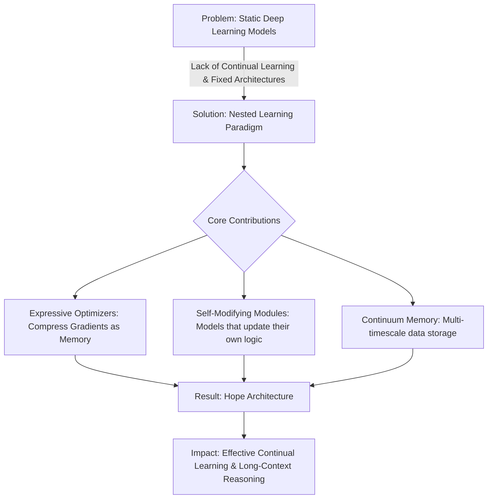
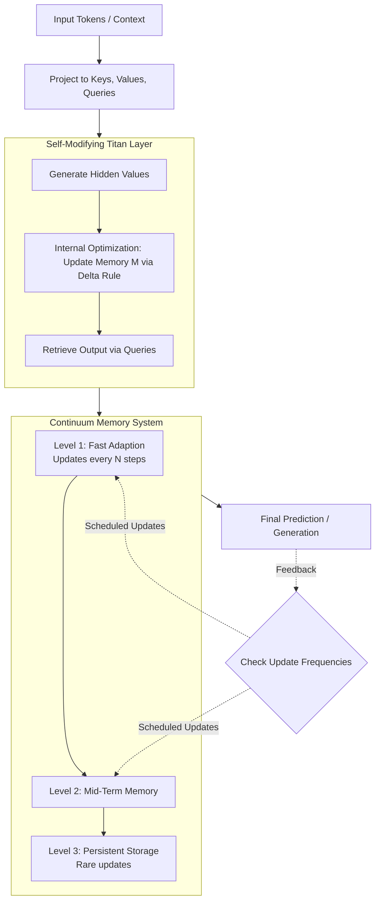

## ⚡ TL;DR

> **Nested Learning (NL)** redefines deep learning as a system of interconnected, multi-level optimization problems where architectures and optimizers act as **associative memories** that compress context at different time scales, enabling models to continually learn and self-modify.

---

## 📝 Detailed Summary (Undergraduate Level)

* **The Core Philosophy: Nested Learning (NL)**
* **Architecture as Optimization:** Instead of seeing a neural network as a static stack of layers, NL views it as a series of **nested optimization problems**. Each part of the model (like a layer or an optimizer) has its own **context flow** (data it learns from) and **update frequency** (how often it changes).
* **Associative Memory:** All components are essentially "associative memories"—operators that map inputs (**keys**) to specific targets (**values**).
* *Example:* A standard linear layer maps input data to an error signal (local surprise).

* **Unified Structure:** NL suggests that the apparent variety in AI models (Transformers vs. RNNs) is an "illusion." They are all just feedforward networks operating at different frequencies.

* **Redefining Optimizers**
* **Optimizers as Compressors:** Common optimizers like **Adam** or **SGD with Momentum** are actually internal memory modules. They aim to "compress" past gradients so the model can understand the overall "landscape" of the problem rather than just the immediate next step.
* **Expressive Optimizers:** By viewing optimizers as memory, the authors created more powerful versions:
* **Delta Gradient Descent (DGD):** An update rule that depends on the current state of the weights, allowing the model to capture dependencies in data more effectively.
* **Deep Momentum:** Replacing simple averages with a multi-layer network (MLP) to store gradient history.

* **The Continuum Memory System (CMS)**
* **Brain-Inspired Updates:** Just as the human brain has different waves (Gamma for fast senses, Delta for slow memory), CMS uses a chain of blocks that update at different speeds.
* **Solving Catastrophic Forgetting:** In standard models, new info often "overwrites" old info. In CMS, slow-frequency layers act as a persistent "long-term storage," while fast-frequency layers adapt to the immediate context. Even if one layer forgets, the knowledge remains looped in others.

* **The "Hope" Module**
* **Self-Referential Titans:** This is a sequence model that learns how to modify its own learning rules. It generates its own "values" in-context, meaning it adapts how it processes information based on the specific data it is currently reading.
* **Implementation:** By combining these self-modifying "Titans" with the **Continuum Memory System**, the authors created the **Hope** architecture. It performs exceptionally well at reasoning over massive amounts of text (up to 10 million tokens) without losing its place.

---

## 🗺️ Diagram 1: High-Level Overview

---

## 🔍 Diagram 2: Detailed Process/Logic

---

## 📚 Glossary of Technical Terms

| Term | Plain-English Definition | Context in Paper |
| --- | --- | --- |
| **Associative Memory** | A system that links two pieces of info (if you see Key A, recall Value B). | The fundamental building block of all layers and optimizers in NL. |
| **In-Context Learning (ICL)** | The ability of a model to "learn" from the text you just gave it without a permanent weight update. | NL views ICL as a high-frequency optimization level. |
| **Catastrophic Forgetting** | When an AI learns something new and completely "erases" what it knew before. | The main problem CMS and Hope aim to solve. |
| **Pre-training** | The initial phase where an AI reads massive amounts of data. | NL views this as just another "level" of learning, but with a huge context. |
| **Backpropagation** | The standard way AI calculates how to correct its mistakes. | Re-interpreted as a self-referential memory process. |

---

## ⚠️ Limitations & Critical Notes

* **Computational Overhead:** Updating multiple layers of memory (CMS) at different frequencies can be more complex to manage than standard static models.
* **Proof of Concept:** The **M3** optimizer is effective but currently slower than existing methods, making it challenging to scale to the world's largest models without further optimization.
* **Dependency on Initialization:** Higher-frequency levels still rely on a powerful "slow" level (pre-training) to function correctly. If the base model is poor, the nested levels can't save it.
* **Fine-Tuning Necessity:** For extremely long contexts (e.g., 10 million tokens), small models still require fine-tuning to manage their memory capacity effectively.

---

## 💡 Key Takeaways

* **AI Architecture is an "Illusion":** Different models are actually just the same types of networks running at different speeds of learning.
* **Optimizers are Memory:** Your optimizer (like Adam) isn't just a math tool; it’s a tiny brain remembering the "shape" of the data's errors.
* **Models Can Change Themselves:** By using self-referential rules, models can literally update how they think *while* they are reading your prompt.
* **Continual Learning is Possible:** By mimicking the multi-speed updates of the human brain, we can build AI that learns new things without forgetting the old.

Would you like me to explain the math behind the **Delta Gradient Descent (DGD)** formula in more detail, or perhaps zoom in on how the **Hope** architecture handles long-context reasoning?