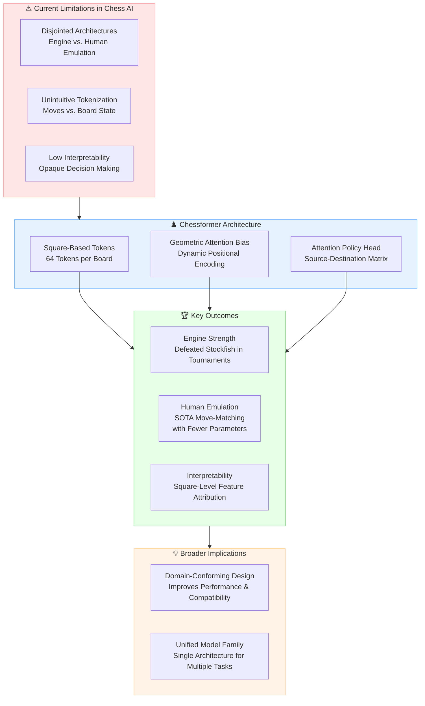
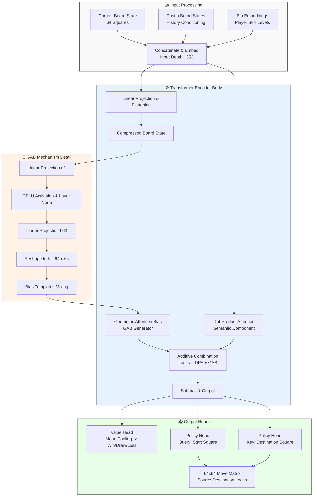

## 📝 Detailed Summary (Undergraduate Level)

### **1. Introduction & Problem Statement**
*   **The Dual Goal of Chess AI**
    *   Modern AI aims to be both **high-performing** (superhuman strength) and **human-compatible** (intelligible, teachable).
    *   *Current Limitation:* There is a gap between strong engines (opaque behavior) and human emulation models (often weaker or disjointed architectures).
*   **Issues with Existing Approaches**
    *   **Fragmented Literature:** Strong engines (e.g., Stockfish, AlphaZero) and human emulators (e.g., MAIA, ALLIE) use different, often unprincipled architectures.
    *   **Tokenization Problems:** Many models use unintuitive input schemes, such as:
        *   Tokenizing **move histories** (language modeling approach).
        *   Tokenizing **convolutional channels** (vision approach).
        *   These methods hinder **interpretability** and misalign with the chess board's geometric structure.
*   **The Chessformer Solution**
    *   Introduces a **unified architecture** that advances state-of-the-art (SOTA) in three areas simultaneously:
        1.  **Raw Engine Strength:** Improves playing performance.
        2.  **Human Move-Matching:** Predicts human moves across skill levels.
        3.  **Interpretability:** Enables square-level analysis of model behavior.

### **2. Core Architecture Innovations**
*   **Board Representation: Squares as Tokens**
    *   **Concept:** Instead of moves or entire positions, the model treats the **64 chessboard squares** as individual input tokens.
    *   **Input Format:** Each square is represented as a one-hot vector (dimension 12) indicating which piece is present.
    *   **History Conditioning:** The model concatenates the current board state with `n` past board states (typically `n = 7`) to capture game history.
    *   **Benefit:** This aligns with the natural visual representation of chess, allowing tokens to specialize to specific squares rather than representing the whole state.
*   **Geometric Attention Bias (GAB)**
    *   **The Problem:** Standard transformers are permutation-invariant and require positional encoding. Static encodings (like absolute or relative bias) do not capture chess-specific geometry (e.g., how a knight moves vs. a bishop).
    *   **The Solution:** GAB is a **dynamic positional encoding** that adapts to the board state.
    *   **Mechanism:**
        1.  Compresses the board state via linear projections and flattening.
        2.  Generates attention biases from a set of learned **"templates"**.
        3.  Adds these biases to the standard **dot-product attention logits** before the softmax operation.
    *   **Formula Concept:** `Attention = Softmax((QK^T / sqrt(d)) + GAB_Bias)`
    *   **Benefit:** Allows attention heads to focus on geometric relationships (e.g., "squares a rook can move to") dynamically based on the position.
*   **Output Heads**
    *   **Value Head:** Predicts the game outcome (win, draw, loss) using mean pooling of the encoder output.
    *   **Policy Head:** Predicts the next move using an **attention-based "source-destination" design**.
        *   Generates query vectors for the **starting square** and key vectors for the **destination square**.
        *   Produces a `64x64` matrix representing all possible moves (traversals from one square to another).
        *   *Note:* Special moves (castling, promotion) are handled via additive biases (see Appendix A.3 in text).

### **3. Training & Evaluation Methodology**
*   **Human Emulation (ZEUS Models)**
    *   **Dataset:** Blitz games from Lichess (Jan 2023 – July 2025), resampled to ensure equal representation of all **Elo skill levels**.
    *   **Skill Conditioning:** Player Elo ratings are encoded as "soft embeddings" prepended to the tokens.
        *   Formula: `e_k = γ * e_weak + (1 - γ) * e_strong`, where `γ` depends on the Elo rating.
    *   **Model Scales:** Trained at 5M, 23M, and 79M parameters (largest named **ZEUS**).
*   **Engine Strength (Apollo-CF)**
    *   **Distillation:** Trained via supervised learning on self-play games generated by the **Apollo engine** (an AlphaZero-style recreation).
    *   **Comparison:** Compared against convolutional models (Apollo-CNN) and other transformer baselines (AC-9M, AC-270M).
    *   **Evaluation:** Measured by **Elo rating** in tournaments and **puzzle-solving accuracy**.

### **4. Key Findings & Results**
*   **Human Move-Matching Performance**
    *   **ZEUS-79M** achieved **57.1% accuracy**, surpassing the previous SOTA (ALLIE-Adaptive-Search at 55.9%) despite having **~4.5x fewer parameters** (79M vs 355M).
    *   **Efficiency:** The 5M parameter model reached 55.4% accuracy, comparable to SOTA with **70x fewer parameters**.
    *   **GAB Impact:** Ablation studies show GAB consistently outperforms absolute and relative positional encodings across Elo and accuracy metrics.
*   **Playing Strength**
    *   **Apollo-CF** (191M parameters) increased the Apollo engine's strength by **over 100 Elo** compared to the previous convolutional model.
    *   **Tournament Success:** Configurations equipped with Chessformer defeated **Stockfish** (a perennial world champion) in multiple computer chess tournaments (Cup and Swiss-system events).
    *   **Puzzle Solving:** Achieved **93.5% - 97.2%** accuracy on puzzle sets, approaching saturation.
*   **Interpretability**
    *   **Square-Level Attribution:** The architecture allows researchers to identify exactly which squares activate specific model features.
    *   **Transcoder Features:** Training sparse autoencoders on MLP activations revealed interpretable concepts like **forks**, **pins**, and **king safety**.
    *   **GAB vs. Attention:** Analysis shows GAB captures **positional/geometric information** (stable between positions, variable within squares), while dot-product attention captures **semantic information** (e.g., important enemy pieces).

### **5. Limitations & Future Work**
*   **Domain Specificity:** GAB is currently tailored to chess geometry; extending it to other structured decision problems requires exploration.
*   **Performance Ceilings:** Human emulation accuracy saturates around 50-60% for low-rated play due to high **aleatoric uncertainty** (inherent inconsistency in human moves).
*   **Next Steps:** Focus on highly skilled play where **epistemic uncertainty** (model knowledge gap) is higher, allowing for greater improvement via better modeling.

## 🗺️ Diagram 1: High-Level Overview

## 🔍 Diagram 2: Detailed Process/Logic

## 💡 Key Takeaways

1.  **Domain Conformity Drives Performance:** Adapting transformer components (tokenization, positional encoding, output heads) to match the specific structure of chess (64 squares, geometric movement) yields significant gains over generic architectures.
2.  **Geometric Attention Bias (GAB) is Critical:** GAB allows the model to dynamically adjust attention based on board geometry (e.g., piece movement rules), outperforming static positional encodings and enabling smaller models to match larger ones.
3.  **Unified Architecture is Possible:** A single model family (Chessformer) can simultaneously achieve state-of-the-art results in **raw engine strength** (defeating Stockfish) and **human move-matching** (emulating players across Elo levels), bridging a historical gap in AI research.
4.  **Interpretability via Design:** By treating squares as tokens and using an attention-based policy head, the model naturally supports **mechanistic interpretability**, allowing researchers to identify specific tactical concepts (pins, forks) within neuron activations.
5.  **Efficiency Matters:** Chessformer achieves superior results with significantly fewer parameters (e.g., 79M vs 355M for prior SOTA human emulation), demonstrating that architectural quality can outweigh brute-force model scaling.